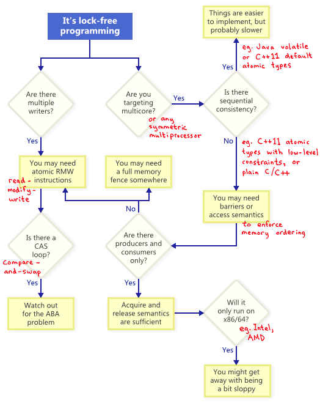

---
category:
  - 并发编程
  - 无锁编程
tag:
  - 无锁并发
  - 译文
date: 2023-10-26
star: true
---

# 无锁编程简介

无锁编程是一项挑战，不仅因为任务本身的复杂性，还因为要深入理解这个主题是非常困难的。

我第一次接触无锁（lock-free，又称为lockless）编程是Bruce Dawson优秀而全面的白皮书《[Lockless Programming Considerations](http://msdn.microsoft.com/en-us/library/windows/desktop/ee418650(v=vs.85).aspx)》。和很多人一样，我也有机会将Bruce的建议付诸实践，在Xbox 360等平台上开发和调试无锁代码。

从那时起，已经写了很多好的材料，从抽象理论和正确性证明到实际示例和硬件细节。我将在脚注中列出参考书目。有时，一个源中的信息可能看起来与其他源正交:例如，一些材料假定[顺序一致性](http://en.wikipedia.org/wiki/Sequential_consistency)，从而避免了通常困扰无锁C/C++代码的内存排序问题。新的[C++11 atomic library standard](http://en.cppreference.com/w/cpp/atomic)给工作带来了另一个难题，挑战了我们许多人表达无锁算法的方式。

在这篇文章中，我想重新介绍无锁编程，首先定义它，然后将大部分信息提炼成几个关键概念。我将用流程图展示这些概念是如何相互关联的，然后我们将深入到细节中去。至少，任何深入研究无锁编程的程序员都应该已经了解如何使用互斥锁和其他高级同步对象，如信号量（semaphores）和事件（events），用其编写正确的多线程代码。

## 什么是无锁编程

人们通常将无锁编程描述为不使用互斥锁（mutex）的编程，互斥锁又称为[lock](http://preshing.com/20111118/locks-arent-slow-lock-contention-is)。这是事实，但这是其中一部分。基于学术文献的普遍接受的定义更广泛一些。从本质上讲，无锁是一个用于描述某些代码的属性，而不需要过多地说明这些代码实际上是如何编写的。

基本上，如果程序的某些部分满足以下条件，那么该部分可以被正确地认为是无锁的。相反，如果代码的给定部分不满足这些条件，那么该部分就不是无锁的。


从这个意义上说，无锁编程中的锁并不是指互斥锁（mutex），而是指以某种方式“锁定”整个应用程序的可能性，无论是死锁、活锁，甚至线程调度决策都可能是你最大的敌人。最后一点听起来很滑稽，但却是关键所在。共享互斥锁是不可能的，因为只要一个线程获得了互斥，你的死对头就再也不会调度该线程了。当然，真正的操作系统不是这样工作的——我们只是在定义术语。

这个示例没有使用互斥锁（mutex），但它仍然不是无锁的。开始时，`X = 0`。作为对读者的练习，考虑如何以一种不让两个线程退出循环的方式调度两个线程。

```c
while (X == 0)
{
    X = 1 - X;
}
```

没有人期望大型应用程序完全没有锁。通常，我们从整个代码库中识别出一组特定的无锁操作。例如，在无锁队列中，可能有一些无锁操作，如`push`、`pop`，可能还有`isEmpty`等等。

Herlihy & Shavit，[The Art of Multiprocessor Programming](http://www.amazon.com/gp/product/0123973376/ref=as_li_ss_tl?ie=UTF8&tag=preshonprogr-20&linkCode=as2&camp=1789&creative=390957&creativeASIN=0123973376)的作者，倾向于用类方法（class method）来表达这样的操作，并给出了无锁的简洁定义(见150页)：“在无限次执行中，无限次地有一些方法调用结束”。换句话说，只要程序能够继续调用那些无锁操作，完成调用的数量就会不断增加。从算法上看，在这些操作期间系统不可能锁定。

无锁编程的一个重要结果是，如果挂起单个线程，它永远不会阻止同一个整体内的其他线程执行自己的无锁操作。这暗示了在编写中断处理程序和实时系统时无锁编程的价值，在这些系统中，某些任务必须在特定的时间限制内完成，而不管程序的其余部分处于什么状态。

最后：设计为阻塞的操作不会使算法失效。队列为空时，队列的`pop`操作可能会故意阻塞。其余的代码仍可视为无锁。

## 无锁编程技术

事实证明，当您试图满足无锁编程的非阻塞条件时，会出现一系列技术：原子操作、内存屏障、避免ABA问题等等，这使得问题变得复杂。

那么这些技术之间的关系是怎样的呢？为了说明，我画了这个流程图，并会说明每一个细节。



## Atomic Read-Modify-Write Operations

原子操作是一种看起来以不可分割的方式操作内存的操作：没有其它线程可以观察到原子操作里的中间部分。在现代处理器上，许多操作已经原子化。例如，简单类型的对齐读写通常是原子的。

[Read-modify-write](http://en.wikipedia.org/wiki/Read-modify-write) (RMW)操作，允许你原子地执行更复杂的操作。当无锁算法必须支持多个writer时，RMW就非常有用。因为当多个线程尝试在同一个地址上执行RMW时，它们将高效地排成一排逐个执行这些操作。在我的博客中，我已经谈到了RMW操作，比如实现[轻量级互斥锁（lightweight mutex）](http://preshing.com/20120226/roll-your-own-lightweight-mutex)，[递归互斥锁（recursive mutex）](http://preshing.com/20120305/implementing-a-recursive-mutex)和[轻量级日志系统（lightweight logging system）](http://preshing.com/20120522/lightweight-in-memory-logging)。


RMW操作的例子包括Win32上的[`_InterlockedIncrement`](http://msdn.microsoft.com/en-us/library/2ddez55b(v=vs.90).aspx), iOS上的[`OSAtomicAdd32`](http://developer.apple.com/library/ios/#DOCUMENTATION/System/Conceptual/ManPages_iPhoneOS/man3/OSAtomicAdd32.3.html), c++11中的[`std::atomic<int>::fetch_add`](http://www.stdthread.co.uk/doc/headers/atomic/atomic/specializations/integral/fetch_add.html)。请注意，c++11原子标准并不能保证实现在每个平台上都是无锁的，因此最好了解您的平台和工具链的功能。您可以调用[`std::atomic<>::is_lock_free`](http://www.stdthread.co.uk/doc/headers/atomic/atomic/specializations/integral/is_lock_free.html)来确认。

不同的CPU系列[以不同的方式支持RMW](http://jfdube.wordpress.com/2011/11/30/understanding-atomic-operations/)。例如PowerPC和ARM这样的处理器的[load-link/store-conditional](http://en.wikipedia.org/wiki/Load-link/store-conditional)指令，这有效地允许您在底层实现自己的RMW原语，尽管这并不经常用到。常见的RMW操作通常就足够了。

如流程图所示，即使在单处理器系统上，原子RMW也是无锁编程的必要部分。如果没有原子性，线程可能会在事务进行到一半时中断，从而可能导致不一致的状态。

## Compare-And-Swap Loops

也许最常讨论的RMW操作是[compare-and-swap](http://en.wikipedia.org/wiki/Compare-and-swap)(CAS)。在Win32上，CAS是通过[`_InterlockedCompareExchange`](http://msdn.microsoft.com/en-us/library/ttk2z1ws.aspx)等一系列内部函数提供的。通常，程序员在循环中执行compare-and-swap来重复尝试事务。这种模式通常包括将共享变量复制到局部变量，执行一些推测工作，并尝试使用CAS发布修改：

```cpp
void LockFreeQueue::push(Node* newHead)
{
    for (;;)
    {
        // Copy a shared variable (m_Head) to a local.
        Node* oldHead = m_Head;

        // Do some speculative work, not yet visible to other threads.
        newHead->next = oldHead;

        // Next, attempt to publish our changes to the shared variable.
        // If the shared variable hasn't changed, the CAS succeeds and we return.
        // Otherwise, repeat.
        if (_InterlockedCompareExchange(&m_Head, newHead, oldHead) == oldHead)
            return;
    }
}
```

这样的循环仍然符合无锁的条件，因为如果一个线程的测试失败，就意味着另一个线程的测试一定成功了。尽管有些体系结构提供了[weaker variant of CAS](http://www.open-std.org/jtc1/sc22/wg21/docs/papers/2008/n2748.html)，使得这不一定正确。无论何时实现CAS循环，都必须特别注意避免[ABA问题](http://en.wikipedia.org/wiki/ABA_problem)。

## 顺序一致性（Sequential Consistency）

顺序一致性是指所有的线程都观察到相同的内存操作顺序，并且该顺序和源代码中的操作顺序一致。在顺序一致性下，不可能经历像我在[上一篇文章](http://preshing.com/20120515/memory-reordering-caught-in-the-act)中演示的内存重新排序的恶作剧。

实现顺序一致性的一种简单(但显然不切实际)的方法是禁用编译器优化，并强制所有线程在单个处理器上运行。在这种情况下，处理器永远不会看到内存乱序，即使线程在任意时间被抢占和调度。

有些编程语言甚至为在多处理器环境中运行的优化代码提供了顺序一致性。在C++11中，您可以将所有共享变量声明为带有默认内存排序约束的C++11原子类型。在Java中，可以将所有共享变量标记为`volatile`。下面是我[之前的文章](http://preshing.com/20120515/memory-reordering-caught-in-the-act)中的例子，用C++11风格重写：

```cpp
std::atomic<int> X(0), Y(0);
int r1, r2;

void thread1()
{
    X.store(1);
    r1 = Y.load();
}

void thread2()
{
    Y.store(1);
    r2 = X.load();
}
```

因为C++11原子类型保证了顺序一致性，所以结果`r1 = r2 = 0`是不可能的。为了实现这一点，编译器添加额外的指令————通常是内存屏障和（或）RMW操作。与程序员直接处理内存排序相比，这些额外的指令可能会降低实现的效率。

## 内存顺序

未完待续...

## 附加参考资料

- [Anthony Williams’ blog](http://www.justsoftwaresolutions.co.uk/blog/) and his book, [C++ Concurrency in Action](http://www.amazon.com/gp/product/1933988770/ref=as_li_ss_tl?ie=UTF8&tag=preshonprogr-20&linkCode=as2&camp=1789&creative=390957&creativeASIN=1933988770)
- [Dmitriy V’jukov’s website](http://www.1024cores.net/) and various [forum discussions](https://groups.google.com/forum/?fromgroups#!forum/lock-free)
- [Bartosz Milewski’s blog](http://bartoszmilewski.com/)
- Charles Bloom’s [Low-Level Threading series](http://cbloomrants.blogspot.ca/2012/06/06-12-12-another-threading-post-index.html) on his blog
- Doug Lea’s [JSR-133 Cookbook](http://g.oswego.edu/dl/jmm/cookbook.html)
- Howells and McKenney’s [memory-barriers.txt](http://www.kernel.org/doc/Documentation/memory-barriers.txt) document
- Hans Boehm’s [collection of links](http://www.hpl.hp.com/personal/Hans_Boehm/c++mm/) about the C++11 memory model
- Herb Sutter’s [Effective Concurrency](http://www.gotw.ca/publications/) series

## Reference

1. 翻译自：[An Introduction to Lock-Free Programming](https://preshing.com/20120612/an-introduction-to-lock-free-programming/)