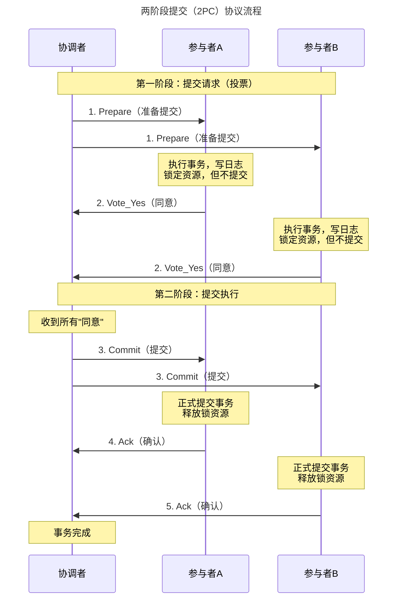
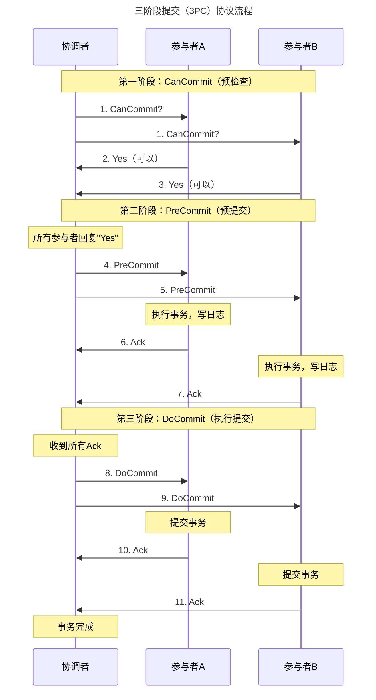
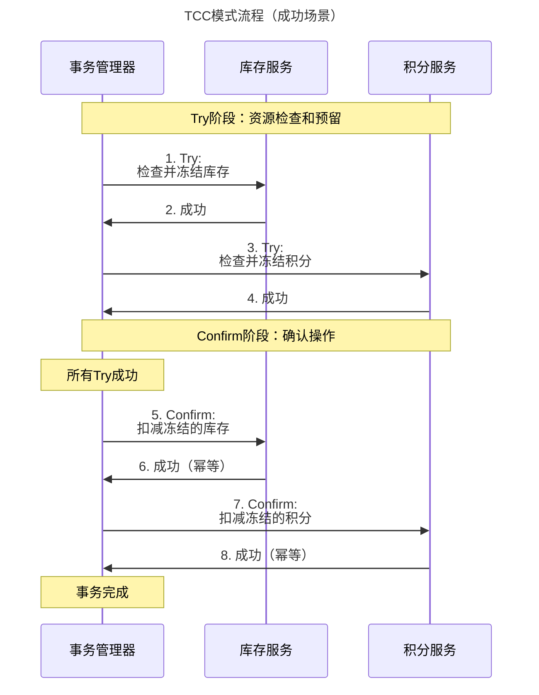
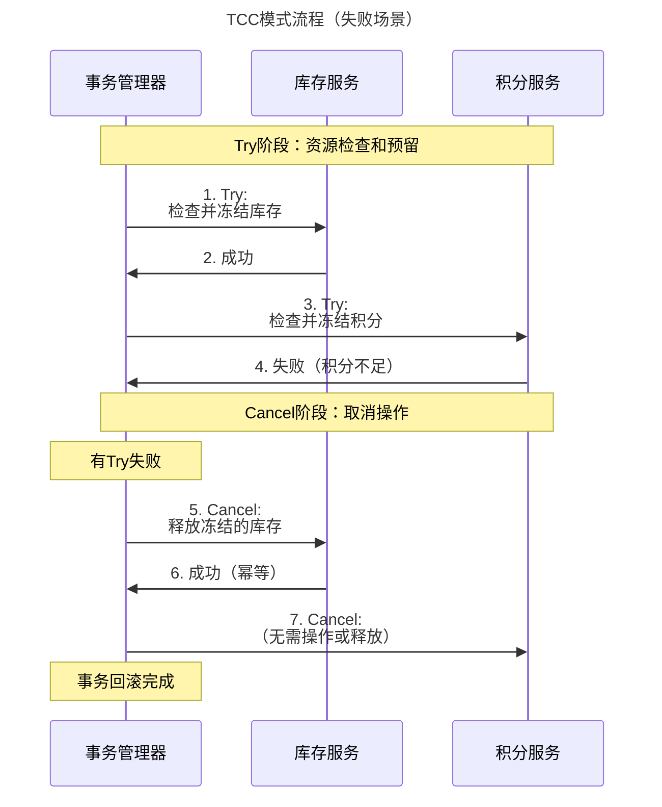
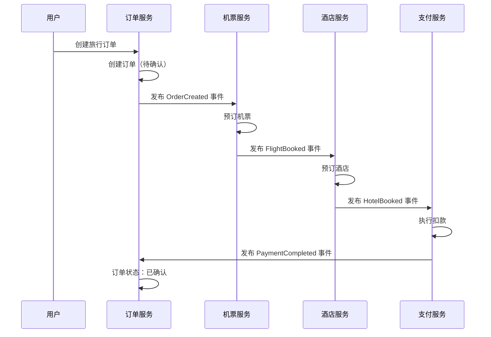
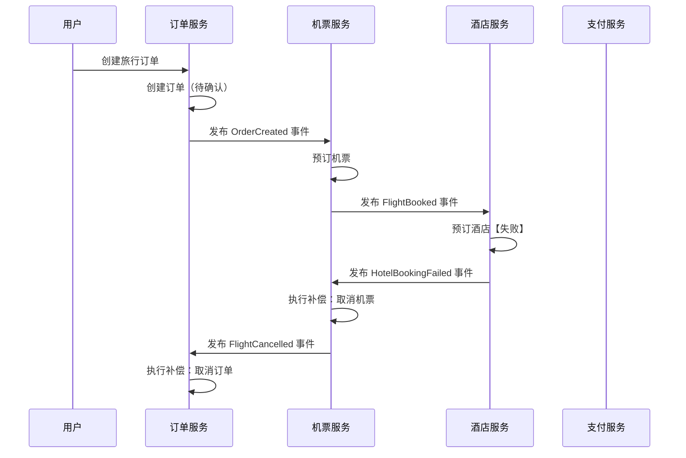
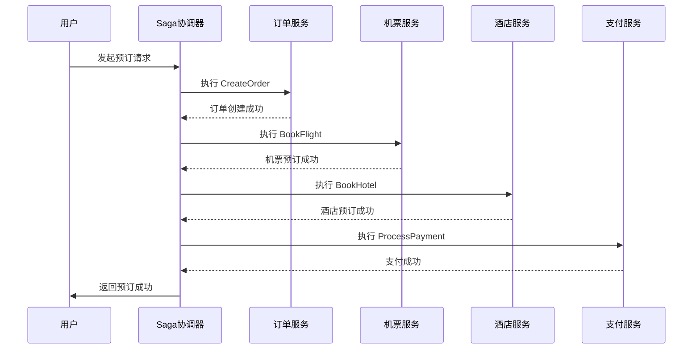
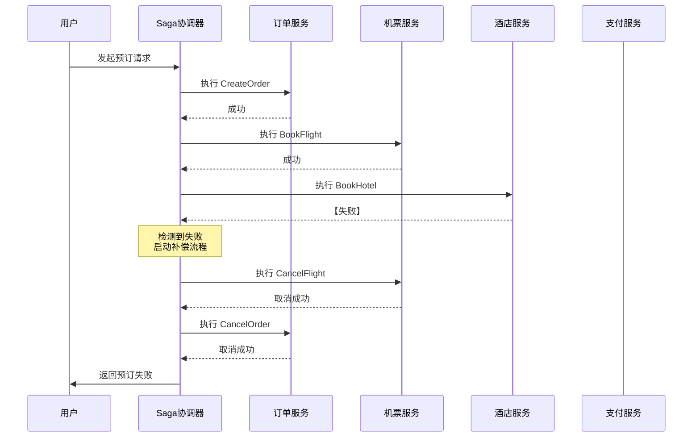

---
category:
  - 分布式系统
tag:
  - 分布式
date: 2025-11-17
star: true
---

# 分布式系统常见概念

## 基本理论

这些理论是理解和设计分布式系统的根本。

### CAP 定理

CAP定理是分布式系统领域最著名的理论，它指出对于一个分布式系统来说，以下三者不可兼得，最多只能同时满足两项：

- **一致性 (C)**：在分布式系统中的所有数据副本，在同一时刻是否具有相同的值。换句话说，每次读取都能获得最新写入的数据。
- **可用性 (A)**：在集群中一部分节点故障后，集群整体是否还能响应客户端的读写请求。
- **分区容错性 (P)**：系统在遇到网络分区（即节点之间无法正常通信）时，仍然能够继续对外提供服务。

#### 核心要点

- **P 是分布式系统的必然选择**：因为网络故障是必然发生的，所以分区容错性 P 是必须保障的。因此，设计系统时其实是在 CP 和 AP 之间做权衡。
- **CP 系统**：当网络分区发生时，为了保证数据一致性，系统会拒绝写入或部分读取请求，从而牺牲可用性。例如：ZooKeeper, HBase, Etcd。
- **AP 系统**：当网络分区发生时，系统仍然提供服务，但返回的数据可能不是最新的（牺牲一致性）。例如：Cassandra, DynamoDB。

#### 简单比喻

- **CP**：如果三人无法全部联系上（网络分区），他们宁愿不做出决策（不可用），也要保证所有人的决策一致。
- **AP**：如果三人无法全部联系上，他们先各自做出决策并执行（可用），但事后可能会出现决策冲突（不一致）。

### BASE 理论

BASE理论是对CAP中AP方案的延伸，是对传统ACID特性（强一致性）在分布式场景下的妥协。它让系统即使出现故障，也能保持“基本可用”。

- **BA - 基本可用**：系统在出现不可预知故障的时候，允许损失部分可用性（如响应时间变长、部分非核心功能不可用），但核心功能仍然可用。
- **S - 软状态**：允许系统中的数据存在中间状态，并且该中间状态不会影响系统的整体可用性。即不同节点的数据副本之间，存在短暂的数据不一致是允许的。
- **E - 最终一致性**：经过一段时间后，所有数据副本最终都会达到一致的状态。这个“一段时间”被称为不一致窗口。

#### BASE vs. ACID

- **ACID**追求强一致性，是数据库领域的基石；
- **BASE**适用于大型分布式系统，通过牺牲强一致性来获得高可用性。

### PACELC 理论

PACELC 理论由 Daniel Abadi 在 2012 年提出，它是对 CAP 定理的补充和扩展。

#### 名称解析

PACELC 这个名称本身就揭示了其核心思想：

- **PAC**：如果发生分区（**P**artition），系统必须在可用性（**A**vailability）和一致性（**C**onsistency）之间选择。（这部分与 CAP 定理相同）
- **ELC**：否则（**E**lse），当系统正常（无分区）运行时，系统必须在延迟（**L**atency）和一致性（**C**onsistency）之间选择。

这个理论的关键洞见是：**即使在完美无缺的网络中，一致性和性能（延迟）之间也存在根本性的权衡**。

#### 核心概念拆解

##### 分区（P）场景

这部分与 CAP 定理完全一致。当网络发生分裂，节点之间无法通信时，系统必须做出选择：

- **选择 A（可用性）**：允许所有节点继续处理读写请求，但这会导致数据不一致。例如，一个电商网站允许用户在分区期间继续下单，但库存数据可能不准。
- **选择 C（一致性）**：为了保证所有节点数据一致，系统必须停止部分或全部写入操作，或者返回错误，从而牺牲可用性。例如，银行的转账服务在分区期间可能会暂时无法使用。

##### 正常（Else）场景 - L（延迟） vs C（一致性）

这是 PACELC 理论的精髓。在无分区时，我们依然面临挑战：如何以低延迟的方式维护数据的多副本一致性？

- **强一致性（C）的代价**：要保证强一致性（如线性一致性），通常需要一种**同步复制**协议。例如，当用户写入数据时，系统必须等待所有副本或大多数副本（如使用
  Quorum 机制）都确认写入成功后，才能向客户端返回成功。这个等待过程会显著增加请求的延迟（L），尤其是在跨地域部署的系统中。
- **低延迟（L）的代价**
  ：为了追求极致的低延迟，系统可以采用**异步复制**。主节点在写入本地后立即返回成功给客户端，然后在后台异步地将数据同步到其他副本。这带来了最终一致性，意味着在某个极短的时间窗口内，不同副本的数据可能是不一致的。

#### 一个简单的比喻

想象一个跨国公司的团队：

- **PAC 场景（网络中断）**：总部和分部的电话线断了。
    - **选择 A**：两边团队都继续做决策，但可能导致决策冲突（不一致）。
    - **选择 C**：任何重大决策都必须暂停，直到通讯恢复（不可用）。
- **ELC 场景（正常办公）**：电话线是通的。
    - **选择 C（强一致性）**：每做一个决策，都必须立即召开全球电话会议，等所有负责人确认同意后才执行。决策过程慢（高延迟），但保证了所有人意见统一。
    - **选择 L（低延迟）**：总部先做决策并执行，然后发邮件通知分部。决策过程快（低延迟），但分部的同事在收到邮件前可能不了解最新情况（暂时不一致）。

#### PACELC 的四种系统分类

根据在 PAC 和 ELC 两个维度上的选择，可以将分布式系统大致分为四类：

- **PA/EC**：当分区时选择可用性，正常时选择一致性。
    - **描述**：这种系统比较少见。它在分区时为了可用性牺牲一致性（成为 AP 系统），但在正常运行时却为了强一致性而忍受高延迟。这显得有些矛盾，因为正常运行时的高延迟可能还不如分区时直接选择 CP。
- **PA/EL**：当分区时选择可用性，正常时选择低延迟。
    - **描述**：这是典型的最终一致性系统。它们在任何时候都优先考虑性能和可用性，接受暂时的不一致。
    - **例子**：DynamoDB（默认配置）、Cassandra、Riak。这些系统通常通过“读修复”、“提示移交”等机制在后台解决不一致问题。
- **PC/EC**：当分区时选择一致性，正常时也选择一致性。
    - **描述**：这是典型的强一致性系统。它们始终将数据一致性放在首位，为此不惜在分区时牺牲可用性，在正常运行时牺牲延迟。
    - **例子**：Bigtable、HBase、传统关系数据库（如 MySQL 集群，使用同步复制）、MongoDB（使用强一致性配置）。像 Google Spanner 这样的系统通过精密时钟（TrueTime）等技术，在保证强一致性的同时尽力优化延迟。
- **PC/EL**：当分区时选择一致性，正常时选择低延迟。
    - **描述**
      ：这种系统理论上存在，但实践中很难实现。它要求在分区时保持一致性（CP），这意味着需要同步通信，但在正常运行时又想实现低延迟，这通常需要异步通信。这两者是矛盾的。有些系统可能通过非常复杂和特定的优化来接近这个目标，但非常困难。

#### 总结与意义

- **PACELC 是 CAP 的扩展**：它指出了在分布式系统设计的两个核心场景（分区和正常）下都存在关键的权衡。
- **核心新观点**：在无分区的正常状态下，一致性（C）和延迟（L）之间存在不可调和的矛盾。强一致性必然带来更高的延迟。
- **指导系统选型与设计**：PACELC 为架构师提供了一个更全面的框架来思考和选择数据库或分布式系统。
    - 如果你的应用需要强一致性（如金融系统），就要准备好接受更高的延迟（PC/EC）。
    - 如果你的应用对延迟极其敏感，并能容忍短暂的不一致（如社交媒体的点赞数），那么可以选择牺牲一致性来换取低延迟（PA/EL）。
- **没有完美的选择**：和 CAP 一样，PACELC 告诉我们，不存在“全能”的系统。所有的选择都是在特定业务场景下的权衡（Trade-off）。理解这些权衡，是设计和选用分布式系统的关键。

## 分布式共识算法

### 核心概念与分类

- **分布式共识**：一组节点（或进程）对某个提案达成一致意见的过程。

- **容错类型**
  - **崩溃容错**：系统只能容忍节点发生崩溃（Crash），即停止响应，但不会作恶。这是大多数经典算法的前提。
  - **拜占庭容错**：系统可以容忍节点发生任意类型的故障，包括恶意行为、发送错误信息等（即“拜占庭将军问题”）。这更难，性能开销也更大。
- **CAP定理**：一个分布式系统不可能同时满足一致性、可用性和分区容错性。共识算法通常优先保证一致性和分区容错性，在出现网络分区时牺牲可用性。

#### 基于容错类型，我们可以将共识算法分为两大类

- **CFT（崩溃容错，Crash Fault Tolerance）类算法**：性能高，常用于数据中心内部。
- **BFT（拜占庭容错，Byzantine Fault Tolerance）类算法**：更安全，能抵御恶意节点，常用于公链、联盟链等不信任环境。

### 经典CFT（崩溃容错）算法

这类算法假设节点不会恶意篡改数据，只会崩溃。

1. **Paxos 家族**

Paxos是共识算法的理论基础，由Leslie Lamport提出，以晦涩难懂著称。
- **核心思想**：通过“提案编号”和“多数派接受”来保证安全性。分为准备阶段和接受阶段。
- **角色**：Proposer（提案者）、Acceptor（接受者）、Learner（学习者）
- **优点**：理论完备，是分布式共识的基石。
- **缺点**：极其难以理解和工程实现。活锁问题（多个Proposer竞争可能导致永远无法达成共识）。
- **变种**：
    - Multi-Paxos：通过选举一个稳定的Leader来优化基本Paxos，避免活锁，提升性能，使其可用于日志复制。这是实践中更常用的形式。

2. **Raft**

为了克服Paxos的复杂性而设计，目标是易于理解。
- **核心思想**：通过明确的Leader选举和日志复制来管理共识。
- **角色**： Leader（领导者）、Follower（跟随者）、Candidate（候选人）
- **工作流程**：
    - **Leader选举**：集群启动或Leader失效时，Follower会超时并成为Candidate，发起投票，获得多数票的节点成为新Leader。
    - **日志复制**
      ：所有客户端请求都发送给Leader，Leader将其追加到自己的日志中，然后并行地复制到所有Follower。当多数派Follower确认后，Leader提交该日志条目，并通知Follower应用该条目。
- **优点**：
    - 易于理解：模块化设计（Leader选举、日志复制、安全性）。
    - 易于实现：有很多成熟的开源实现（如etcd的Raft库）。
- **缺点**：
    - 强依赖Leader，在网络分区时，如果出现“脑裂”（两个多数派），需要额外的机制（如PreVote）来缓解。
    - 仍然是CFT，无法应对恶意节点。
- **应用**：Kubernetes（etcd）、Consul、TiDB等。

3. **ZAB（ZooKeeper Atomic Broadcast）**

为Apache ZooKeeper设计的核心共识协议，与Raft非常相似，但独立发展。
- **核心思想**：类似于Raft，也分为Leader选举（Fast Leader Election）和原子广播两个阶段。
- **与Raft的区别**：
    - 选举机制：ZAB的Fast Leader Election设计不同，它要求新Leader拥有集群中最新的数据（最高的ZXID）。
    - 日志提交：在细节上有一些差异，但最终一致性保证是相同的。
- **优点**：在ZooKeeper中久经考验，高性能。
- **应用**：Apache ZooKeeper。

### 算法对比

| 算法       | 容错类型 | 性能  | 通信复杂度 | 优点        | 缺点          | 典型应用                      |
|----------|------|-----|-------|-----------|-------------|---------------------------|
| Paxos    | CFT  | 高   | O(N²) | 理论基石      | 极其复杂，难实现    | Chubby, 早期数据库             |
| Raft     | CFT  | 高   | O(N)  | 易于理解实现    | 非拜占庭容错      | etcd, Consul, TiDB        |
| ZAB      | CFT  | 高   | O(N)  | 在ZK中久经考验  | 与ZK强耦合      | ZooKeeper                 |
| PBFT     | BFT  | 中   | O(N²) | 首个实用BFT   | 规模扩展性差      | 早期联盟链                     |
| PoW      | BFT  | 极低  | O(N)  | 去中心化，安全   | 耗能，性能低      | Bitcoin, Ethereum 1.0     |
| PoS/DPoS | BFT  | 中-高 | O(N)  | 节能，高效     | 富者愈富，依赖初始分配 | Ethereum 2.0, EOS, Cosmos |
| HotStuff | BFT  | 高   | O(N)  | 线性，视图更换简单 | 相对较新        | Diem                      |

## 分布式存储与数据库

### 数据分区

将大规模数据集水平切分，分布到不同的节点上。目的是解决单机存储容量和性能瓶颈。常见的分区策略有：范围分区、哈希分区。

#### 范围分区

- **原理**：基于键的自然顺序（如数字、字母、时间戳）将数据划分为连续的范围。每个分区负责一个特定的键范围。
- **示例**：[A-F), [F-M), [M-Z)。
- **优点**
    - 支持高效的范围查询：因为相邻的数据很可能存储在同一个或相邻的分区上。
    - 易于管理：分区逻辑直观。
- **缺点**
    - 容易产生数据倾斜（热点）：如果某些范围的数据访问特别频繁（如最新的时间戳范围），或者数据量特别大，会导致负载不均衡。
    - 需要精心设计分区键：选择不当的分区键会导致严重的性能问题。

#### 哈希分区

- **原理**：使用一个哈希函数计算每个键的哈希值，然后根据这个哈希值决定数据属于哪个分区。
- **示例**：`hash(key) % N`（N为分区数）。
- **优点**
    - 数据分布均匀：可以很好地打散数据，避免热点，实现负载均衡。
- **缺点**
    - 不支持高效的范围查询：因为哈希函数破坏了键的自然顺序，相邻的键会被散列到完全不同的分区。
- **重要变体**
    - **一致性哈希**：解决了传统哈希分区在扩缩容时数据大规模迁移的问题。
    - **虚拟节点**：在一致性哈希的基础上，通过一个物理节点承载多个虚拟节点，解决了数据倾斜问题。

#### 目录分区

- **原理**：使用一个独立的、高可用的查询表来维护“键 -> 分区/节点”的映射关系。
- **工作流程**：客户端先查询目录服务，得到数据所在的位置，然后再去访问对应的节点。
- **优点**
    - 极高的灵活性：可以手动指定任何键到任何分区的映射，实现复杂的路由逻辑和负载均衡。
    - 易于动态调整：迁移数据时，只需更新目录即可。
- **缺点**
    - 存在单点瓶颈和故障风险：目录服务本身可能成为性能和可用性的瓶颈，需要精心设计其高可用方案（如使用ZooKeeper、Etcd等）。

#### 常用分布式系统的分区策略举例

下面我们看看这些理论如何在实践中应用。

| 系统                      | 主要分区策略       | 详细说明与特点                                                                                                                                                 |
|-------------------------|--------------|---------------------------------------------------------------------------------------------------------------------------------------------------------|
| Apache HBase            | 范围分区         | - 表在创建时预设一个或多个初始分区键。 - 数据按行键的字典序排列，划分成多个 Region。 - 当一个 Region 变得太大时，会自动在中间分裂成两个新 Region。 - 优点：完美支持按行键的范围扫描。                                    |
| Apache Kafka            | 分区策略可配置      | - 生产者发送消息时，通过 Partitioner 决定消息进入哪个分区。 - 默认策略：若指定了 Key，则对 Key 进行哈希；若未指定 Key，则采用轮询。 - Key 哈希：保证同一 Key 的消息总是进入同一分区，从而实现分区内有序。 - 轮询：实现尽可能均匀的负载。    |
| Google Bigtable / HBase | 范围分区         | 作为 HBase 的鼻祖，其 Tablet 就相当于 HBase 的 Region，同样是范围分区。                                                                                                      |
| Amazon DynamoDB         | 一致性哈希 + 虚拟节点 | - 分区键的哈希值决定其在哈希环上的位置。 - 使用大量虚拟节点来确保数据均匀分布和负载均衡。 - 可以单独指定分区键，或使用分区键+排序键的组合来实现同一分区内的范围查询。                                                           |
| Apache Cassandra        | 一致性哈希 + 虚拟节点 | - 与 DynamoDB 一脉相承，同样使用一致性哈希环。 - 每个节点负责环上的一段令牌范围。 - 虚拟节点是其默认和推荐的方式，极大地简化了运维（如替换一个节点，其虚拟令牌会均匀地分散到其他节点）。                                             |
| MongoDB                 | 范围分区 或 哈希分区  | - 分片键的选择决定了分区策略。 - 基于范围的分片：使用分片键的值将数据划分为连续的范围。适合范围查询。 - 基于哈希的分片：计算分片键的哈希值。适合写吞吐量高且无范围查询需求的场景，能保证数据均匀分布。 - 使用一个配置服务器（目录）来维护分片信息。                |
| Redis Cluster           | 哈希槽          | - 将整个 Keyspace 划分为固定的 16384 个槽。 - 使用 CRC16(key) mod 16384 计算键所属的槽。 - 将槽分配给集群中的主节点。可以看作是预分区的、可管理的哈希分区，兼具了哈希的均匀性和目录的灵活性。                            |
| Elasticsearch           | 哈希分区（默认）     | - 使用文档 _id 的哈希值来决定分配到哪个主分片。 - 路由公式：shard_num = hash(_routing) % num_primary_shards（默认 _routing 就是 _id）。 - 用户也可以在索引时指定 routing 参数，将相关数据强制路由到同一个分片。 |
| MySQL Sharding / Vitess | 目录分区（常见于应用层） | - 在应用层或中间件层（如 Vitess）维护一个分片映射表。 - 根据用户 ID、租户 ID 等业务键，查询映射表找到对应的 MySQL 实例。 - 提供了最大的灵活性，但需要自行实现目录服务的高可用和缓存。                                         |

**总结与选择建议**

| 策略   | 适用场景                                                              | 不适用场景                  |
|------|-------------------------------------------------------------------|------------------------|
| 范围分区 | 需要高效范围查询（如按时间范围查询日志、按字母顺序查询名单）。例如：HBase, Bigtable。                | 写热点严重或数据分布极度不均匀的场景。    |
| 哈希分区 | 写吞吐量高、要求数据均匀分布、且不需要范围查询的场景。例如：Cassandra, DynamoDB, Redis Cluster。 | 需要按主键进行范围扫描的场景。        |
| 目录分区 | 数据分布有复杂的业务规则，或需要极致的灵活性和控制力。例如：多租户SaaS应用、自定义分片逻辑。                  | 对性能要求极高，希望避免目录查询开销的场景。 |

**现代系统的趋势是融合多种策略：**

- **MongoDB** 让你在创建分片键时直接选择范围或哈希。
- **DynamoDB/Cassandra** 使用哈希分区保证分布均匀，同时允许你定义排序键来在分区内进行范围查询。
- **Redis Cluster** 的哈希槽是一种工程上的优化，在哈希分区的基础上引入了可管理的抽象层。

#### 一致性哈希算法

##### 1. 它要解决什么问题？

在理解一致性哈希之前，我们需要先了解它所替代的传统方案及其缺陷。

**传统方案：模哈希（Hash Mod）**

假设我们有：

- 一个缓存集群，包含 N 台服务器。
- 一个请求的键为 `key`。

我们通过 `hash(key) % N` 来计算这个键应该被路由到哪台服务器上。

**缺陷：**
当集群需要扩容（增加服务器）或缩容（减少服务器）时，N 发生了变化，变为 N'。这会导致 `hash(key) % N` 和 `hash(key) % N'`
的结果几乎完全不同。

**后果：**
绝大多数数据的映射关系都失效了，需要大规模迁移。这在一个大型分布式系统中是灾难性的，会导致缓存雪崩、数据库压力激增等问题。

##### 2. 一致性哈希的核心思想

一致性哈希通过一个全新的结构——哈希环，巧妙地解决了这个问题。

它的核心思想不是将数据映射到具体的服务器，而是将服务器和数据都映射到同一个抽象的环上。

**第1步：构建哈希环**
想象一个圆环，其取值范围通常是 0 到 2^32 - 1（一个32位的哈希空间）。

这个环的起点 0 和终点 2^32 - 1 连接在一起。

**第2步：将服务器映射到环上（Node A, B, C）**
使用一个哈希函数（如 `hash(服务器IP或主机名)`）来计算每个服务器的哈希值。

这个哈希值决定了服务器在环上的位置。

**第3步：将数据对象映射到环上（Object 1, 2, 3, 4）**
使用同一个哈希函数计算数据的键（`hash(key)`），确定其在环上的位置。

**第4步：为数据寻找所属服务器**
从数据在环上的位置出发，沿顺时针方向寻找，遇到的第一个服务器，就是该数据所属的服务器。

根据这个规则：

- Object 1 -> Node A
- Object 2 -> Node B
- Object 3 -> Node C
- Object 4 -> Node A

##### 3. 一致性哈希如何解决扩缩容问题？

现在，我们来看一致性哈希的魔力所在。

**场景：服务器扩容（增加 Node D）**
假设我们在环上增加一台新的服务器 Node D。

现在，只有一部分数据的映射关系会受到影响：

- 原来映射到 Node B 的数据中，只有介于 Node D 和 Node B 之间的那一部分需要重新映射到 Node D。
- 其他所有数据（Object 1, Object 4 -> Node A; Object 3 -> Node C）的映射关系完全不受影响。

**结论：**
当增加或删除一个节点时，只会影响环上相邻节点的数据，而不会影响全局。这极大地减少了数据迁移的量。

##### 4. 一致性哈希的挑战与优化：虚拟节点

基本的一致性哈希存在一个明显问题：数据倾斜。

如果服务器在环上的分布不均匀，可能会导致大部分数据都集中在某一台服务器上，而其他服务器很空闲。

为了解决这个问题，引入了 **虚拟节点** 的概念。

**虚拟节点的原理：**

- 不再将每个物理服务器映射到环上的一个点。
- 而是为每个物理服务器创建多个虚拟节点，并将这些虚拟节点随机地分布到哈希环上。
- 一个数据对象先映射到一个虚拟节点，再由虚拟节点对应到其物理服务器。

例如：

- 物理服务器 Node A 可以有虚拟节点 A-1, A-2, A-3 ...
- 物理服务器 Node B 可以有虚拟节点 B-1, B-2, B-3 ...

将这些虚拟节点散列到环上。

**虚拟节点的优点：**

- **平衡数据分布：** 即使物理服务器很少，大量的虚拟节点也能让环上的分布更加均匀，从而让每个物理服务器承担大致均衡的负载。
- **便于权重调整：** 如果某台物理服务器性能更好，可以为其分配更多的虚拟节点，让它承担更多的数据。

**总结：一致性哈希的优点**

- **可扩展性：** 增删节点时，只影响环上相邻的节点，数据迁移量最小化。这是其最核心的优势。
- **容错性：** 当某个节点宕机时，原本属于它的数据会顺时针转移到下一个节点，不会导致整个集群不可用。
- **负载均衡：** 通过引入虚拟节点，可以有效地让数据在各个服务器间均匀分布。

### 数据复制（副本）

将同一份数据拷贝到多个节点上。目的是提高系统的可用性和读性能。

| 协议类型    | 常见具体实现算法或机制                                             | 核心原理简介                                                            | 典型系统举例                                      |
|---------|---------------------------------------------------------|-------------------------------------------------------------------|---------------------------------------------|
| 主从复制    | 基于日志（WAL, Row-based Logical Log）、半同步复制、并行复制             | 主节点处理所有写入，并通过日志（如二进制日志、逻辑日志）将数据变更**异步或同步**地复制到一个或多个从节点。           | MySQL, Redis, Informix                      |
| 多主复制    | 冲突自由/收敛的数据类型（CRDTs）、冲突解决策略（如"最后写入获胜"、自定义逻辑）             | 多个主节点均可独立接受写操作，并通过异步协调机制解决数据冲突，确保数据最终一致。                          | Eureka Server, Informix (双主模式)              |
| 无主复制    | Quorum NWR机制、读修复（Read Repair）、反熵（Anti-Entropy）、Gossip协议 | 客户端直接向多个副本写入，通过法定节点数（Quorum）确保一致性；通过读修复和反熵过程修复数据不一致。              | Amazon Dynamo, Apache Cassandra, Riak       |
| 基于共识的复制 | Paxos、Raft、ZAB                                          | 通过投票机制使分布式系统中的多个节点对某个值（或状态）达成一致，通常需要多数派（Majority）确认，能容忍一定数量的节点故障。 | TiDB (Raft), ZooKeeper (ZAB), Neo4j (Paxos) |

#### 深入了解核心算法

- **核心机制**：日志的传递与重放。
- **示例**：MySQL中，主节点将数据变更写入二进制日志（binlog），从库的I/O线程获取这些日志并写入本地中继日志（relay
  log），最后由SQL线程重放，实现数据同步。
- **优化机制**：
    - **半同步复制**：确保事务的binlog至少传输到一个从库才返回，平衡一致性与性能。
    - **并行复制**：从库多线程应用binlog，减少延迟。

**多主复制**

- **主要挑战**：数据冲突。
- **解决策略**：
    - **最后写入获胜（LWW）**：常见的冲突解决规则。
    - **自定义逻辑**：根据业务需求在应用层自定义冲突解决策略。

**无主复制**

- **核心机制**：Quorum NWR机制。
- **参数定义**：
    - **W**：写成功节点数。
    - **R**：读成功节点数。
    - **N**：副本总数。
- **规则**：遵循 R + W > N，保证客户端总能读取到最新的数据。
- **修复机制**：
    - **读修复**：在读取时发现并修复旧副本。
    - **反熵**：后台进程异步同步数据差异。

**基于共识的复制**

- **Paxos**
    - **特点**：分布式共识算法的奠基者，理论基础深厚。
    - **缺点**：复杂性高，较难理解和实现。
- **Raft**
    - **设计目标**：易于理解。
    - **核心步骤**：领导者选举、日志复制和安全性。
    - **应用**：广泛应用于各种分布式系统。

#### 如何选择协议与算法

在选择分布式系统中的协议与算法时，可以遵循以下思路：

1. **明确一致性要求**：
    - **强一致性需求**：如果业务需要强一致性（如金融交易），基于共识的协议（如Raft、Paxos）是首选。
    - **容忍短暂不一致**：如果业务能容忍短暂的不一致（如社交媒体的功能），主从复制、多主复制或无主复制可能更合适。

2. **评估可用性与性能**：
    - **低延迟高吞吐**：强一致性通常以更高的写延迟为代价。如果业务要求低延迟和高吞吐量，可以考虑异步主从复制或无主复制。
    - **高一致性**：如果业务对一致性要求较高，可以选择同步复制或基于共识的协议。

3. **考虑容灾与冲突处理**：
    - **多主复制**：在数据中心故障时，多主复制能提供更好的写入可用性，但必须妥善处理数据冲突。
    - **无主复制**：在节点故障时无需故障切换，架构更简单，但需要通过Quorum机制确保数据一致性，并通过读修复和反熵过程修复数据不一致。

通过以上步骤，可以根据业务的具体需求选择合适的协议和算法。

#### 常见系统策略

| 系统/类别              | 副本模型 | 复制方式与一致性                         | 核心特点                                                                       |
|--------------------|------|----------------------------------|----------------------------------------------------------------------------|
| HDFS               | 主从模型 | 同步复制（强一致性）                       | 管道式地同步复制到多个DataNode。简单可靠。                                                  |
| MongoDB            | 主从模型 | 基于类Raft的同步复制（写主节点强一致性，读从节点可最终一致） | 副本集是基础架构。写操作进入主节点的oplog，并同步复制到大多数从节点后确认。客户端可配置读偏好，如从主节点读（强一致）或从从节点读（最终一致）。 |
| Kafka              | 主从模型 | 异步 / 同步复制（可配置）                   | 通过 ISR 列表管理同步副本，平衡了一致性和性能。                                                 |
| Cassandra / Dynamo | 无主模型 | Quorum机制（最终一致性，可调至强一致性）          | 任何节点都可处理读写请求。通过 W + R > N 来保证读写一致性。                                        |
| Etcd / ZooKeeper   | 主从模型 | 基于共识的同步复制（强一致性）                  | 所有写请求都必须经过Leader，提供线性一致性。                                                  |
| Redis              | 主从模型 | 异步复制（最终一致性），Gossip协议             | 性能好，但故障时可能丢失数据。                                                            |

### 通信与协调

- **RPC (远程过程调用)**：它让开发者可以像调用本地函数一样调用远程服务，是构建分布式服务的基石。**gRPC** 是当前最流行的 RPC
  框架之一。

- **消息队列**：异步通信的典范，能够解耦服务，提供削峰填谷、异步处理、最终一致性等能力。常见的消息队列有：
    - **Kafka**
    - **RabbitMQ**
    - **RocketMQ**

- **协调服务**：提供分布式锁、领导者选举、配置管理、服务发现等基础功能。典型的协调服务包括：
    - **ZooKeeper**
    - **Etcd**

## 核心挑战与应对模式

在设计和使用分布式系统时，我们必须直面这些挑战。

### 1. 网络问题

网络是不可靠的，这是所有分布式问题的根源。

- **网络分区**：部分节点之间网络中断，形成“孤岛”。
- **延迟**：数据在节点间传输需要时间。
- **丢包**：数据包可能在传输过程中丢失。

**应对措施**：

- 超时与重试机制
- 心跳检测
- 幂等性设计

### 2. 一致性模型

根据业务需求选择不同强度的一致性。

- **强一致性**：任何时刻，任何节点读取的数据都是最新的。实现代价高，影响性能。
- **弱一致性**：系统不保证读取到最新数据。
- **最终一致性**：弱一致性的特例，保证在没有新更新的情况下，数据最终会一致。
- **读写一致性**：保证用户总能读到他自己刚刚提交的数据。
- **会话一致性**：在同一用户会话内，保证读写一致性。

### 3. 容错与高可用

系统在部分组件故障时，依然能持续提供服务的能力。

- **冗余**：通过复制（数据、服务）来消除单点故障。
- **故障检测**：通过心跳等机制快速发现故障节点。
- **故障恢复**：当主节点故障时，能快速选举出新的主节点（领导者选举）。

### 4. 分布式事务

如何在多个服务/数据库中保证操作的原子性（要么全做，要么全不做）是一个巨大挑战。

- **两阶段提交 (2PC)**：一个协调者协调所有参与者进行投票和提交。它是一个阻塞式协议，存在单点问题和性能瓶颈。
- **三阶段提交 (3PC)**：2PC 的改进版，引入了超时机制来减少阻塞，但更复杂。
- **TCC (Try-Confirm-Cancel)**：一种业务补偿型事务。通过代码在应用层实现，分为尝试、确认、取消三个阶段。
- **SAGA**：将一个长事务拆分为多个本地事务，每个事务都有对应的补偿操作。如果某个步骤失败，则按顺序执行前面所有步骤的补偿操作，回滚整个事务。

#### 两阶段提交（2PC - Two-Phase Commit）

2PC是最经典、最广为人知的分布式事务协议，它通过引入一个协调者（Coordinator）来管理多个参与者（Participants）的事务状态。

**核心角色**

- **协调者（Coordinator）**：事务的发起者和管理者，负责最终决定提交或回滚。
- **参与者（Participant）**：事务的实际执行者，通常是各个独立的数据库或服务。

**执行流程**

1. **第一阶段：提交请求阶段（Voting Phase）**
    - 协调者向所有参与者发送“准备提交（Prepare）”请求，并附带事务内容。
    - 每个参与者执行事务操作（例如更新数据），但不提交（Commit）。它会将Undo和Redo信息写入日志。
    - 参与者根据自身执行情况，向协调者反馈响应：
        - **同意（Yes）**：事务执行成功，已进入就绪状态。
        - **中止（No）**：事务执行失败，或出现其他问题。

2. **第二阶段：提交执行阶段（Commit Phase）**

协调者根据第一阶段的投票结果做出决策：

- **情况A：所有参与者都返回“同意”**
    - 协调者向所有参与者发送“提交（Commit）”命令。
    - 参与者收到Commit后，正式提交事务，释放锁资源。
    - 参与者完成提交后，向协调者发送“确认（Ack）”消息。
    - 协调者收到所有参与者的Ack后，标识整个分布式事务完成。
- **情况B：任何一个参与者返回“中止”，或协调者等待超时**
    - 协调者向所有参与者发送“回滚（Rollback）”命令。
    - 参与者收到Rollback后，利用第一阶段写入的Undo日志进行回滚，释放锁资源。
    - 参与者完成回滚后，向协调者发送“确认（Ack）”消息。
    - 协调者收到所有参与者的Ack后，标识整个分布式事务已回滚。

**优缺点**

- **优点**
    - **强一致性**：保证了所有节点数据状态的一致。
    - **原理简单**，易于理解。

- **缺点**
    - **同步阻塞**：在参与者等待协调者命令期间，该参与者持有的资源锁不会被释放，其他访问该资源的操作会被阻塞，影响系统吞吐量。
    - **单点问题**：协调者至关重要，一旦协调者宕机，整个系统会处于阻塞状态（参与者会一直等待命令）。
    - **数据不一致**：在第二阶段，如果只有部分参与者收到了Commit命令并执行，而其他参与者因网络问题没有收到，就会导致数据不一致。（尽管有日志恢复机制，但很复杂）。
    - **保守性**：任何节点失败（包括协调者）都会导致事务回滚，没有容错机制。

#### 三阶段提交（3PC - Three-Phase Commit）

3PC是2PC的改进版，旨在解决2PC的同步阻塞和单点问题。它引入了超时机制和一个额外的阶段。

**执行流程**

**第一阶段：CanCommit**

1. 协调者向所有参与者发送CanCommit请求。
2. 参与者评估自身状况（如资源、网络是否正常），如果可以提交则返回Yes，否则返回No。
3. 这一阶段不执行事务，也不加锁，只是一个“预检查”。

**第二阶段：PreCommit**

1. 协调者根据第一阶段的响应做出决策：
    - 如果所有参与者返回Yes：协调者发送PreCommit命令。参与者执行事务操作（写Undo/Redo日志），但不提交。
    - 如果有参与者返回No或超时：协调者发送Abort命令，事务中止。

**第三阶段：DoCommit**

1. 协调者根据第二阶段的执行情况做出最终决策：
    - 如果所有参与者在第二阶段都成功执行了PreCommit，协调者发送DoCommit命令。参与者正式提交事务。
    - 如果协调者没有收到某个参与者的PreCommit响应（超时），它会发送Abort命令。

**关键改进：超时机制**

在3PC中，参与者在PreCommit阶段后，如果长时间没有收到协调者的DoCommit或Abort命令，它会默认执行提交。这是因为能够到达PreCommit阶段，说明所有参与者都已经确认自己可以提交，并且成功执行了预备操作，此时大概率是协调者出了问题，因此选择提交是合理的。

**优缺点**

**优点：**

- 降低了阻塞范围。
- 通过在参与者引入超时机制，部分解决了单点故障问题。

**缺点：**

- 引入了额外的网络通信开销。
- 依然可能存在数据不一致。例如，在DoCommit阶段，由于网络分区，部分参与者收不到命令而超时提交，另一部分参与者则收到Abort而回滚。

#### TCC（Try-Confirm-Cancel）

TCC是一种业务层面的分布式事务解决方案，它将一个完整的业务逻辑拆分成三个操作，由业务代码实现。

**核心思想**
“与其让数据库帮你回滚，不如你自己实现回滚的逻辑”。

**三个阶段**

1. **Try（尝试）**
    - 完成所有业务的检查，并预留必要的业务资源。
    - 例如，在下单场景中：
        - **库存服务**：检查库存是否充足，然后将可销售库存-1，预占库存+1。
        - **积分服务**：检查积分是否足够，然后冻结要抵扣的积分。
        - **资金服务**：检查账户余额，然后冻结要支付的金额。
    - Try阶段成功后，整个系统处于一个“中间状态”，资源已被预留但未最终消耗。

2. **Confirm（确认）**
    - 如果所有参与者的Try都成功了，事务管理器会调用每个服务的Confirm接口。
    - Confirm使用Try阶段预留的资源，进行真正的业务操作。Confirm必须保证幂等性。
    - 例如：
        - **库存服务**：将预占库存-1。
        - **积分服务**：将冻结的积分扣除。
        - **资金服务**：将冻结的金额扣除。

3. **Cancel（取消）**
    - 如果任何一个参与者的Try阶段失败，事务管理器会调用所有已成功Try的服务的Cancel接口。
    - Cancel释放Try阶段预留的资源。Cancel也必须保证幂等性。
    - 例如：
        - **库存服务**：将预占库存-1，可销售库存+1（恢复）。
        - **积分服务**：解冻冻结的积分。
        - **资金服务**：解冻冻结的金额。

**优缺点**

- **优点**
    - **性能好**：在Try阶段就完成了资源锁定和检查，Confirm/Cancel执行很快。
    - **数据最终一致性**：通过业务逻辑保证。
    - **适用于对性能要求高、执行时间较长的业务场景**。

- **缺点**
    - **业务侵入性非常强**：需要为每个业务逻辑设计Try、Confirm、Cancel三个接口，开发和维护成本高。
    - **需要保证Confirm和Cancel操作的幂等性**，以及空回滚、防悬挂等复杂问题。

#### SAGA

Saga 的核心思想是：“以退为进”。

- 拆分大事务：将一个庞大的分布式事务 T 拆分成一系列前后相连的本地子事务（Step），记为 T1, T2, T3, ..., Tn。每个本地事务 Ti 都会更新数据库并持久化结果。

- 补偿机制：为每一个子事务 Ti 设计一个对应的补偿操作 Ci。补偿操作 Ci 的语义是撤销 Ti 已经完成的工作（比如，Ti 是创建订单，Ci 就是取消订单；Ti 是扣减库存，Ci 就是恢复库存）。

##### Saga 的协调模式**

**协同式（Choreography）— “事件驱动，各自为政”**

在这种方式下，没有中央协调器。每个服务在执行完本地事务后，会发布一个事件到消息中间件（如 Kafka,
RabbitMQ），其他服务监听这些事件并决定是否执行自己的任务或补偿。

**示例：旅行预订**

- **开始**：用户发起一个“预订旅行”请求。
- **T1**：订单服务创建一个状态为“待确认”的订单，并发布 `OrderCreated` 事件。
- **T2**：机票服务监听到事件，预订机票，发布 `FlightBooked` 事件。
- **T3**：酒店服务监听到事件，预订酒店，发布 `HotelBooked` 事件。
- **T4**：支付服务监听到事件，执行扣款，发布 `PaymentCompleted` 事件。
- **T5**：订单服务监听到所有成功事件，将订单状态更新为“已确认”。

如果失败怎么办？（例如酒店预订失败）

- **T3 失败**：酒店服务预订失败，发布 `HotelBookingFailed` 事件。
- **C2**：机票服务监听到失败事件，执行补偿操作：取消已预订的机票。
- **C1**：订单服务监听到失败事件，将订单状态更新为“已取消”。

**优点**

- 简单，无需中央协调器。
- 松耦合，服务之间通过事件通信。

**缺点**

- 业务流程难以理解和调试。
- 可能存在循环依赖的风险。
- 事件混乱时，难以管理。

**编排式（Orchestration）— “中央指挥，统一调度”**

在这种方式下，有一个中央协调器（Orchestrator）来负责指挥整个 Saga 的执行。协调器以命令/响应的方式调用各个服务。

**示例：同样的旅行预订**

- **开始**：用户发起请求，Saga 协调器被启动。
- **命令**：协调器向订单服务发送 `CreateOrder` 命令。
- **成功**：订单服务返回成功。
- **命令**：协调器向机票服务发送 `BookFlight` 命令。
- **成功**：机票服务返回成功。
- **命令**：协调器向酒店服务发送 `BookHotel` 命令。
- **失败**：酒店服务返回失败。
- **补偿**：协调器开始执行补偿流程：
    - 向机票服务发送 `CancelFlight` 命令。
    - 向订单服务发送 `CancelOrder` 命令。

**成功流程**

**失败流程**

**优点**

- 业务流程集中管理，清晰易懂。
- 依赖关系简单，服务之间无直接调用。
- 更容易处理复杂逻辑和条件分支。

**缺点**

- 引入了单点风险（虽然协调器本身可以做成高可用的）。
- 增加了额外的复杂性（需要实现和管理协调器）。

**Saga 的优缺点总结**

**优点**

- 解决了数据一致性：在无法使用分布式事务的微服务架构中，提供了最终一致性解决方案。
- 高可用性：避免了长时间的资源锁定，提高了系统的吞吐量和响应能力。
- 灵活性强：适用于长时间运行的业务流程。
- 性能非常高，避免了同步阻塞。
- 业务侵入性较低（相比 TCC）。

**缺点**

- 编程模型复杂：开发者必须设计事务和补偿操作，增加了开发心智负担。
- 难以调试：尤其是在协同式下，问题追踪困难。
- 隔离性弱（“脏读”问题）：在 Saga 执行过程中，一个服务完成的更改可能被其他服务或外部查询看到，而此时整个 Saga
  可能尚未完成甚至最终会失败。这被称为“脏读”。解决此问题通常需要采用复杂的方案，如语义锁（将状态标记为“进行中”）。
- 消费者需要保证接口的幂等性，以防止重复消息导致的数据错误。

#### 总结与对比

| 协议   | 一致性       | 性能        | 业务侵入性   | 适用场景                        |
|------|-----------|-----------|---------|-----------------------------|
| 2PC  | 强一致性      | 低（同步阻塞）   | 低（数据库层） | 数据库原生支持，传统企业应用              |
| 3PC  | 强一致性（有瑕疵） | 更低（多一轮通信） | 低（数据库层） | 较少使用，作为2PC的理论改进             |
| TCC  | 最终一致性     | 高         | 非常高     | 对性能要求高，金融、电商等               |
| SAGA | 最终一致性     | 高         | 高       | 互联网主流，适用于链路长、并发高的场景，如订单、积分等 |
| 消息事务 | 最终一致性     | 高         | 中       | 异步处理、日志记录、通知类业务             |

- **追求强一致性，且事务涉及方都是关系型数据库**：可以考虑使用数据库本身支持的XA协议（即2PC的实现）。

- **追求高性能和最终一致性，业务链路复杂**：首选基于消息的最终一致性方案。这是目前最主流的做法。

- **业务非常重要，且对一致性有较高要求，同时有强大的技术团队**：可以考虑TCC方案，它能提供更好的保证和控制力。

### 5. 时钟与顺序

在分布式系统中，很难有一个全局的、精确同步的时钟。

- **物理时钟同步**：如 NTP 协议，但存在毫秒级误差。
- **逻辑时钟**：不关心具体时间，只关心事件的先后顺序。如 Lamport 逻辑时间戳。
- **向量时钟**：逻辑时钟的扩展，可以检测事件之间的因果关系。
- **分布式 ID 生成**：需要生成全局唯一、趋势递增的 ID。如 Snowflake 算法。