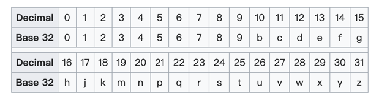

---
category:
  - 空间
tag:
  - 算法
date: 2024-6-16
---

# 地理空间邻近算法：GeoHash

## 问题背景

假设要开发一款基于地理位置的交友软件，其中最核心的功能为用户匹配其邻近的用户。为了实现这个功能，可以把每个用户的经纬度记录下来，之后，可以使用半正矢公式计算两个用户经纬度之间的距离。


可以把用户经纬度数据都存到数据库里，然后用SQL查询附近的用户：

```sql
select * from user where latitude between LAT-D and LAT+D and longitude between LNG-D and LNG+D;
```

`LAT`是当前用户的纬度，`LNG`是当前用户的经度，`D`是要查在当前用户经纬度范围值。

这里用经纬度计算近似距离，在高纬度，这种计算的偏差比较大。如果在SQL里使用距离计算公式，则会导致索引失效。

## GeoHash

GeoHash算法是一种地理位置编码算法，通过将地图切分成网格，将二维的地理位置经纬度转为一维的GeoHash编码。所以，GeoHash编码代表的是一个区域，而不是一个点。

### 将经纬度分别编码为二进制串

分别将经度、纬度编码为二进制字符串。纬度范围为`[-90, 90]`，将该区间从中间划开，如果当前纬度位于区间左边，则编码为`0`，在区间右边编码为`1`，在新的区间继续重复上述操作，直到精度符合要求。


经度范围为`[-180, 180]`，进行类似的编码。


### 合并经度、纬度二进制串

将经纬度二进制串交叉组合，经度放在偶数位（包括0），纬度放在奇数位。
例如：
- 经度：`11010101011101111110101111`
- 纬度：`10101011000010010101010001`
- 合并：`1110011001100111001010100110101110111001100110101011`

### 二进制编码为Base32编码

将二进制串，按每5位转为十进制数字，然后再编码成Base32编码。



例如：`1011001101`，`10110=22=q`，`01101=13=e`，所以编码位`qe`。

### 完整算法例子

纬度、经度：（-20.12, 100.13）。编码长度为12。

- 纬度二进制：`011000110110001010001000000101`
- 经度二进制：`110001110011010000011100001101`
- 合并二进制：`101101000010111100011110001001000100001011100000000010110011`
- 12位编码：`qhrjw922w05m`

Java代码实现可参考：https://github.com/coldgust/GeoHash-Java

## GeoHash精度


## 查找附近的人

GeoHash编码如果前缀相同越多的地理位置越接近，但反之不成立。例如，在第一次二分时刚好位于边界的两个编码，第一位就不一样，但实际的地理位置很接近。为了避免这种情况，可以以当前格子为中心，找出和其相邻的8个格子。


其中最小的经纬度单元格和二进制串的长度有关。`min_lat = (MAX_LAT - MIN_LAT) / (1 << n)`。`MAX_LAT = 90`，`MIN_LAT = -90`，`n`为二进制字符串长度。经度的计算方式类似。

最后，找出这9个格子里的所有用户，再使用距离计算公式计算当前用户与这9个格子里所有用户的距离，找出符合条件的用户。