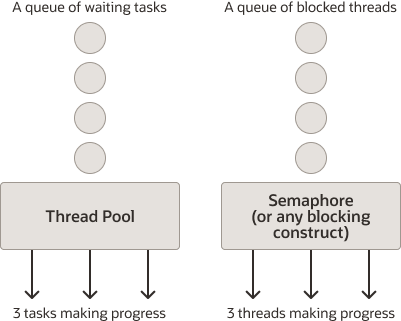

---
category:
  - Java
tag:
  - 虚拟线程
date: 2023-10-07
star: true
---

# Java 虚拟线程（virtual thread）

虚拟线程是轻量级线程，可以减少编写、维护和调试高吞吐量并发应用程序的工作量。虚拟线程在`JDK 19`中作为预览特性引入，在`JDK 21`中作为正式特性引入。

在其它语言中也有类似于虚拟线程的技术，例如`Go`中的`goroutine`。

关于虚拟线程的背景信息可以参考：[JEP 444](https://openjdk.org/jeps/444)。

线程是最小的可调度单元，多个线程可以并发运行，在很大程度上，它们之间是独立运行的。 线程是`java.lang.Thread`的一个实例。线程分为两种类型：平台线程（platform thread）和虚拟线程（virtual thread）。

## 什么是平台线程（platform thread）

平台线程是对操作系统线程的包装实现。平台线程在其底层操作系统线程上运行Java代码，在其生命周期内都与一个操作系统线程绑定。因此，可用的平台线程数量受限于操作系统线程的数量。

平台线程通常有一个大的线程堆栈和其他由操作系统维护的资源。它们适合运行所有类型的任务，但其可用的资源受限于操作系统的线程数量。

## 什么是虚拟线程（virtual thread）

与平台线程一样，虚拟线程也是`java.lang.Thread`的一个实例。然而，虚拟线程并不绑定到特定的操作系统线程。

虚拟线程仍然在操作系统线程上运行代码，但是，当运行在虚拟线程中的代码调用阻塞I/O（blocking I/O）时，Java runtime会挂起该虚拟线程，直到它可以被恢复。与挂起的虚拟线程相关联的操作系统线程，可以为其它虚拟线程执行操作。

虚拟线程与虚拟内存的实现有点类似，为了模拟大量内存，操作系统将一个大的虚拟地址空间映射到数量有限的物理内存。类似地，为了模拟大量线程，Java运行时将大量虚拟线程映射到少量操作系统线程。

与平台线程不同，虚拟线程的调用栈通常更浅，例如只执行一个HTTP调用或者一次JDBC查询。尽管虚拟线程支持线程局部变量（thread-local variables）和可继承的线程局部变量（inheritable thread-local variables），但您应该仔细考虑使用它们，因为单个JVM可能运行数百万个虚拟线程。

虚拟线程适合运行大部分时间被阻塞的任务（I/O密集型任务），这些任务通常等待I/O操作完成。然而，**它们并不适合的cpu密集型任务**，这些任务通常需要长时间占用cpu。

## 为什么要使用虚拟线程？

在高吞吐量高并发的应用程序中使用虚拟线程，尤其是那些需要大量时间等待的并发任务组成的应用程序。例如，服务端程序就是高吞吐量高并发的应用，因为它们通常需要处理大量的客户端请求，里面通常有阻塞I/O操作（例如请求资源）。

虚拟线程不是更快的线程，它们运行代码不会比平台线程快。它们的存在是为了提供可伸缩性(更高的吞吐量)，而不是速度(更低的延迟)。

## 创建和运行虚拟线程

`Thread`和`Thread.Builder`都可以用来创建虚拟线程和平台线程。`java.util.concurrent.Executors`类提供可以给每个任务创建虚拟线程的`ExecutorService`。

### 用`Thread`类和`Thread.Builder`接口创建虚拟线程

调用`Thread.ofVirtual()`方法创建`Thread.Builder`的一个实例去创建虚拟线程。

下面的例子创建和启动了一个打印信息的虚拟线程。它调用`join`方法来等待虚拟线程结束（这可以让你看到打印的信息在main线程终止前）。

```java
Thread thread = Thread.ofVirtual().start(() -> System.out.println("Hello"));
thread.join();
```

`Thread.Builder`接口可以让你创建带有属性（例如线程名称）的线程。接口`Thread.Builder.OfPlatform`用来创建平台线程，而`Thread.Builder.OfVirtual`用来创建虚拟线程。

下面的例子使用`Thread.Builder`接口创建了一个名为`MyThread`的虚拟线程。

```java
Thread.Builder builder = Thread.ofVirtual().name("MyThread");
Runnable task = () -> {
    System.out.println("Running thread");
};
Thread t = builder.start(task);
System.out.println("Thread t name: " + t.getName());
t.join();
```

下面的例子使用`Thread.Builder`创建和启动了两个虚拟线程。

```java
Thread.Builder builder = Thread.ofVirtual().name("worker-", 0);
Runnable task = () -> {
    System.out.println("Thread ID: " + Thread.currentThread().threadId());
};

// name "worker-0"
Thread t1 = builder.start(task);   
t1.join();
System.out.println(t1.getName() + " terminated");

// name "worker-1"
Thread t2 = builder.start(task);   
t2.join();  
System.out.println(t2.getName() + " terminated");
```

输出如下：
```text
Thread ID: 21
worker-0 terminated
Thread ID: 24
worker-1 terminated
```

### 使用`Executors.newVirtualThreadPerTaskExecutor()`方法创建和运行虚拟线程

Executors允许你将线程的创建和管理与应用程序的其它部分分开。

下面的例子使用`Executors.newVirtualThreadPerTaskExecutor()`创建`ExecutorService`。当`ExecutorService.submit(Runnable)`被调用，就会创建一个虚拟线程去执行任务。这个方法返回`Future`的一个实例。`Future.get()`会等待直到线程任务完成。所以，这个例子会打印一条信息当线程任务完成后。

```java
try (ExecutorService myExecutor = Executors.newVirtualThreadPerTaskExecutor()) {
    Future<?> future = myExecutor.submit(() -> System.out.println("Running thread"));
    future.get();
    System.out.println("Task completed");
    // ...
```

### 多线程客户端服务器例子

下面的例子有2个类组成。`EchoServer`是一个服务端程序，它监听端口和为每个连接启动一个虚拟线程。`EchoClient`是一个客户端程序，它连接到服务端程序，发送命令行的输入。

`EchoClient`创建一个socket，从而连接到`EchoServer`。它从用户的标准输入流读取输入，然后将文本写入到socket发送到`EchoServer`。`EchoServer`将信息通过socket回显到`EchoClient`。`EchoClient`将从服务端接收的信息显示出来。`EchoServer`可以通过虚拟线程同时为多个客户端服务，每个客户端一个虚拟线程。

```java
public class EchoServer {
    
    public static void main(String[] args) throws IOException {
         
        if (args.length != 1) {
            System.err.println("Usage: java EchoServer <port>");
            System.exit(1);
        }
         
        int portNumber = Integer.parseInt(args[0]);
        try (
            ServerSocket serverSocket =
                new ServerSocket(Integer.parseInt(args[0]));
        ) {                
            while (true) {
                Socket clientSocket = serverSocket.accept();
                // Accept incoming connections
                // Start a service thread
                Thread.ofVirtual().start(() -> {
                    try (
                        PrintWriter out =
                            new PrintWriter(clientSocket.getOutputStream(), true);
                        BufferedReader in = new BufferedReader(
                            new InputStreamReader(clientSocket.getInputStream()));
                    ) {
                        String inputLine;
                        while ((inputLine = in.readLine()) != null) {
                            System.out.println(inputLine);
                            out.println(inputLine);
                        }
                    
                    } catch (IOException e) { 
                        e.printStackTrace();
                    }
                });
            }
        } catch (IOException e) {
            System.out.println("Exception caught when trying to listen on port "
                + portNumber + " or listening for a connection");
            System.out.println(e.getMessage());
        }
    }
}
```
```java
public class EchoClient {
    public static void main(String[] args) throws IOException {
        if (args.length != 2) {
            System.err.println(
                "Usage: java EchoClient <hostname> <port>");
            System.exit(1);
        }
        String hostName = args[0];
        int portNumber = Integer.parseInt(args[1]);
        try (
            Socket echoSocket = new Socket(hostName, portNumber);
            PrintWriter out =
                new PrintWriter(echoSocket.getOutputStream(), true);
            BufferedReader in =
                new BufferedReader(
                    new InputStreamReader(echoSocket.getInputStream()));
        ) {
            BufferedReader stdIn =
                new BufferedReader(
                    new InputStreamReader(System.in));
            String userInput;
            while ((userInput = stdIn.readLine()) != null) {
                out.println(userInput);
                System.out.println("echo: " + in.readLine());
                if (userInput.equals("bye")) break;
            }
        } catch (UnknownHostException e) {
            System.err.println("Don't know about host " + hostName);
            System.exit(1);
        } catch (IOException e) {
            System.err.println("Couldn't get I/O for the connection to " +
                hostName);
            System.exit(1);
        } 
    }
}
```

## 虚拟线程调度和固定（Pinned）虚拟线程

平台线程由操作系统调度其何时运行，虚拟线程由Java Runtime调度决定其何时运行。当Java Runtime调度虚拟线程时，它被分配（assign）或者挂载（mount）到平台线程上，然后由操作系统调度平台线程。这个平台线程称为载体（carrier）。在运行了一些代码后，虚拟线程可以从其载体卸载，这通常在虚拟线程执行了阻塞I/O操作后发生。在虚拟线程卸载其载体后，这个载体可以被Java Runtime挂载上其它的虚拟线程。

当虚拟线程固定(Pinned)到其载体上时，它在阻塞操作期间不能从载体上卸载。虚拟线程在以下情况下被固定：

- 虚拟线程在`synchronized`代码块或者方法内运行代码
- 虚拟线程运行`native`方法或者外部函数（[foreign function](https://docs.oracle.com/en/java/javase/21/core/foreign-function-and-memory-api.html)）。

固定（Pinned）不会使程序出错，但可能会阻碍伸缩性。尝试修改频繁运行的`synchronized`代码块，使用`java.util.concurrent.locks.ReentrantLock`作为替代保护可能长时间的I/O操作，从而避免长时间的Pinned。

## Debug虚拟线程

虚拟线程仍然是线程，debugger可以像平台线程一样逐步调试。JDK Flight Recorder和`jcmd`工具具有额外的功能，可以帮助您观察应用程序中的虚拟线程。

### JDK Flight Recorder Events

JDK Flight Recorder (JFR)可以发出这些与虚拟线程相关的事件:

- `jdk.VirtualThreadStart`和`jdk.VirtualThreadEnd`表示虚拟线程的开始和结束。这些事件默认是关闭的。
- `jdk.VirtualThreadPinned`表示一个虚拟线程被固定（其载体线程没有释放）的时间超过了阈值时间。该时间默认启用，其阈值时间为20ms。
- `jdk.VirtualThreadSubmitFailed`表示启动或者恢复（unpark）一个虚拟线程失败，可能的原因是资源问题。`park`一个虚拟线程释放底层的载体线程去做其他工作，`unpark`一个虚拟线程调度它继续。该事件默认开启。

通过JDK Mission Control或者自定义JFR configuration（参考[这里](https://docs.oracle.com/en/java/javase/21/jfapi/flight-recorder-configurations.html)）启用`jdk.VirtualThreadStart`和`jdk.VirtualThreadEnd`事件。

要打印这些事件，请运行以下命令，其中`recording.jft`是你的record文件名:

```shell
jfr print --events jdk.VirtualThreadStart,jdk.VirtualThreadEnd,jdk.VirtualThreadPinned,jdk.VirtualThreadSubmitFailed recording.jfr
```

### 使用`jcmd` dump虚拟线程

你可以创建thread dump的文本格式或者json格式：

```shell
jcmd <PID> Thread.dump_to_file -format=text <file>
jcmd <PID> Thread.dump_to_file -format=json <file>
```

json格式对于能使用的调试工具来说更好。

jcmd thread dump列出在网络IO阻塞和由`ExecutorService`接口创建的虚拟线程。这不包括object addresses, locks, JNI statistics, heap statistics和其它在平台线程出现的信息。

## 虚拟线程使用指南

虚拟线程由Java Runtime实现而不是操作系统。虚拟线程和传统线程(我们称之为平台线程)之间的主要区别在于，我们可以很容易地在同一个Java进程中运行大量活动的虚拟线程，甚至数百万个。大量的虚拟线程赋予了它们强大的功能:通过允许服务器并发处理更多的请求，它们可以更有效地运行以每个请求一个线程的方式编写的服务器应用程序，从而实现更高的吞吐量和更少的硬件浪费。

由于虚拟线程是`java.lang.thread`的实现，并且遵循自Java SE 1.0以来指定`java.lang.thread`的相同规则，因此开发人员不需要学习使用它们的新概念。由于无法生成非常多的平台线程，因此产生了应对创建平台线程的高成本的实践。当把这些实践应用到虚拟线程时会适得其反。此外，由于创建平台线程和虚拟线程的成本存在巨大的差异，我们需要一些新的方法。

该指南并不打算全面介绍虚拟线程的每一个重要细节。它只是为了提供一组介绍性的指导方针，以帮助那些希望开始使用虚拟线程的人充分利用它们。

### 使用一个请求一个线程的风格编写简单、同步的阻塞IO代码

虚拟线程可以显著提高以每个请求一个线程的方式编写的服务器的吞吐量(而不是延迟)。在这种风格中，服务器至少使用一个线程来处理每个传入请求，因为在处理单个请求时，您可能希望使用更多线程来并发地执行一些任务。

阻塞平台线程的代价很高，因为它占用了系统线程（相对稀缺的资源），而没有做多少有意义的工作。而虚拟线程可以创建很多，其创建成本很低，所以阻塞它们的成本也很低。因此，应该以同步阻塞IO的风格去写代码。

下面的代码使用了非阻塞异步的编码风格，将不会受益于虚拟线程。

```java
CompletableFuture.supplyAsync(info::getUrl, pool)
   .thenCompose(url -> getBodyAsync(url, HttpResponse.BodyHandlers.ofString()))
   .thenApply(info::findImage)
   .thenCompose(url -> getBodyAsync(url, HttpResponse.BodyHandlers.ofByteArray()))
   .thenApply(info::setImageData)
   .thenAccept(this::process)
   .exceptionally(t -> { t.printStackTrace(); return null; });
```

另外，下面的代码使用同步阻塞风格，将会受益于虚拟线程。

```java
try {
   String page = getBody(info.getUrl(), HttpResponse.BodyHandlers.ofString());
   String imageUrl = info.findImage(page);
   byte[] data = getBody(imageUrl, HttpResponse.BodyHandlers.ofByteArray());   
   info.setImageData(data);
   process(info);
} catch (Exception ex) {
   t.printStackTrace();
}
```

这样的代码也更容易调试，分析或者在thread-dumps里观察。要观察虚拟线程，请使用`jcmd`命令创建thread dump：

```shell
jcmd <pid> Thread.dump_to_file -format=json <file>
```

以这种风格编写的stack越多，虚拟线程的性能和可观察性就越好。用其他风格编写的程序或框架，如果没有为每个任务指定一个线程，就不应该期望从虚拟线程中获得显著的好处。避免将同步、阻塞代码与异步框架混在一起。

### 每个并发任务使用一个虚拟线程：不要使用虚拟线程池

虚拟线程虽然它们具有与平台线程相同的行为，但它们不应该表示相同的程序概念。

平台线程是稀缺的，因此是一种宝贵的资源。稀缺的资源需要被管理，管理平台线程的最常用方法是使用线程池。接下来需要回答的问题是，池中应该有多少线程?

但是虚拟线程可以创建非常多，因此每个线程不应该代表一些共享的、池化的资源，而应该代表一个任务。线程从被管理的资源转变为对象。我们应该有多少个虚拟线程的问题变得很明显，就像我们应该使用多少个字符串存储用户名的问题一样，虚拟线程的数量总是等于应用程序中并发任务的数量。

将n个平台线程转换为n个虚拟线程不会产生什么好处，相反，需要转换的是任务。

为了将每个应用程序任务表示为一个线程，不要像下面的例子那样使用共享线程池:

```java
Future<ResultA> f1 = sharedThreadPoolExecutor.submit(task1);
Future<ResultB> f2 = sharedThreadPoolExecutor.submit(task2);
// ... use futures
```

相反，应该使用虚拟线程Executor：

```java
try (var executor = Executors.newVirtualThreadPerTaskExecutor()) {
        Future<ResultA> f1 = executor.submit(task1);
        Future<ResultB> f2 = executor.submit(task2);
        // ... use futures
        }
```

代码仍然使用`ExecutorService`，但是从`Executors.newVirtualThreadPerTaskExecutor()`返回的对象没有使用线程池。相反，它为每个提交的任务创建一个新的虚拟线程。

此外，`ExecutorService`本身是轻量级的，我们可以创建一个新的，就像处理任何简单的对象一样。这允许我们依赖于新添加的`ExecutorService.close()`方法和`try-with-resources`。在try块结束时隐式调用的close方法将自动等待提交给`Executorservice`的所有任务(即由`Executorservice`生成的所有虚拟线程)终止。

对于fanout场景，这是一个特别有用的模式，在这种场景中，您希望并发地向不同的服务执行多个请求调用，如下面的示例所示:

```java
void handle(Request request, Response response) {
    var url1 = ...
    var url2 = ...
 
    try (var executor = Executors.newVirtualThreadPerTaskExecutor()) {
        var future1 = executor.submit(() -> fetchURL(url1));
        var future2 = executor.submit(() -> fetchURL(url2));
        response.send(future1.get() + future2.get());
    } catch (ExecutionException | InterruptedException e) {
        response.fail(e);
    }
}
 
String fetchURL(URL url) throws IOException {
    try (var in = url.openStream()) {
        return new String(in.readAllBytes(), StandardCharsets.UTF_8);
    }
}
```

您应该创建一个新的虚拟线程，如上所示，即使是小型的、短暂的并发任务也是如此。

为了在编写fanout模式和其他常见并发模式时获得更多帮助，并且具有更好的可观察性，请使用结构化并发。

根据经验，如果您的应用程序从来没有10,000个或更多的虚拟线程，那么它不太可能从虚拟线程中获益。要么它的负载太轻，不需要更好的吞吐量，要么您没有向虚拟线程添加足够多的任务。

### 使用`Semaphores`限制并发量

有时需要限制某个操作的并发性。例如，某些外部服务可能无法处理十个以上的并发请求。由于平台线程是通常是在线程池中使用，因此线程池已经变得如此普遍，以至于它们被用于限制并发性的目的，如下例所示:

```java
ExecutorService es = Executors.newFixedThreadPool(10);
...
Result foo() {
    try {
        var fut = es.submit(() -> callLimitedService());
        return f.get();
    } catch (...) { ... }
}
```

这个例子确保最多只有10个线程并发请求。

但是限制并发性只是线程池操作的副作用。池被设计为共享稀缺资源，而虚拟线程并不稀缺，因此永远不应该被池化!

在使用虚拟线程时，如果希望限制访问某些服务的并发性，则应该使用专门为此目的设计的构造`Semaphore`类。下面的例子演示了这个类:

```java
Semaphore sem = new Semaphore(10);
...
Result foo() {
    sem.acquire();
    try {
        return callLimitedService();
    } finally {
        sem.release();
    }
}
```

在同一时间内只有10个线程可以执行foo，其它线程将不受阻碍地继续它们的任务。

简单地用信号量阻塞一些虚拟线程似乎与将任务提交到固定线程池有很大的不同，但事实并非如此。提交到线程池的任务会被排队在稍后执行，而`Semaphore`（或者其它同步阻塞的构造）创建一个阻塞的线程队列，该队列对应于线程池的任务队列，因为虚拟线程是任务，所以它们在结构上是等价的。



即使你可以认为平台线程池是worker线程从任务队列里获取任务并处理，虚拟线程本身是任务，它们阻塞直到可以继续执行。它们在计算机的底层表示是相同的。认识到任务队列和阻塞线程之间的等价性将帮助您充分利用虚拟线程。

数据库连接池本身用作信号量。限制为10个连接的连接池将阻止第11个试图获取连接的线程。不需要在连接池之上添加额外的信号量。

### 不要在线程变量里缓存昂贵的可重用对象

虚拟线程支持线程局部变量，就像平台线程一样。有关更多信息，请参阅[Thread-Local Variables](https://docs.oracle.com/en/java/javase/21/core/thread-local-variables.html#GUID-2CEB9041-3DF7-43DA-868F-E0596F4B63FD)。通常，线程局部变量用于将一些特定于上下文的信息与当前运行的代码相关联，例如当前事务和用户ID。对于虚拟线程，使用线程局部变量是完全合理的。但是，请考虑使用更安全、更有效的范围值。有关更多信息，请参阅[Scoped Values](https://docs.oracle.com/en/java/javase/21/core/scoped-values.html#GUID-9A4565C5-82AE-4F03-A476-3EAA9CDEB0F6)。

线程局部变量的另一种用法在虚拟线程上不可用:缓存可重用对象。这些对象的创建成本通常很高(并消耗大量内存)，它们是可变的，而且不是线程安全的。它们缓存在线程局部变量中，以减少实例化的次数和内存中的实例数量，但是它们被在不同时间运行在线程上的多个任务重用。

例如，`SimpleDateFormat`的实例创建成本很高，并且不是线程安全的。出现的一种模式是在ThreadLocal中缓存这样的实例，如下例所示:

```java
static final ThreadLocal<SimpleDateFormat> cachedFormatter = 
       ThreadLocal.withInitial(SimpleDateFormat::new);

void foo() {
  ...
	cachedFormatter.get().format(...);
	...
}
```

只有当多个任务共享并重用线程(缓存在线程本地的是昂贵对象)时，这种缓存才有用，就像平台线程被池化时一样。在线程池中运行时，许多任务可能会调用`foo`，但由于线程池只包含几个线程，因此对象只会被实例化几次，然后缓存并重用。

但是，虚拟线程永远不会被池化，也不会被不相关的任务重用。因为每个任务都有自己的虚拟线程，所以每次从不同的任务调用`foo`都会触发一个新的`SimpleDateFormat`的实例化。此外，由于可能有大量的虚拟线程并发地运行，昂贵的对象可能会消耗相当多的内存。这些结果与线程局部缓存想要实现的目标完全相反。

没有一个通用的方案可以代替，但是对于`SimpleDateFormat`，您应该用`DateTimeFormatter`替换它。`DateTimeFormatter`是不可变的，所以一个实例可以被所有线程共享。

```java
static final DateTimeFormatter formatter = DateTimeFormatter….;

void foo() {
  ...
	formatter.format(...);
	...
}
```

请注意，使用线程局部变量来缓存昂贵的共享对象有时是由异步框架在幕后完成的，在它们隐含的假设下，它们被非常少量的池化线程使用。这就是为什么混合虚拟线程和异步框架不是一个好主意的原因之一:对方法的调用可能会导致在线程局部变量中实例化昂贵的对象，这些对象本来打算被缓存和共享。

### 避免长时间和频繁的Pinning

当前虚拟线程实现的一个限制是，在`synchronized`代码块或方法内部执行阻塞操作会导致JDK的虚拟线程调度器阻塞宝贵的操作系统线程，而如果阻塞操作在`synchronized`代码块或方法之外完成，则不会。我们称这种情况为“Pinning”。如果阻塞操作既长又频繁，那么Pinning可能会对服务器的吞吐量产生不利影响。短时间的保护操作，比如保护的代码块只在内存操作，或者使用`synchronized`代码块或方法的不频繁操作，应该不会产生不利影响。

为了检测可能有害的Pinning实例，JDK Flight Recorder (JFR)会发出`jdk.VirtualThreadPinned`时间当阻塞操作被Pinning。缺省情况下启用该事件，超时时间为20ms。

另外，你可以使用system property `jdk.tracePinnedThreads`在线程被阻塞和Pinning时发出调用栈。运行参数`-Djdk.tracePinnedThreads=full`打印完成的调用栈当线程阻塞和Pinning时，并且高亮显示`native frames`和其持有的`monitors`。运行参数`-Djdk.tracePinnedThreads=short`将输出限制为有问题的帧。

如果这些机制检测到固定存在时间较长且频繁的地方，那么在这些特定的地方用`ReentrantLock`替换`synchronized`的使用(不需要在`synchronized`保护时间较短或不频繁的操作的地方替换`synchronized`)。下面是一个长时间且频繁使用同步块的例子。

```java
synchronized(lockObj) {
    frequentIO();
}
```

你可以替换为以下代码：

```java
lock.lock();
try {
    frequentIO();
} finally {
    lock.unlock();
}
```

## Reference

1. 翻译自：[Virtual Threads](https://docs.oracle.com/en/java/javase/21/core/virtual-threads.html)