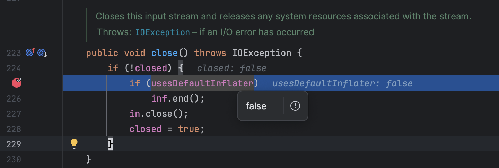
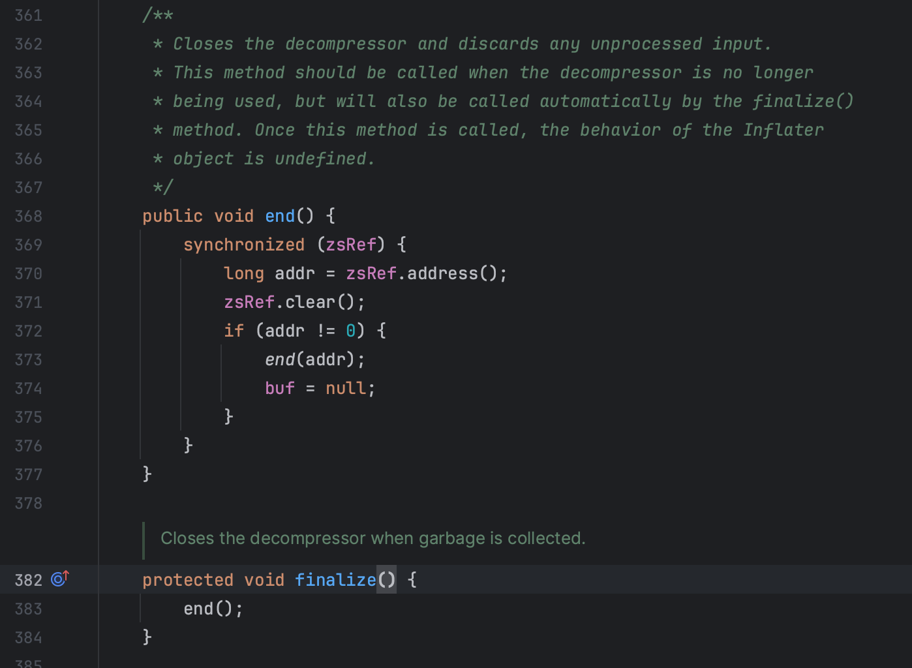

---
category:
  - Java
  - Linux
tag:
  - OOM
  - 线上问题
date: 2023-11-02
star: true
---

# 一次线上OOM问题排查

生产环境的JVM进程经常被运维报告有OOM的情况，运维的描述是，内存一直在缓慢增长，1-2天就会出现OOM的情况。因为已经严重影响到客户的使用，所以采取由运维定时监控，与客户交流，开发负责排查问题的策略。

## Step1：测试环境复现问题

由于开发是没权限进入生产环境的，要高效率解决问题，必须能在测试环境复现。查看生产环境的日志，确认容器出发OOM的接口，然后使用`Jmeter`在测试环境压测该接口，发生OOM的情况，问题能够复现。

## Step2: 在测试环境复现

在测试环境建一个和生产环境规格一样的容器，使用`Jmeter`压测，确认问题能复现。

## Step3: 初步确认问题原因

查看Java应用日志，没有OOM信息，使用`dmesg`查看系统日志，确认是因为OOM而被操作系统杀掉。

```text
kernel: [1799319.246494] Out of memory: Kill process 28536 (java) score 673 or sacrifice childSep 
kernel: [1799319.246506] Killed process 28536 (java) total-vm:1271568kB, anon-rss:426528kB, file-rss:0kB
```

## Step4: 在压测过程中观察指标

- `top`命令观察内存占用情况
- `arthas`观察JVM的内存情况
- `jcmd`观察JVM的内存情况

容器内存为`8GB`，堆内存设置为`5.6GB`开始第一次观察。

### 第一次观察

压测前和压测过程中已经在内存快爆之前使用`jcmd`观察内存情况，发现total的`committed`和`reserved`大小只有小幅度的上升，而`top`里观察到的`RES`值一直在上升，直至内存爆掉。

而total committed的值为7.2GB，非常接近容器的8GB，未压测前虽然committed 的total差不多为7G，但是这些内存未被实际使用，所以没有被映射到物理内存里，所以开始时`RES`值比committed低很多，随着压测进行，越来越多内存被交换到物理内存里，最后容器内存超过8G被killed。

由于堆外内存使用量大，堆内存不能配置为容器内存的70%，改为4GB，容器内存的50%值再压力测试。

### 第二次观察

堆内存改为`4GB`后，进行一个小时的压测，容器不再被killed，JVM也未OOM。但此时还有一个问题，top观察到的物理内存RES占用比jcmd里的committed高很多，也就是说，jcmd追踪不到的堆外内存占用多，需要排查是什么占用了这部分内存。

使用`pmap`观察进程内存的变化，发现压测前和压测后比对，`pmap`里多了大约`100`个`15M`左右的`anon`内存块。

使用smaps获取可疑的`15M`内存块的起始地址和结束地址，之后使用`gdb`dump出内存块。

启动gdb

`gdb -p <pid>`

dump指定内存地址到指定的目录下，参数的地址需要在smaps拿到地址前加上0x。

`dump memory /tmp/0x7fb9b0000000-0x7fb9b3ffe000.dump 0x7fb9b0000000 0x7fb9b3ffe000`

显示长度超过10字符的字符串。或者把内存块下载到本地，使用`vscode`之类的文本编辑器打开分析，或者使用二进制编辑器分析二进制。也可以使用`string`查看字符串内容。

`strings -10 /tmp/0x7fb9b0000000-0x7fb9b3ffe000.dump`

发现内存块中有大量的jar包里的`MANIFEST.MF`文件的字符串，猜测是代码里有加载jar包到堆外内存里。

### 第三次观察

在压测过程中观察JVM的线程栈。

注意到压测大部分线程的栈都在以下RUNNABLE中，

```text
at java.util.zip.Inflater.inflateBytes(Native Method)
at java.util.zip.Inflater.inflate(Inflater.java:259)
- locked <0x00000007720e8bf0> (a java.util.zip.ZStreamRef)
at java.util.zip.InflaterInputStream.read(InflaterInputStream.java:152)
at sun.misc.IOUtils.readFully(IOUtils.java:163)
at java.util.jar.JarFile.getBytes(JarFile.java:452)
at java.util.jar.JarFile.getManifestFromReference(JarFile.java:196)
at java.util.jar.JarFile.getManifest(JarFile.java:184)
at com.sun.tools.javac.file.FSInfo.getJarClassPath(FSInfo.java:69)
at com.sun.tools.javac.file.Locations$Path.addJarClassPath(Locations.java:305)
at com.sun.tools.javac.file.Locations$Path.addFile(Locations.java:296)
at com.sun.tools.javac.file.Locations$Path.addFiles(Locations.java:236)
at com.sun.tools.javac.file.Locations$Path.addFiles(Locations.java:242)
at com.sun.tools.javac.file.Locations$SimpleLocationHandler.setLocation(Locations.java:439)
at com.sun.tools.javac.file.Locations.setLocation(Locations.java:697)
at com.sun.tools.javac.file.JavacFileManager.setLocation(JavacFileManager.java:798)
at com.xxx.xxx.JavaCompileService.compile(JavaCompileService.java:86)
```

业务代码这个接口会使用`JavaCompiler`动态编译代码，又由于`at java.util.zip.Inflater.inflateBytes(Native Method)`这里是使用堆外内存加载zip文件，猜测就是这里代码把jar包加在到堆外内存中。

### 分析Inflater和InflaterInputStream

分析`InflaterInputStream`中的`close`方法，发现其在`close`时不一定会释放内存，而是依赖于`Inflater`类被回收时，调用`finalize`方法时释放内存。





### 观察Inflater在堆内存的数量

在压测前，压测后，手动gc后分别观察`java.util.zip.Inflater`对象的数量。

```shell
jmap -histo <pid> | grep java.util.zip.Inflater
```

观察堆里的对象数

```shell
jcmd <pid> GC.run
```

手动执行GC发现压测后确实比压测前多了很多`java.util.zip.Inflater`对象，手动gc后减少了很多，但是从top里观察内存并没有减少占用。

### 内存碎片分析

考虑到是内存碎片的原因，使用`tcmalloc`代替Linux默认的内存分配器`ptmalloc`。

使用`tcmalloc`压测后，top里的内存占用为`5.8G`，jcmd里的内存committed total为`5.5G`。 对比使用`ptmalloc`压测后，top里的内存占用为`6.8G`，jcmd里的内存committed total为`5.5G`。 再使用`pmap`观察进程内存分布，发现之前存在的大量`15MB`左右的内存块已经没了。推断为大概率是内存碎片导致内存释放后，内存分配器没有把内存还给操作系统。

使用`jemalloc`压测过程中，top里的内存占用为`5.8G`，和`tcmalloc`基本一致，不过`jemalloc`内存有浮动，在`5.6-6G`之间浮动，但大多数时间保持在`5.8G`。 然而`jemalloc`在压测完后，手动执行GC之后，内存降到`5.4G`，这里应该就是因为`java.util.zip.Inflater`被回收后释放的内存，而`tcmalloc`和`ptmalloc`在手动GC后，内存占用不会产生变化。从`pmap`里观察堆内存的`RSS`值和手动GC前一致，所以该减少不是因为堆GC的原因。所以推导在该场景下`jemalloc`比`tcmalloc`内存碎片整理更好。

结论为：`jemalloc` > `tcmalloc` >> `ptmalloc`。

## 后记

之后发现可以通过gdb调用`malloc_stats`来检查glibc缓存的内存大小，调用`malloc_trim(0)`释放缓存的内存。也可以通过`tcmalloc`或者`jemalloc`检测是否有内存泄漏。这样排查会更方便。