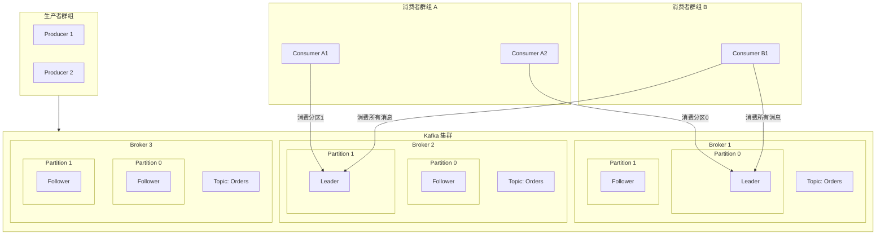
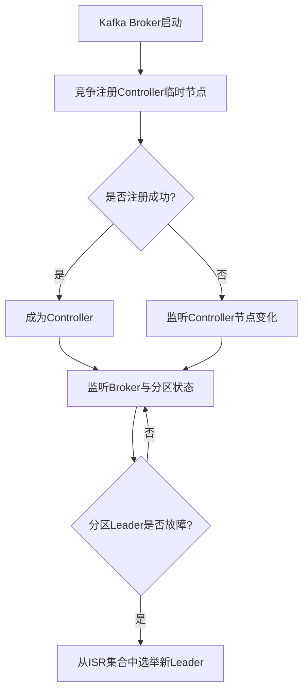

---
category:
  - 分布式系统
  - kafka
tag:
  - 分布式
  - 消息队列
date: 2025-11-18
star: true
---

# Kafka简介

Apache Kafka 是一个分布式的、高吞吐量、高可扩展性的流处理平台。它主要用于构建实时的数据管道和流式应用程序。它可以被看作是一种分布式的、基于发布/订阅模式的消息队列。

它的核心能力可以概括为以下三项：

1. **发布和订阅消息流**。
2. **持久化存储消息流，并以容错的方式处理**。
3. **实时处理消息流**。



## 核心概念详解

### 基本角色与架构

- **Producer**：生产者
    - **角色**：向Kafka的Topic发送消息的客户端。
    - **行为**：生产者决定将消息发送到Topic的哪个Partition。可以通过轮询、指定Key等方式。

- **Consumer**：消费者
    - **角色**：从Kafka的Topic读取消息的客户端。
    - **行为**：消费者通过订阅一个或多个Topic，并从一个Consumer Group中拉取消息。

- **Broker**：代理/服务器
    - **角色**：一个独立的Kafka服务器实例。多个Broker组成一个Kafka集群。
    - **行为**：接收生产者的消息，为这些消息设置偏移量，并持久化存储到磁盘；同时响应消费者的拉取请求，返回消息。

- **Cluster**：集群
    - **角色**：由多个Broker组成的集合，提供高可用和负载均衡。
    - **行为**：整个Kafka服务由一个集群来提供。集群会自动在Broker间分布数据和客户端请求。

- **Controller**：控制器
    - **角色**：Kafka集群中的一个特殊Broker，由集群选举产生。
    - **行为**：负责管理分区和副本的状态，包括分区的分配、Leader选举、监控Broker故障等。是集群的“大脑”。

- **ZooKeeper**
    - **角色**：Kafka的“元数据管理者”和“协调者”。（注意：新版本Kafka正在逐步移除对ZooKeeper的依赖，使用Kraft模式）
    - **行为**：
        - 存储和管理Broker、Topic、Partition等元数据。
        - 进行Controller的选举。
        - 管理Consumer Group的偏移量（老版本）。
        - 监听Broker上下线，通知Controller。

### 数据模型与存储

- **Topic**：主题
    - **概念**：消息的类别或流的名字。生产者将消息发送到特定的Topic，消费者订阅特定的Topic来消费消息。
    - **类比**：可以理解为数据库中的表名或文件系统中的文件夹。

- **Partition**：分区
    - **概念**：这是Kafka实现高吞吐和水平扩展的核心。每个Topic可以被分成一个或多个Partition。
    - **作用**：
        - **并行处理**：不同Partition的数据可以被并行生产和消费，极大地提高了吞吐量。
        - **水平扩展**：Partition可以分布在不同Broker上，使得Topic的数据量可以远超单台服务器的容量。
        - **消息顺序**：Kafka只保证在单个Partition内消息的有序性，不保证整个Topic的有序性。
    - **存储**：每个Partition在物理上对应一个文件夹，里面存储着日志文件。

- **Offset**：偏移量
    - **概念**：消息在Partition中的唯一标识，是一个单调递增且不变的序列号。
    - **作用**：
        - 消费者通过记录自己消费到的Offset，来追踪消费进度。
        - Kafka不跟踪每条消息是否被消费，而是由消费者自己管理Offset。这带来了极大的灵活性。

- **Log Segment**：日志分段
    - **概念**：Partition在物理上并不是一个巨大的文件，而是被拆分成多个大小相等的Log Segment文件。
    - **作用**：
        - 便于过期数据的删除（直接删除整个旧文件）。
        - 提高索引和查找效率。
    - **组成**：每个Segment由一个日志文件（.log，存数据）和一个索引文件（.index，存偏移量到文件位置的映射）组成。

- **Replica**：副本
    - **概念**：每个Partition可以有多个副本，用于提供数据冗余和高可用。
    - **角色**：
        - **Leader Replica**：每个Partition都有一个Leader，负责处理所有该分区的读写请求。
        - **Follower Replica**：被动地、异步地从Leader复制数据。如果Leader发生故障，Kafka会从Follower中选举一个新的Leader。
    - **ISR**：In-Sync Replicas（同步副本集合）。这是与Leader保持同步的Replica集合（包括Leader自己）。只有ISR中的副本才有资格被选举为新的Leader。

### 消费组与交付语义

- **Consumer Group：消费者组**
    - **概念**：由一组消费者实例组成的逻辑组，共同消费一个或多个Topic。
    - **核心机制**：**一个Partition在同一时间只能被同一个Consumer Group内的一个Consumer消费**。
    - **作用**：
    - **实现两种消息模式**：
        - **队列模式**：所有Consumer在同一个Group内，它们共同分担Topic的消息，每条消息只被组内的一个Consumer处理。
        - **发布/订阅模式**：每个Consumer在不同的Group内，它们都能收到Topic的全部消息。
    - **水平扩展消费能力**：通过增加Group内的Consumer实例，可以提高消费的并行度。但注意，Consumer数量不应超过Topic的Partition数量，否则多余的Consumer会闲置。

- **消息交付语义**：
    - **At Most Once**：消息最多被消费一次。消费者先提交Offset，再处理消息。可能会丢失消息。
    - **At Least Once**：消息至少被消费一次。消费者先处理消息，成功后提交Offset。可能会重复消费，这是最常用的模式。
    - **Exactly Once**：消息有且仅被消费一次。这是最理想的模式。Kafka通过事务和幂等生产者等机制来实现。

## 选举

### 控制器（Controller）选举

控制器是Kafka集群的“大脑”，负责管理分区和副本的状态。其选举过程完全依赖于ZooKeeper的分布式锁特性：

1. **抢占节点**：所有Broker启动时，都会尝试在ZooKeeper的 `/controller` 路径下创建一个临时节点（Ephemeral Node）。
2. **先到先得**：由于ZooKeeper保证节点唯一性，只有一个Broker能创建成功。创建成功的Broker就成为集群的控制器。
3. **监听与接管**：其他未成功的Broker会监听这个 `/controller`
   节点。如果当前的控制器宕机，它与ZooKeeper的会话会超时，导致其创建的临时节点被自动删除。其他Broker通过Watch机制感知到这一变化，便会重新发起新一轮的控制器选举。



### 分区Leader选举

分区的Leader副本负责处理该分区的所有读写请求。其选举工作由控制器具体负责：

1. **选举触发**：当某个分区的Leader副本失效（例如，其所在的Broker宕机）时，控制器会监听到这一变化，并立即触发该分区的Leader选举。
2. **候选范围**：Kafka默认只会从 ISR集合 中选举新的Leader。ISR（In-Sync
   Replicas）是指所有与当前Leader副本保持同步的副本集合。一个Follower副本需要满足一定条件（如在一定时间内与Leader的同步延迟未超过阈值）才能被认为是ISR成员。
3. **选举策略**：常见的选举策略包括：
    - **首选副本选举**：这是默认策略。控制器会尝试将分区的Leader切换回AR列表中的第一个副本（即“首选副本”），这有助于保证负载均衡。
    - **ISR选举**：当Leader宕机时，控制器会从ISR中选择一个存活的副本作为新Leader，通常会选择AR列表中排在前面且存活的副本。

## ISR

ISR（In-Sync Replicas）是指与Leader副本保持同步的副本集合。只有ISR中的副本才有资格在Leader失效时被选举为新的Leader。

### LEO（Log End Offset）的定义

- **对于Leader副本**：LEO表示当前日志的结束位置，即下一条待写入消息的偏移量。生产者新写入的消息会追加到Leader副本的日志中，然后更新Leader的LEO。
- **对于Follower副本**：Follower副本会从Leader副本拉取消息，并追加到自己的日志中，然后更新自己的LEO。

### LEO的维护

- 每个副本（无论是Leader还是Follower）都会维护自己的LEO。
- 在Leader副本中，除了维护自己的LEO，还会维护所有Follower副本的LEO（通过Follower发送的Fetch请求中的偏移量来更新）。

### LEO与HW（High Watermark）的关系

- **HW = ISR中所有副本的最小LEO**
- HW（高水位）表示已经成功被所有ISR副本复制的消息偏移量。消费者只能消费到HW之前的消息。
- HW的更新机制如下：
    - Leader副本会维护每个Follower副本的LEO（称为remote LEO）和自己的LEO。
    - Leader会选取所有ISR副本（包括自己）的LEO中的最小值作为新的HW。
    - Follower副本在从Leader拉取消息时，会在响应中收到Leader的HW，然后将自己的HW更新为收到的HW。

### LEO在数据复制中的作用

- 当Follower副本向Leader发送Fetch请求时，会携带自己当前的LEO（即下一次要拉取的偏移量）。
- Leader根据这个偏移量返回数据，并在响应中包含当前的HW。
- Follower接收到数据后，将消息追加到日志中，并更新自己的LEO，然后根据响应中的HW更新自己的HW。

### 监控维度

Leader副本通过两个核心维度监控Follower的同步状态：

1. **时间维度监控**
   ```java
   // 伪代码：时间维度检查
   public boolean isFollowerLagging(FollowerReplica follower) {
       long currentTime = System.currentTimeMillis();
       long lastFetchTime = follower.getLastFetchTime();
       
       // 关键判断：最后一次成功拉取是否超时
       return (currentTime - lastFetchTime) > replica.lag.time.max.ms;
   }
   ```

2. **进度维度监控**
   ```java
   // 伪代码：进度维度检查  
   public boolean isFollowerCatchingUp(FollowerReplica follower) {
       long leaderLEO = this.logEndOffset;
       long followerLEO = follower.getLogEndOffset();
       
       // Follower的LEO必须至少达到当前的HW
       return followerLEO >= this.highWatermark;
   }
   ```

### 监控触发时机

- **定时检查**：Leader定期（默认每10秒）扫描所有Follower状态
- **事件驱动**：
    - 处理Follower的FetchRequest时
    - 新消息写入时
    - HW更新时

### ISR成员变更流程

#### ISR收缩（副本移出）

当Follower副本同步滞后时，会被移出ISR：

```java
// 伪代码
// 完整的ISR收缩逻辑
public void maybeShrinkIsr() {
    long now = System.currentTimeMillis();
    Set<Integer> outOfSyncReplicas = new HashSet<>();
    
    for (FollowerReplica follower : followers) {
        // 检查同步状态
        if (now - follower.lastCaughtUpTimeMs > replica.lag.time.max.ms) {
            outOfSyncReplicas.add(follower.brokerId);
        }
    }
    
    if (!outOfSyncReplicas.isEmpty()) {
        // 执行ISR收缩
        shrinkIsr(outOfSyncReplicas);
    }
}

private void shrinkIsr(Set<Integer> outOfSyncReplicas) {
    // 1. 更新ISR集合
    Set<Integer> newIsr = new HashSet<>(isr);
    newIsr.removeAll(outOfSyncReplicas);
    
    // 2. 持久化到ZooKeeper
    persistIsrToZk(newIsr);
    
    // 3. 更新内存状态
    this.isr = newIsr;
    
    // 4. 重新计算HW
    updateHighWatermark();
    
    // 5. 记录日志和指标
    log.info("Shrank ISR from {} to {}", isrBeforeShrink, newIsr);
    metrics.recordIsrShrink();
}
```

#### ISR扩展（副本重新加入）

当滞后的Follower副本重新追上进度时，会被重新加入ISR：
```java
// ISR扩展逻辑
public void maybeExpandIsr(FollowerReplica follower) {
    // 检查副本是否满足重新加入条件
    if (shouldRejoinIsr(follower)) {
        expandIsr(Collections.singleton(follower.brokerId));
    }
}

private boolean shouldRejoinIsr(FollowerReplica follower) {
    long currentTime = System.currentTimeMillis();
    
    // 必须满足的条件：
    return 
        // 1. 当前不在ISR中
        !isr.contains(follower.brokerId) &&
        // 2. LEO至少达到HW
        follower.logEndOffset >= highWatermark &&
        // 3. 最近有活跃的拉取请求
        (currentTime - follower.lastFetchTime) < replica.lag.time.max.ms;
}

private void expandIsr(Set<Integer> rejoiningReplicas) {
    // 1. 更新ISR集合
    Set<Integer> newIsr = new HashSet<>(isr);
    newIsr.addAll(rejoiningReplicas);
    
    // 2. 持久化到ZooKeeper  
    persistIsrToZk(newIsr);
    
    // 3. 更新内存状态
    this.isr = newIsr;
    
    // 4. 可能推进HW
    updateHighWatermark();
    
    // 5. 记录日志和指标
    log.info("Expanded ISR from {} to {}", isrBeforeExpand, newIsr);
    metrics.recordIsrExpand();
}
```

## 核心配置

| 配置类别         | 核心配置项                          | 推荐值与说明                                                          | 主要优化目标     |
|--------------|--------------------------------|-----------------------------------------------------------------|------------|
| Broker 通用配置  | num.network.threads            | 通常设置为 CPU核心数+1 或 CPU核心数的50%。处理网络请求。                             | 吞吐量、延迟     |
|              | num.io.threads                 | 通常设置为 CPU核心数的2倍 或 CPU核心数的50%~100%。处理磁盘IO操作。                     | 吞吐量        |
|              | num.partitions                 | 创建Topic时的默认分区数。建议为消费者线程数的整数倍，以提升并行处理能力。                         | 并行度、扩展性    |
|              | default.replication.factor     | Topic的默认副本因子，建议设置为 3。保障数据可靠性。                                   | 可靠性、可用性    |
|              | log.retention.hours            | 日志保留时间，根据磁盘容量和业务需求设置，例如 72小时。                                   | 磁盘容量       |
|              | log.segment.bytes              | 单个日志段文件的大小，可设置为 1GB~2GB，以减少分段数量和索引开销。                           | 磁盘IO       |
| Broker 可靠性配置 | min.insync.replicas            | 最小同步副本数。当生产者acks="all"时，建议设置为 2，与3副本因子配合。                       | 可靠性、一致性    |
|              | replica.lag.time.max.ms        | 默认10000ms(10秒)。Follower同步超时阈值，超过此时长未同步会被移出ISR。网络较差时可调大至30000ms。 | 可靠性、可用性    |
|              | unclean.leader.election.enable | 是否允许非ISR副本成为Leader，建议设置为 false，防止数据丢失。                          | 可靠性、数据一致性  |
| 生产者配置        | acks                           | "all"或"-1"：最高可靠性；"1"：均衡；"0"：最佳吞吐量但可能丢失。                         | 可靠性 vs 吞吐量 |
|              | compression.type               | 压缩算法，如 lz4 (高TPS)、snappy (低CPU)、zstd (高压缩率)。可减少网络IO。            | 网络带宽、吞吐量   |
|              | batch.size & linger.ms         | 批量大小（如16KB~1MB）和等待时间（如50~100ms）。共同控制批量发送行为，提高吞吐量。               | 吞吐量        |
|              | buffer.memory                  | 生产者内存缓冲区大小，如 32MB 或 64MB以上。                                     | 吞吐量        |
| 消费者配置        | fetch.min.bytes                | 每次拉取的最小数据量，默认为1字节。可适当调大（如1MB）以减少拉取频率。                           | 吞吐量、网络开销   |
|              | max.poll.records               | 单次拉取返回的最大消息数，默认500。若单条处理耗时较长，应调小以避免超时。                          | 处理能力、避免活锁  |
|              | max.poll.interval.ms           | 两次poll的最大时间间隔，默认300000ms(5分钟)。超过会触发消费者重平衡。                      | 处理能力、避免重平衡 |