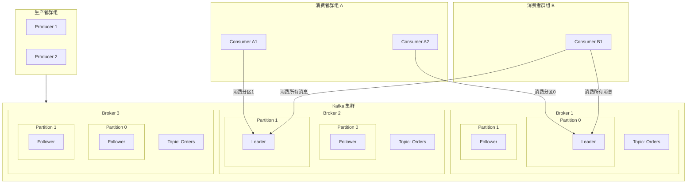
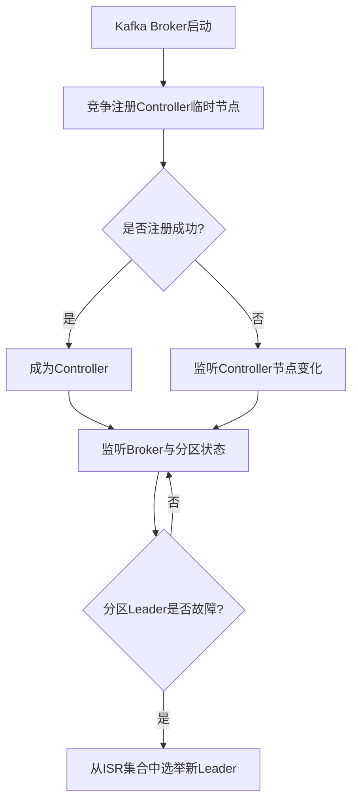

---
category:
  - 分布式系统
  - kafka
tag:
  - 分布式
  - 消息队列
date: 2025-11-18
star: true
---

# Kafka简介

Apache Kafka 是一个分布式的、高吞吐量、高可扩展性的流处理平台。它主要用于构建实时的数据管道和流式应用程序。它可以被看作是一种分布式的、基于发布/订阅模式的消息队列。

它的核心能力可以概括为以下三项：

1. **发布和订阅消息流**。
2. **持久化存储消息流，并以容错的方式处理**。
3. **实时处理消息流**。



## 核心概念详解

### 基本角色与架构

- **Producer**：生产者
    - **角色**：向Kafka的Topic发送消息的客户端。
    - **行为**：生产者决定将消息发送到Topic的哪个Partition。可以通过轮询、指定Key等方式。

- **Consumer**：消费者
    - **角色**：从Kafka的Topic读取消息的客户端。
    - **行为**：消费者通过订阅一个或多个Topic，并从一个Consumer Group中拉取消息。

- **Broker**：代理/服务器
    - **角色**：一个独立的Kafka服务器实例。多个Broker组成一个Kafka集群。
    - **行为**：接收生产者的消息，为这些消息设置偏移量，并持久化存储到磁盘；同时响应消费者的拉取请求，返回消息。

- **Cluster**：集群
    - **角色**：由多个Broker组成的集合，提供高可用和负载均衡。
    - **行为**：整个Kafka服务由一个集群来提供。集群会自动在Broker间分布数据和客户端请求。

- **Controller**：控制器
    - **角色**：Kafka集群中的一个特殊Broker，由集群选举产生。
    - **行为**：负责管理分区和副本的状态，包括分区的分配、Leader选举、监控Broker故障等。是集群的“大脑”。

- **ZooKeeper**
    - **角色**：Kafka的“元数据管理者”和“协调者”。（注意：新版本Kafka正在逐步移除对ZooKeeper的依赖，使用Kraft模式）
    - **行为**：
        - 存储和管理Broker、Topic、Partition等元数据。
        - 进行Controller的选举。
        - 管理Consumer Group的偏移量（老版本）。
        - 监听Broker上下线，通知Controller。

### 数据模型与存储

- **Topic**：主题
    - **概念**：消息的类别或流的名字。生产者将消息发送到特定的Topic，消费者订阅特定的Topic来消费消息。
    - **类比**：可以理解为数据库中的表名或文件系统中的文件夹。

- **Partition**：分区
    - **概念**：这是Kafka实现高吞吐和水平扩展的核心。每个Topic可以被分成一个或多个Partition。
    - **作用**：
        - **并行处理**：不同Partition的数据可以被并行生产和消费，极大地提高了吞吐量。
        - **水平扩展**：Partition可以分布在不同Broker上，使得Topic的数据量可以远超单台服务器的容量。
        - **消息顺序**：Kafka只保证在单个Partition内消息的有序性，不保证整个Topic的有序性。
    - **存储**：每个Partition在物理上对应一个文件夹，里面存储着日志文件。

- **Offset**：偏移量
    - **概念**：消息在Partition中的唯一标识，是一个单调递增且不变的序列号。
    - **作用**：
        - 消费者通过记录自己消费到的Offset，来追踪消费进度。
        - Kafka不跟踪每条消息是否被消费，而是由消费者自己管理Offset。这带来了极大的灵活性。

- **Log Segment**：日志分段
    - **概念**：Partition在物理上并不是一个巨大的文件，而是被拆分成多个大小相等的Log Segment文件。
    - **作用**：
        - 便于过期数据的删除（直接删除整个旧文件）。
        - 提高索引和查找效率。
    - **组成**：每个Segment由一个日志文件（.log，存数据）和一个索引文件（.index，存偏移量到文件位置的映射）组成。

- **Replica**：副本
    - **概念**：每个Partition可以有多个副本，用于提供数据冗余和高可用。
    - **角色**：
        - **Leader Replica**：每个Partition都有一个Leader，负责处理所有该分区的读写请求。
        - **Follower Replica**：被动地、异步地从Leader复制数据。如果Leader发生故障，Kafka会从Follower中选举一个新的Leader。
    - **ISR**：In-Sync Replicas（同步副本集合）。这是与Leader保持同步的Replica集合（包括Leader自己）。只有ISR中的副本才有资格被选举为新的Leader。

### 消费组与交付语义

- **Consumer Group：消费者组**
    - **概念**：由一组消费者实例组成的逻辑组，共同消费一个或多个Topic。
    - **核心机制**：**一个Partition在同一时间只能被同一个Consumer Group内的一个Consumer消费**。
    - **作用**：
        - **实现两种消息模式**：
            - **队列模式**：所有Consumer在同一个Group内，它们共同分担Topic的消息，每条消息只被组内的一个Consumer处理。
            - **发布/订阅模式**：每个Consumer在不同的Group内，它们都能收到Topic的全部消息。
        - **水平扩展消费能力**：通过增加Group内的Consumer实例，可以提高消费的并行度。但注意，Consumer数量不应超过Topic的Partition数量，否则多余的Consumer会闲置。

- **消息交付语义**：
    - **At Most Once**：消息最多被消费一次。消费者先提交Offset，再处理消息。可能会丢失消息。
    - **At Least Once**：消息至少被消费一次。消费者先处理消息，成功后提交Offset。可能会重复消费，这是最常用的模式。
    - **Exactly Once**：消息有且仅被消费一次。这是最理想的模式。Kafka通过事务和幂等生产者等机制来实现。

## 选举

### 控制器（Controller）选举

控制器是Kafka集群的“大脑”，负责管理分区和副本的状态。其选举过程完全依赖于ZooKeeper的分布式锁特性：

1. **抢占节点**：所有Broker启动时，都会尝试在ZooKeeper的 `/controller` 路径下创建一个临时节点（Ephemeral Node）。
2. **先到先得**：由于ZooKeeper保证节点唯一性，只有一个Broker能创建成功。创建成功的Broker就成为集群的控制器。
3. **监听与接管**：其他未成功的Broker会监听这个 `/controller`
   节点。如果当前的控制器宕机，它与ZooKeeper的会话会超时，导致其创建的临时节点被自动删除。其他Broker通过Watch机制感知到这一变化，便会重新发起新一轮的控制器选举。



### 分区Leader选举

分区的Leader副本负责处理该分区的所有读写请求。其选举工作由控制器具体负责：

1. **选举触发**：当某个分区的Leader副本失效（例如，其所在的Broker宕机）时，控制器会监听到这一变化，并立即触发该分区的Leader选举。
2. **候选范围**：Kafka默认只会从 ISR集合 中选举新的Leader。ISR（In-Sync
   Replicas）是指所有与当前Leader副本保持同步的副本集合。一个Follower副本需要满足一定条件（如在一定时间内与Leader的同步延迟未超过阈值）才能被认为是ISR成员。
3. **选举策略**：常见的选举策略包括：
    - **首选副本选举**：这是默认策略。控制器会尝试将分区的Leader切换回AR列表中的第一个副本（即“首选副本”），这有助于保证负载均衡。
    - **ISR选举**：当Leader宕机时，控制器会从ISR中选择一个存活的副本作为新Leader，通常会选择AR列表中排在前面且存活的副本。

## ISR

ISR（In-Sync Replicas）是指与Leader副本保持同步的副本集合。只有ISR中的副本才有资格在Leader失效时被选举为新的Leader。

### LEO（Log End Offset）的定义

- **对于Leader副本**：LEO表示当前日志的结束位置，即下一条待写入消息的偏移量。生产者新写入的消息会追加到Leader副本的日志中，然后更新Leader的LEO。
- **对于Follower副本**：Follower副本会从Leader副本拉取消息，并追加到自己的日志中，然后更新自己的LEO。

### LEO的维护

- 每个副本（无论是Leader还是Follower）都会维护自己的LEO。
- 在Leader副本中，除了维护自己的LEO，还会维护所有Follower副本的LEO（通过Follower发送的Fetch请求中的偏移量来更新）。

### LEO与HW（High Watermark）的关系

- **HW = ISR中所有副本的最小LEO**
- HW（高水位）表示已经成功被所有ISR副本复制的消息偏移量。消费者只能消费到HW之前的消息。
- HW的更新机制如下：
    - Leader副本会维护每个Follower副本的LEO（称为remote LEO）和自己的LEO。
    - Leader会选取所有ISR副本（包括自己）的LEO中的最小值作为新的HW。
    - Follower副本在从Leader拉取消息时，会在响应中收到Leader的HW，然后将自己的HW更新为收到的HW。

### LEO在数据复制中的作用

- 当Follower副本向Leader发送Fetch请求时，会携带自己当前的LEO（即下一次要拉取的偏移量）。
- Leader根据这个偏移量返回数据，并在响应中包含当前的HW。
- Follower接收到数据后，将消息追加到日志中，并更新自己的LEO，然后根据响应中的HW更新自己的HW。

### 监控维度

Leader副本通过两个核心维度监控Follower的同步状态：

1. **时间维度监控**
   ```java
   // 伪代码：时间维度检查
   public boolean isFollowerLagging(FollowerReplica follower) {
       long currentTime = System.currentTimeMillis();
       long lastFetchTime = follower.getLastFetchTime();
       
       // 关键判断：最后一次成功拉取是否超时
       return (currentTime - lastFetchTime) > replica.lag.time.max.ms;
   }
   ```

2. **进度维度监控**
   ```java
   // 伪代码：进度维度检查  
   public boolean isFollowerCatchingUp(FollowerReplica follower) {
       long leaderLEO = this.logEndOffset;
       long followerLEO = follower.getLogEndOffset();
       
       // Follower的LEO必须至少达到当前的HW
       return followerLEO >= this.highWatermark;
   }
   ```

### 监控触发时机

- **定时检查**：Leader定期（默认每10秒）扫描所有Follower状态
- **事件驱动**：
    - 处理Follower的FetchRequest时
    - 新消息写入时
    - HW更新时

### ISR成员变更流程

#### ISR收缩（副本移出）

当Follower副本同步滞后时，会被移出ISR：

```java
// 伪代码
// 完整的ISR收缩逻辑
public void maybeShrinkIsr() {
    long now = System.currentTimeMillis();
    Set<Integer> outOfSyncReplicas = new HashSet<>();
    
    for (FollowerReplica follower : followers) {
        // 检查同步状态
        if (now - follower.lastCaughtUpTimeMs > replica.lag.time.max.ms) {
            outOfSyncReplicas.add(follower.brokerId);
        }
    }
    
    if (!outOfSyncReplicas.isEmpty()) {
        // 执行ISR收缩
        shrinkIsr(outOfSyncReplicas);
    }
}

private void shrinkIsr(Set<Integer> outOfSyncReplicas) {
    // 1. 更新ISR集合
    Set<Integer> newIsr = new HashSet<>(isr);
    newIsr.removeAll(outOfSyncReplicas);
    
    // 2. 持久化到ZooKeeper
    persistIsrToZk(newIsr);
    
    // 3. 更新内存状态
    this.isr = newIsr;
    
    // 4. 重新计算HW
    updateHighWatermark();
    
    // 5. 记录日志和指标
    log.info("Shrank ISR from {} to {}", isrBeforeShrink, newIsr);
    metrics.recordIsrShrink();
}
```

#### ISR扩展（副本重新加入）

当滞后的Follower副本重新追上进度时，会被重新加入ISR：
```java
// ISR扩展逻辑
public void maybeExpandIsr(FollowerReplica follower) {
    // 检查副本是否满足重新加入条件
    if (shouldRejoinIsr(follower)) {
        expandIsr(Collections.singleton(follower.brokerId));
    }
}

private boolean shouldRejoinIsr(FollowerReplica follower) {
    long currentTime = System.currentTimeMillis();
    
    // 必须满足的条件：
    return 
        // 1. 当前不在ISR中
        !isr.contains(follower.brokerId) &&
        // 2. LEO至少达到HW
        follower.logEndOffset >= highWatermark &&
        // 3. 最近有活跃的拉取请求
        (currentTime - follower.lastFetchTime) < replica.lag.time.max.ms;
}

private void expandIsr(Set<Integer> rejoiningReplicas) {
    // 1. 更新ISR集合
    Set<Integer> newIsr = new HashSet<>(isr);
    newIsr.addAll(rejoiningReplicas);
    
    // 2. 持久化到ZooKeeper  
    persistIsrToZk(newIsr);
    
    // 3. 更新内存状态
    this.isr = newIsr;
    
    // 4. 可能推进HW
    updateHighWatermark();
    
    // 5. 记录日志和指标
    log.info("Expanded ISR from {} to {}", isrBeforeExpand, newIsr);
    metrics.recordIsrExpand();
}
```

## Offset

在 Kafka 中，Offset 是一个单调递增的整数，用于唯一标识某个分区中的每条消息。

主题被分为多个分区。

每个分区都是一个有序的、不可变的消息序列。

消息在被添加到分区时，会被分配一个从 0 开始递增的偏移量。

对于消费者来说，Offset 表示“消费者在当前分区上的消费进度”。例如，一个消费者在分区 0 的 Offset 是 5，意味着它已经消费了偏移量 0 到 4 的消息，接下来将要消费偏移量为 5 的消息。

### Offset 的存储与管理方式

Kafka 提供了两种主要的 Offset 管理策略。

#### 方式一：由 Kafka 内部维护（默认且推荐）

Kafka 使用一个特殊的内部主题 `__consumer_offsets` 来存储消费者组的偏移量。

**工作原理：**

1. **注册消费者群组**：
    - 消费者群组在启动时，会向 Kafka 集群注册自己。

2. **提交偏移量**：
    - 消费者消费消息后，会定期（或手动）将其当前读取到的每个分区的最大偏移量提交到 `__consumer_offsets` 主题。

3. **恢复消费位置**：
    - 当消费者重启或发生再均衡（Rebalance）时，它会向 Kafka 请求它上次提交的偏移量，并从该位置继续消费。

**提交方式：**

- **自动提交**
    - **配置**：`enable.auto.commit = true`（默认）
    - **行为**：消费者在后台定期（由 `auto.commit.interval.ms` 配置，默认 5 秒）自动提交偏移量。
    - **优点**：简单，无需手动编码。
    - **缺点**：可能导致重复消费。如果在两次自动提交的间隔内应用程序崩溃，那么从上次提交成功到崩溃前消费的消息将会被再次处理。
```java
Properties props = new Properties();
props.put("bootstrap.servers", "localhost:9092");
props.put("group.id", "my-group");
props.put("enable.auto.commit", "true");
props.put("auto.commit.interval.ms", "5000"); // 5秒
// ... 其他配置
```

- **手动提交**

    - **配置**：- `enable.auto.commit = false`
    - **行为**：由应用程序代码在消息被成功处理之后，显式地调用 `commitSync()` 或 `commitAsync()` 方法来提交偏移量。
    - **优点**：更精确地控制提交时机，可以确保消息被成功处理后再提交偏移量，从而避免重复消费。是实现“至少一次”语义的常用方法。
    - **缺点**：编码稍复杂，如果提交失败需要妥善处理。
    - **同步提交**：`commitSync()`会阻塞直到偏移量提交成功或遇到不可恢复的错误。可靠性高，但性能较差。

    ```java
    try {
        while (true) {
            ConsumerRecords<String, String> records = consumer.poll(Duration.ofMillis(100));
            for (ConsumerRecord<String, String> record : records) {
                // 处理消息（例如，写入数据库，进行业务计算）
                processMessage(record);
            }
            // 在处理完当前批次的所有消息后，同步提交偏移量
            consumer.commitSync();
        }
    } catch (Exception e) {
        // 处理异常
    } finally {
        consumer.close();
    }
    ```

    - 异步提交：`commitAsync()` 不会阻塞，立即返回。性能更好，但在发生再均衡时，如果提交失败，可能导致重复消费。通常可以配合回调函数进行错误处理。

  ```java
  while (true) {
    ConsumerRecords<String, String> records = consumer.poll(Duration.ofMillis(100));
    for (ConsumerRecord<String, String> record : records) {
        processMessage(record);
    }
    // 异步提交，并注册一个回调函数
    consumer.commitAsync(new OffsetCommitCallback() {
        @Override
        public void onComplete(Map<TopicPartition, OffsetAndMetadata> offsets, Exception exception) {
            if (exception != null) {
                log.error("Commit failed for offsets {}", offsets, exception);
            } else {
                log.debug("Commit successful for offsets {}", offsets);
            }
        }
    });
  }
  ```
    
  - 组合提交：通常在生产环境中，为了兼顾可靠性和性能，会采用一种组合策略：在常规流程中使用异步提交，在消费者关闭或再均衡发生前，使用同步提交做最后的保障。

**方式二：由消费者自定义维护（例如在外部数据库）**

在某些特殊场景下，你可能需要将 Offset 存储在 Kafka 之外的地方，例如 MySQL、Redis 或 ZooKeeper。

**适用场景**

- **精确一次处理**：需要将消息的处理结果和 Offset 在同一个数据库事务中提交，确保两者同时成功或失败。
- **输出目标不支持幂等性**：如果处理后的输出系统（如数据库）不支持幂等写入，通过将 Offset 与数据一起存储，可以避免重复数据。
- **Legacy 系统或特殊需求**：某些旧系统或特定需求可能要求自定义 Offset 的管理方式。

**实现方式**

1. **配置消费者**：设置 `enable.auto.commit = false`，禁用自动提交偏移量。

2. **启动时读取偏移量**：在代码中使用 `consumer.seek(TopicPartition, offset)` 方法，在启动或再均衡时从外部存储中读取偏移量，并定位到该位置。

3. **处理消息并提交偏移量**：在处理完消息后，将消息结果和新的 Offset 在同一个事务中写入外部存储。

```java
// 伪代码示例
while (true) {
    ConsumerRecords<String, String> records = consumer.poll(Duration.ofMillis(100));
    for (ConsumerRecord<String, String> record : records) {
        // 1. 开始数据库事务
        startTransaction();
        
        // 2. 处理消息，将结果写入数据库
        saveResultToDatabase(record.value());
        
        // 3. 将当前消息的 Offset (record.offset() + 1) 存入数据库
        saveOffsetToDatabase(record.topic(), record.partition(), record.offset() + 1);
        
        // 4. 提交数据库事务
        commitTransaction();
    }
}
```

### 新加入消费者或消费者组

#### 场景一：消费者组之前已提交过 Offset（最常见情况）

这是最常见的场景。消费者组中的某个消费者之前已经消费过分配给新消费者的那个分区，并且成功提交了 Offset。

- **行为**：新加入的消费者会从该消费者组最后提交的 Offset 位置开始消费。
- **原理**：Kafka 在 `__consumer_offsets` 主题中记录了这个消费者组在每个分区上的消费进度。 当发生再均衡，分区被重新分配给新消费者时，新消费者会去查询这个进度，并从那里开始消费。
- **示例**：
  - 假设一个主题 `my-topic` 的分区 0 有 1000 条消息（Offset 0-999）。
  - 原消费者 A 消费到了 Offset 500 并提交。
  - 此时新消费者 B 加入组，再均衡后，分区 0 被分配给了 B。
  - 消费者 B 会直接从 Offset 501 开始消费，而不是从 0 或 1000。

#### 场景二：全新的消费者组，或者 Offset 已过期

如果这是一个全新的消费者组（即 `group.id` 是新的），或者该消费者组上次提交的 Offset 因为超过保留期限而被 Kafka
删除，那么行为将由消费者的 `auto.offset.reset` 配置决定。

- **配置项**：`auto.offset.reset = [earliest | latest | none]`

- **行为**：
    - **earliest**：从分区最早可用的 Offset 开始消费（即从第一条消息开始）。
    - **latest**（默认值）：从分区最新的 Offset 开始消费（即只消费消费者启动后新产生的消息）。
    - **none**：如果找不到之前的 Offset，则抛出异常。

**中途加入的情况**：
即使消费者是中途加入的，但如果它分配到的分区是该消费者组从未消费过的，那么对于这个特定的分区来说，其行为就等同于“全新的消费者组”，同样会遵循`auto.offset.reset` 规则。

**示例**：

- 消费者组 `group-1` 只消费过分区 0。
- 现在主题新增了分区 1。
- 新消费者 C 加入 `group-1`，并被分配到了分区 1。
- 由于 `group-1` 从未提交过分区 1 的 Offset，所以消费者 C 在分区 1 上的起始位置将由 `auto.offset.reset` 配置决定。

| 场景                    | 新加入消费者的起始 Offset                                  |
|-----------------------|---------------------------------------------------|
| 消费者组已提交过该分区的 Offset   | 从最后提交的 Offset 开始                                  |
| 消费者组是全新的，或 Offset 已过期 | 由 `auto.offset.reset` 配置决定（通常为 `latest`，即从最新消息开始） |
| 消费者组消费过其他分区，但这是新分区    | 对于这个新分区，等同于“全新的”，由 `auto.offset.reset` 配置决定       |

### 总结

| 特性   | 自动提交                      | 手动提交（同步/异步）                | 自定义外部存储                    |
|------|---------------------------|----------------------------|----------------------------|
| 配置   | `enable.auto.commit=true` | `enable.auto.commit=false` | `enable.auto.commit=false` |
| 控制精度 | 低                         | 高                          | 最高                         |
| 数据语义 | 至少一次（可能重复）                | 至少一次                       | 恰好一次（需事务支持）                |
| 性能   | 最佳                        | 同步差，异步佳                    | 取决于外部系统                    |
| 复杂度  | 最低                        | 中等                         | 最高                         |

**实践建议**

1. **对于大多数应用**：推荐使用手动提交，并优先选择异步提交以保证性能。在消费者优雅关闭或发生再均衡时，使用同步提交作为最终保障。

2. **关键业务**：如果业务要求极高的一致性，不允许重复或丢失，并且输出系统支持事务，可以考虑使用自定义外部存储的方式来实现恰好一次处理。

3. **测试环境**：可以在测试环境开启自动提交以简化配置，但生产环境务必谨慎。

4. **监控**：监控消费者组的滞后情况，即最新消息的偏移量与消费者当前提交的偏移量之差。Lag持续增大通常意味着消费者处理速度跟不上生产者。

### 日志清理

1. 机制一：基于时间的保留策略（默认
```properties
# server.properties 或 topic 配置
log.retention.hours=168    # 默认保留7天
# 或
log.retention.ms=604800000 # 7天，以毫秒为单位
```

**工作原理：**
- Kafka 后台有一个"日志清理"线程定期运行
- 检查每个日志段的最后修改时间（基于段中最后一条消息的时间戳）
- 删除超过保留期限的段文件
- 最早可用 Offset = 现存最旧段文件的起始 Offset

2. 机制二：基于大小的保留策略

```properties
log.retention.bytes=-1              # 分区总大小限制，-1表示无限制
log.segment.bytes=1073741824        # 单个段文件大小，默认1GB
```

**工作原理：**
- 当分区总大小超过 log.retention.bytes 时 从最旧的段文件开始删除，直到总大小低于限制 
- 最早可用 Offset 相应向前推进

3. 机制三：日志压缩策略

```properties
cleanup.policy=compact              # 启用日志压缩
min.cleanable.dirty.ratio=0.5       # 触发压缩的脏数据比例
```

**工作原理：**
- 只保留每个 Key 的最新值
- 删除相同 Key 的旧消息（墓碑机制处理已删除的 Key）
- 最早可用 Offset 可能会"跳跃"，因为有些中间消息被压缩掉了

## 再均衡

再均衡 是指在一个消费者组内，当消费者成员数量发生变化（增加或减少）或订阅主题的分区数发生变化时，Kafka 为了实现负载均衡和高可用性，自动重新分配 订阅主题的分区给组内各个消费者的过程。

### 再均衡的触发条件

以下三种情况会触发再均衡：

1. **消费者加入组**：一个新的消费者实例启动了，并加入了现有的消费者组。
2. **消费者离开组**：一个消费者实例被正常关闭（发送离开组请求）或崩溃（心跳超时，被协调器认为已死亡）。
3. **订阅的主题分区数发生变化**：管理员通过 `kafka-topics.sh` 脚本增加了主题的分区数量。注意：减少分区数通常不被推荐，且不会触发再均衡。

### 机制

1. **触发**：新消费者 B 启动，并向 Group Coordinator 注册。
2. **暂停**：Group Coordinator 检测到组内成员变化，会标记该组进入 "Preparing Rebalance" 状态。此时组内所有消费者都会暂停消息拉取。
3. **重新分配**：Group Coordinator 根据分区分配策略（如 RangeAssignor、RoundRobinAssignor 或
   CooperativeStickyAssignor）为组内所有消费者（包括新加入的）重新分配分区。
4. **获取 Offset**：分配完成后，每个消费者会向 Group Coordinator 获取它被分配到的每个分区的最后提交的 Offset。
5. **定位与恢复**：每个消费者调用 `seek` 方法，将拉取位置定位到获取到的 Offset，然后开始正常消费。

### 有序消费

在Kafka中保证消息的有序消费是一个常见需求，核心在于理解其 「分区内有序，分区间无序」 的特性。

| 方案    | 实现原理                      | 适用场景                       | 优点                | 缺点                    |
|-------|---------------------------|----------------------------|-------------------|-----------------------|
| 单分区法  | 整个Topic只使用1个分区。           | 消息量小，严格要求全局顺序。             | 实现简单，严格保证全局顺序。    | 性能瓶颈，无法水平扩展。          |
| 键保序法  | 将需保序的消息设置相同的Key，使其进入同一分区。 | 局部有序场景，如：同一用户的订单、同一设备的日志。  | 性能与顺序的较好平衡，可水平扩展。 | 需要合理设计消息Key，可能出现数据倾斜。 |
| 单消费者法 | 一个消费者组内只部署一个消费者实例。        | 消费能力要求不高，但需保序的Topic。       | 配置简单。             | 单个消费者容易成为性能瓶颈。        |
| 事务/幂等 | 生产者端启用事务或幂等性，防止重复发送导致乱序。  | 需要精确一次（Exactly-Once）语义的场景。 | 保证消息不重复，维护顺序。     | 有一定性能开销，配置稍复杂。        |

### 配置

**生产者端**

- **使用同步发送**：异步发送可能因网络重试导致消息乱序到达。通过将 `max.in.flight.requests.per.connection`参数设置为1，可以确保同一时间只能有一个请求在传输，从而保证顺序。
- **合理设置Key**：如果你使用键保序法，需要确保具有相同逻辑顺序的消息（例如同一个订单ID）拥有相同的Key。

**消费者端**

- **关闭自动提交**：将 `enable.auto.commit` 设置为 `false`。自动提交可能导致消息未处理完就提交了偏移量，再均衡时造成消息丢失或重复消费。
- **手动提交偏移量**：在处理完一批消息后，手动调用 `commitSync()` 同步提交偏移量。这样可以确保只有成功处理的消息才会被提交。
- **谨慎处理并行消费**：一个分区在同一时间只能被同一个消费者组内的一个消费者消费。如果你在消费者内部启用多线程处理，需要自行维护分区内消息的处理顺序。

## 核心配置

| 配置类别         | 核心配置项                                 | 参数含义说明                                                           | 默认值                    | 推荐值与详细说明                                                                                                                                                                                               | 主要优化目标           |
|--------------|---------------------------------------|------------------------------------------------------------------|------------------------|--------------------------------------------------------------------------------------------------------------------------------------------------------------------------------------------------------|------------------|
| Broker 通用配置  | num.network.threads                   | broker处理网络请求（如接收客户端连接、接收生产者消息、响应消费者拉取请求）的最大线程数。                  | 3                      | 通常设置为 CPU核心数+1 或 CPU核心数的50% 。                                                                                                                                                                          | 吞吐量、延迟           |
|              | num.io.threads                        | broker处理磁盘IO（将消息写入磁盘、从磁盘读取消息、副本同步）的线程数。                          | 8                      | 通常设置为 CPU核心数的2倍 或 CPU核心数的50%~100% 。                                                                                                                                                                    | 吞吐量              |
|              | num.partitions                        | 每个Topic的默认分区个数。分区是Kafka并行处理的基本单位。                                | 1                      | 创建Topic时的默认分区数。建议为消费者线程数的整数倍，以提升并行处理能力。                                                                                                                                                                | 并行度、扩展性          |
|              | default.replication.factor            | Topic的默认副本数。副本机制是Kafka实现高可用的核心。                                  | 1                      | 建议设置为 3 。保障数据可靠性。                                                                                                                                                                                      | 可靠性、可用性          |
|              | log.retention.hours                   | 日志保存时间，超过这个时间会根据policy处理数据。                                      | 168 (7天)               | 根据磁盘容量和业务需求设置，例如 72小时。                                                                                                                                                                                 | 磁盘容量             |
|              | log.segment.bytes                     | 控制日志segment文件的最大大小。                                              | 1GB (1073741824 bytes) | 可设置为 1GB~2GB，以减少分段数量和索引开销。                                                                                                                                                                             | 磁盘IO             |
| Broker 可靠性配置 | min.insync.replicas                   | 当生产者acks设置为"all"时，要求同步完成的最小副本数。                                  | 1                      | 建议设置为 2，与3副本因子配合。                                                                                                                                                                                      | 可靠性、一致性          |
|              | replica.lag.time.max.ms               | Follower副本同步超时阈值。如果Follower在此时间内未追上Leader的数据，会被移出ISR。            | 30000 (30秒)            | 默认30000ms。网络较差时可调大，对延迟敏感场景可调小至10000ms。                                                                                                                                                                 | 可靠性、可用性          |
|              | unclean.leader.election.enable        | 是否允许非ISR副本成为Leader。                                              | true                   | 建议设置为 false，防止数据丢失。                                                                                                                                                                                    | 可靠性、数据一致性        |
| 生产者配置        | acks                                  | 消息发送的确认机制，指定了生产者认为消息成功发送之前，分区领导者必须收到消息的确认方式。这是可靠性、吞吐量和延迟的核心权衡参数。 | 1                      | 0（无确认）: 生产者不等待任何确认，可能丢失数据，但吞吐量最高，延迟最低。<br>1（领导者确认）: 生产者等待Leader确认，可能丢失数据（当Leader故障且未复制到Follower时），默认值，可靠性与吞吐量的折中。<br>all/-1（全量同步确认）: 生产者等待ISR中所有副本确认，最高可靠性，但吞吐量最低，延迟最高。需与Broker端min.insync.replicas配合。 | 可靠性 vs 吞吐量 vs 延迟 |
|              | compression.type                      | 消息的压缩算法。压缩可减少网络传输和存储开销。                                          | none (不压缩)             | 如 lz4 (高TPS)、snappy (低CPU)、zstd (高压缩率)。                                                                                                                                                                | 网络带宽、吞吐量         |
|              | batch.size                            | 指定ProducerBatch内存区域的大小。                                          | 16384 (16KB)           | 批量大小（如16KB~1MB）和等待时间（如50~100ms）。共同控制批量发送行为。                                                                                                                                                            | 吞吐量              |
|              | linger.ms                             | 指定ProducerBatch在延迟多少毫秒后再发送。                                      | 0 (立即发送)               | 与batch.size配合使用，提高吞吐量。                                                                                                                                                                                 | 吞吐量              |
|              | buffer.memory                         | 生产者客户端中用于缓存消息的缓冲区大小。                                             | 33554432 (32MB)        | 如 32MB 或 64MB以上。                                                                                                                                                                                       | 吞吐量              |
|              | max.in.flight.requests.per.connection | 生产者在收到broker响应之前单个连接上可以发送的未确认请求数量。                               | 5                      | 默认5。设置为1可保证分区内消息顺序，但可能降低吞吐量。                                                                                                                                                                           | 顺序性 vs 吞吐量       |
| 消费者配置        | fetch.min.bytes                       | 消费者一次拉取请求的最小数据量。                                                 | 1 (1字节)                | 可适当调大（如1MB）以减少拉取频率。                                                                                                                                                                                    | 吞吐量、网络开销         |
|              | max.poll.records                      | 消费者单次poll()调用返回的最大消息数。                                           | 500                    | 默认500。若单条处理耗时较长，应调小以避免超时。                                                                                                                                                                              | 处理能力、避免活锁        |
|              | max.poll.interval.ms                  | 两次poll操作之间的最大时间间隔。                                               | 300000 (5分钟)           | 默认300000ms。处理大批量数据时可适当调大。                                                                                                                                                                              | 处理能力、避免重平衡       |
|              | session.timeout.ms                    | 检测消费者是否失效的超时时间。                                                  | 45000 (45秒)            | 默认45000ms。通常建议设置为比 heartbeat.interval.ms 的3倍大一些。                                                                                                                                                       | 故障检测、可用性         |
|              | heartbeat.interval.ms                 | 消费者发送心跳给协调器的时间间隔。                                                | 3000 (3秒)              | 默认3000ms。应小于 session.timeout.ms 的三分之一。                                                                                                                                                                 | 故障检测、可用性         |
|              | fetch.max.bytes                       | 消费者单次拉取请求返回的最大数据量。                                               | 52428800 (50MB)        | 可根据消息大小和网络带宽调整，如增加至100MB。                                                                                                                                                                              | 吞吐量              |
|              | enable.auto.commit                    | 是否自动提交消费位移。                                                      | true                   | 对于精确一次处理，建议设置为 false 并手动提交。                                                                                                                                                                            | 数据一致性            |