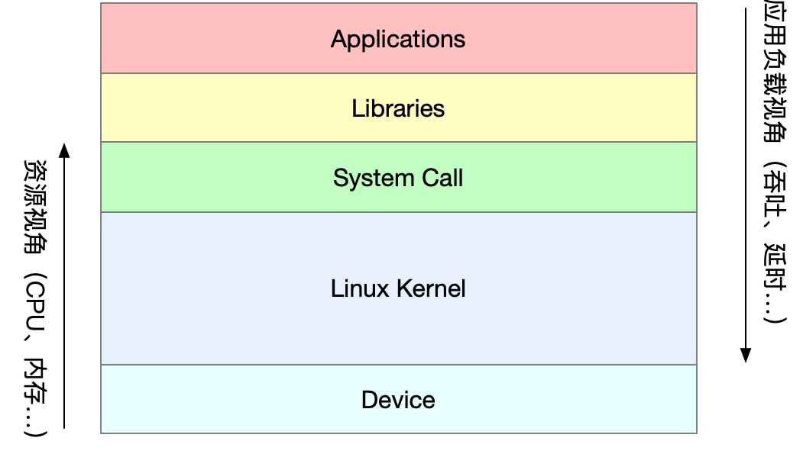
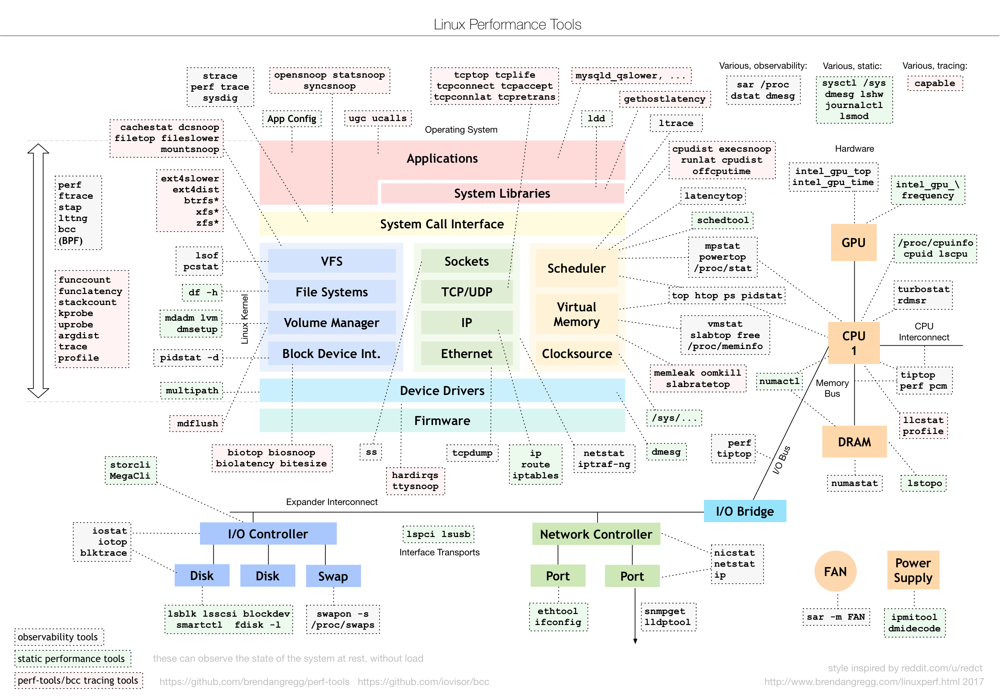
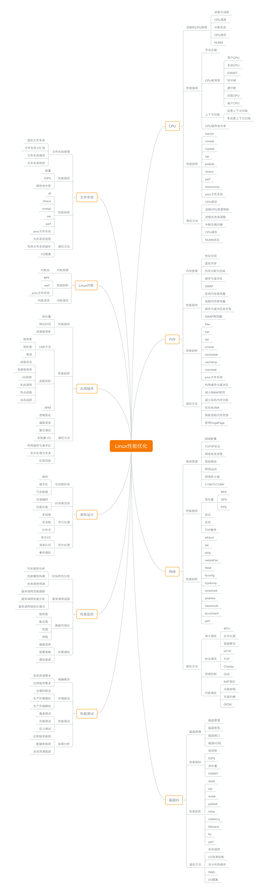

---
category:
  - 性能
  - 非原创
  - 收集整理
tag:
  - Linux
date: 2024-06-19
---

# Linux性能相关工具和指标总结

本文收集了Linux相关的性能指标和工具。大部分资料来源于极客时间课程《[Linux性能优化实战](https://time.geekbang.org/column/intro/100020901)》，工具使用资料大部分来源于：[linux-command](https://github.com/jaywcjlove/linux-command)。

## 总揽

### 系统资源



### 工具图谱



图片来自[brendangregg.com](https://www.brendangregg.com/Perf/linux_perf_tools_full.png)

### 思维导图



## CPU

### 平均负载（load average）

平均负载（Load Average）是指单位时间内，系统处于**可运行状态**和**不可中断状态**的平均进程数，也就是**平均活跃进程数**，它和CPU使用率并没有直接关系。

所谓可运行状态的进程，是指正在使用CPU或者正在等待CPU的进程，也就是我们常用ps命令看到的，处于R状态（Running 或 Runnable）的进程。

不可中断状态的进程则是正处于内核态关键流程中的进程，并且这些流程是不可打断的，比如最常见的是等待硬件设备的I/O响应，也就是我们在ps命令中看到的D状态（Uninterruptible Sleep，也称为Disk Sleep）的进程。

比如，当一个进程向磁盘读写数据时，为了保证数据的一致性，在得到磁盘回复前，它是不能被其他进程或者中断打断的，这个时候的进程就处于不可中断状态。如果此时的进程被打断了，就容易出现磁盘数据与进程数据不一致的问题。

所以，不可中断状态实际上是系统对进程和硬件设备的一种保护机制。

平均活跃进程数，直观上的理解就是单位时间内的活跃进程数，但它实际上是活跃进程数的指数衰减平均值。

既然平均的是活跃进程数，那么最理想的，就是每个CPU上都刚好运行着一个进程，这样每个CPU都得到了充分利用。比如当平均负载为2时，意味着什么呢？

- 在只有2个CPU的系统上，意味着所有的CPU都刚好被完全占用。
- 在4个CPU的系统上，意味着CPU有50%的空闲。
- 而在只有1个CPU的系统中，则意味着有一半的进程竞争不到CPU。

#### 平均负载为多少时合理

经验值：**当平均负载高于 CPU 数量70%的时候**，就应该分析排查负载高的问题了。

- 如果1分钟、5分钟、15分钟的三个值基本相同，或者相差不大，那就说明系统负载很平稳。
- 但如果1分钟的值远小于15 分钟的值，就说明系统最近1分钟的负载在减少，而过去15分钟内却有很大的负载。
- 反过来，如果1分钟的值远大于 15 分钟的值，就说明最近1分钟的负载在增加，这种增加有可能只是临时性的，也有可能还会持续增加下去，所以就需要持续观察。一旦1分钟的平均负载接近或超过了CPU的个数，就意味着系统正在发生过载的问题，这时就得分析调查是哪里导致的问题，并要想办法优化了。

#### 平均负载与CPU使用率

平均负载是指单位时间内，处于可运行状态和不可中断状态的进程数。所以，它不仅包括了**正在使用 CPU** 的进程，还包括**等待 CPU 和等待 I/O** 的进程。

而 CPU 使用率，是单位时间内 CPU 繁忙情况的统计，跟平均负载并不一定完全对应。比如：

- CPU 密集型进程，使用大量 CPU 会导致平均负载升高，此时这两者是一致的；
- I/O 密集型进程，等待 I/O 也会导致平均负载升高，但 CPU 使用率不一定很高；
- 大量等待 CPU 的进程调度也会导致平均负载升高，此时的CPU使用率也会比较高。

### stress

stress 是一个 Linux 系统压力测试工具，可以用作异常进程模拟平均负载升高的场景。

CPU 密集型进程：模拟一个 CPU 使用率 100%
```shell
stress --cpu 1 --timeout 600
```

I/O 密集型进程：模拟 I/O 压力，即不停地执行 sync 
```shell
stress -i 1 --timeout 600
```

大量进程的场景：模拟 8 个进程
```shell
stress -c 8 --timeout 600
```

### mpstat

mpstat 是一个常用的多核 CPU 性能分析工具，用来实时查看每个 CPU 的性能指标，以及所有CPU的平均指标。

语法：
```shell
mpstat [选项] [<间隔时间> [<次数>]]
```

选项：
```shell
-P：指定CPU编号。
```

参数：
- 间隔时间：每次报告的间隔时间（秒）；
- 次数：显示报告的次数。

表头含义：
- %user：表示处理用户进程所使用CPU的百分比。
- %nice：表示在用户级别处理经nice降级的程序所使用CPU的百分比。
- %system：表示内核进程使用的CPU百分比。
- %iowait：表示等待进行I/O所占用CPU时间百分比。
- %irq：表示用于处理系统中断的CPU百分比。
- %soft：表示用于处理软件中断的CPU百分比。
- %steal：在管理程序为另一个虚拟处理器服务时，显示虚拟的一个或多个CPU在非自愿等待中花费的时间的百分比。
- %guest：表示一个或多个CPU在运行虚拟处理器时所花费的时间百分比。
- %gnice：表示一个或多个CPU在运行经nice降级后的虚拟处理器时所花费的时间百分比。
- %idle：CPU的空闲时间百分比。

实例：
```shell
 显示所有CPU的指标，并在间隔5秒输出一组数据
$ mpstat -P ALL 5 1
Linux 4.15.0 (ubuntu)     09/22/18     _x86_64_    (2 CPU)
13:41:28     CPU    %usr   %nice    %sys %iowait    %irq   %soft  %steal  %guest  %gnice   %idle
13:41:33     all    0.21    0.00   12.07   32.67    0.00    0.21    0.00    0.00    0.00   54.84
13:41:33       0    0.43    0.00   23.87   67.53    0.00    0.43    0.00    0.00    0.00    7.74
13:41:33       1    0.00    0.00    0.81    0.20    0.00    0.00    0.00    0.00    0.00   98.99
```

### pidstat

pidstat 是一个常用的进程性能分析工具，用来实时查看进程的 CPU、内存、I/O 以及上下文切换等性能指标。

语法：
```shell
pidstat [ 选项 ] [ <时间间隔> ] [ <次数> ]
```
选项
- u：默认的参数，显示各个进程的cpu使用统计
- r：显示各个进程的内存使用统计
- d：显示各个进程的IO使用情况
- w：显示每个进程的上下文切换情况
- t：显示到线程的统计信息
- p：指定进程号
- T { TASK | CHILD | ALL } 这个选项指定了pidstat监控的。TASK表示报告独立的task，CHILD关键字表示报告进程下所有线程统计信息。ALL表示报告独立的task和task下面的所有线程。 注意：task和子线程的全局的统计信息和pidstat选项无关。这些统计信息不会对应到当前的统计间隔，这些统计信息只有在子线程kill或者完成的时候才会被收集。
- V：版本号
- h：在一行上显示了所有活动，这样其他程序可以容易解析。
- I：在SMP环境，表示任务的CPU使用率/内核数量
- l：显示命令名和所有参数

#### 查看所有进程的CPU使用情况

```shell
# pidstat -u -p ALL
11:04:06 AM   UID       PID    %usr %system  %guest    %CPU   CPU  Command
11:04:06 AM     0         1    0.03    0.05    0.00    0.08    20  systemd
11:04:06 AM     0         2    0.00    0.00    0.00    0.00    28  kthreadd
11:04:06 AM     0         3    0.00    0.00    0.00    0.00     0  rcu_gp
11:04:06 AM     0         4    0.00    0.00    0.00    0.00     0  rcu_par_gp
11:04:06 AM     0         6    0.00    0.00    0.00    0.00     0  kworker/0:0H-kblockd
11:04:06 AM     0         9    0.00    0.00    0.00    0.00    38  mm_percpu_wq
11:04:06 AM     0        10    0.00    0.01    0.00    0.01     0  ksoftirqd/0
11:04:06 AM     0        11    0.00    0.23    0.00    0.23    15  rcu_sched
11:04:06 AM     0        12    0.00    0.00    0.00    0.00     0  migration/0
11:04:06 AM     0        14    0.00    0.00    0.00    0.00     0  cpuhp/0
11:04:06 AM     0        15    0.00    0.00    0.00    0.00     1  cpuhp/1
...
```

表头字段说明
- PID：进程ID
- %usr：进程在用户空间占用cpu的百分比
- %system：进程在内核空间占用cpu的百分比
- %guest：进程在虚拟机占用cpu的百分比
- %CPU：进程占用cpu的百分比
- CPU：处理进程的cpu编号
- Command：当前进程对应的命令

#### 查看所有进程的内存使用情况

```shell
# pidstat -r
11:10:35 AM   UID       PID  minflt/s  majflt/s     VSZ    RSS   %MEM  Command
11:10:35 AM     0         1      7.24      0.05  191312   4208   0.01  systemd
11:10:35 AM     0      1407      2.02      0.09   39316   9016   0.03  systemd-journal
11:10:35 AM     0      1442      0.03      0.00  190380   1080   0.00  lvmetad
11:10:35 AM     0      1457      0.46      0.00   46252   1560   0.00  systemd-udevd
11:10:35 AM     0      2429      0.11      0.00  163620   9472   0.03  sshd
11:10:35 AM   992      2446      0.02      0.00    8588    996   0.00  lsmd
11:10:35 AM     0      2447      0.05      0.00   90572   1468   0.00  rngd
11:10:35 AM     0      2448      0.15      0.02  451272   3520   0.01  udisksd
11:10:35 AM     0      2449      0.18      0.02  396488   1948   0.01  accounts-daemon
11:10:35 AM     0      2454      0.02      0.02  201336   1464   0.00  gssproxy
...
```

表头字段说明
- PID：进程标识符
- Minflt/s:任务每秒发生的次要错误，不需要从磁盘中加载内存页
- Majflt/s:任务每秒发生的主要错误，需要从磁盘中加载内存页
- VSZ：虚拟地址大小，虚拟内存的使用KB
- RSS：常驻集合大小，非交换区物理内存使用KB
- Command：task命令名

#### 查看所有进程的IO使用情况

```shell
# pidstat -d
11:12:30 AM   UID       PID   kB_rd/s   kB_wr/s kB_ccwr/s  Command
11:12:30 AM     0         1    250.05     11.57      2.13  systemd
11:12:30 AM     0       224      1.21      0.00      0.00  khugepaged
11:12:30 AM     0       290      0.03      0.00      0.00  kswapd0
11:12:30 AM     0       291      0.02      0.00      0.00  kswapd1
11:12:30 AM     0      1312      1.03      0.00      0.00  xfsaild/dm-0
11:12:30 AM     0      1407      1.31      0.00      0.00  systemd-journal
11:12:30 AM     0      1442      0.01      0.00      0.00  lvmetad
11:12:30 AM     0      1457      1.77      0.00      0.00  systemd-udevd
11:12:30 AM   992      2446      0.79      0.00      0.00  lsmd
11:12:30 AM     0      2447      0.07      0.00      0.00  rngd
11:12:30 AM     0      2448      0.46      0.00      0.00  udisksd
...
```

表头字段说明
- PID：进程id
- kB_rd/s：每秒从磁盘读取的KB
- kB_wr/s：每秒写入磁盘KB
- kB_ccwr/s：任务取消的写入磁盘的KB。当任务截断脏的pagecache的时候会发生。
- COMMAND:task的命令名

#### 查看进程的上下文切换情况

```shell
# pidstat -w
11:15:52 AM   UID       PID   cswch/s nvcswch/s  Command
11:15:52 AM     0         1      3.15      0.03  systemd
11:15:52 AM     0         2      0.13      0.00  kthreadd
11:15:52 AM     0         3      0.00      0.00  rcu_gp
11:15:52 AM     0         4      0.00      0.00  rcu_par_gp
11:15:52 AM     0         6      0.00      0.00  kworker/0:0H-kblockd
11:15:52 AM     0         9      0.00      0.00  mm_percpu_wq
11:15:52 AM     0        10      1.99      0.00  ksoftirqd/0
...
```

表头字段含义
- PID:进程id
- Cswch/s:每秒主动任务上下文切换数量
- Nvcswch/s:每秒被动任务上下文切换数量
- Command:命令名