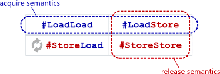

---
category:
  - 并发编程
  - 无锁编程
tag:
  - 无锁并发
date: 2023-10-30
star: true
---

# 无锁编程与内存顺序

无锁编程里最复杂，最难理解的莫过于是内存顺序。

## 乱序

程序不一定会按照源代码的顺序执行，这称之为乱序。乱序的必须遵循的原则是：在单线程执行下，乱序与不乱序执行的结果必须相同。所以，在单线程的环境里不需要注意乱序的问题，而到了多线程环境就需要考虑乱序。

乱序产生的原因有好几种：

- 编译器优化，在编译阶段将源码交换。
- 程序执行期间，指令流水被CPU乱序执行。
- inherent cache 的分层及刷新策略使得有时候某些写读操作的从效果上看，顺序被重排。

## Release和Acquire语义

release和acquire必须配合在一起使用，分开使用没有意义。release只能用于写操作，而acquire只能用于读操作。它们两结合在一起表达这样一个约定：**如果一个线程A对一块内存 m 以 release 的方式进行修改，那么在线程 A 中，所有在该 release 操作之前进行的内存操作，都在另一个线程 B 对内存 m 以 acquire 的方式进行读取之后，变得可见。**

release和acquire是针对两个线程来说的，如果有C线程以非acquire读取内存m，则它的行为是不确定的。

这个描述还隐含这样的信息：release之前的内存操作不允许重排序到release之后，acquire之后的内存操作不允许重排序到acquire之前。

现代处理器通常还会支持一些RMW（read-modify-write）指令，对于这种指令，既要release也要acquire语义，C++11的`memory_order_acq_rel`结合了这两种语义，还提供了内存屏障功能。



## 顺序一致性（Sequential Consistency）

顺序一致性是指所有的线程都观察到相同的内存操作顺序，相当于release + acquire之外，还对该操作加上了全剧顺序一致的要求。

例如：a、b初始值为0，

线程 A 执行：

```cpp
a.store(3, seq_cst);
```

线程 B 执行：

```cpp
b.store(4, seq_cst);
```

在所有线程里，观察到的执行顺序是一样的。所以，a == 0 && b == 4 和 a == 3 && b == 0 不可能同时成立。

在Java里可通过标记变量为`volatile`实现顺序一致性。

## Reference

- [c++11 内存模型解读](https://www.cnblogs.com/catch/p/3803130.html)
- [Acquire and Release Semantics](https://preshing.com/20120913/acquire-and-release-semantics/)