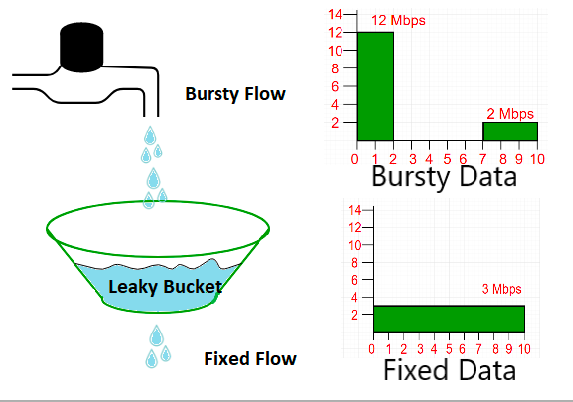
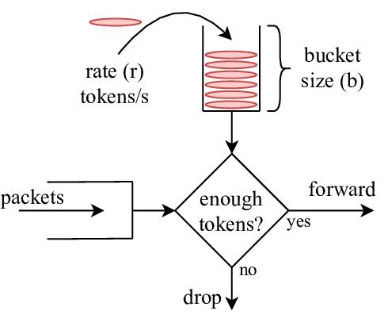
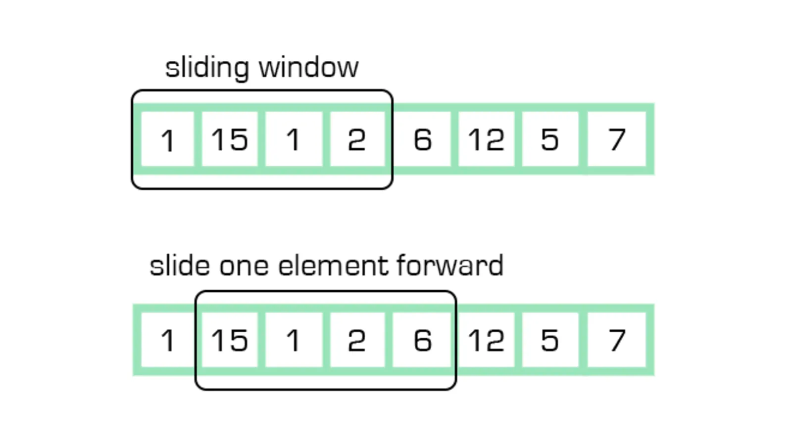

---
category:
  - 微服务
tag:
  - 流量控制
date: 2023-10-18
star: true
---

# 流量控制-限流、熔断降级

在微服务系统中，往往需要一些手段来应对流量激增的情况。例如，弹性伸缩，在高流量时自动扩容。但弹性伸缩往往只能在无状态服务上比较容易实现，在有状态的服务，例如数据库、消息中间件、分布式缓存上，是比较难实现的。这时就需要流量控制，只接受系统能处理的流量，拒绝或排队处理不过来的流量，从而保护微服务系统的可用性。

服务在自己处理不过来时，应该拒绝其它服务的请求，保护自己，这就是限流降级。当服务发现它调用一个服务，在发现这个服务“不行”时，应该不再去请求它，从而保护这个服务，但其实也是在保护自己，因为服务“不行”时，往往响应很慢，拒绝请求它避免大量请求在自己服务内堆积，这就是熔断降级。一般而言，限流侧重于流量控制，预防系统被压垮，一般通过拒绝或者排队等流量整形手段应付暂时不能处理的流量。而熔断侧重于在发现依赖的服务“不行”时，如：每秒请求异常数超过多少，每秒请求错误率超过多少时，每秒平均耗时超过多少时，在一个时间窗口内拒绝请求该服务，在一个时间窗口之后再恢复请求，从而保护依赖的服务。当然，服务也可以自己统计自己的错误率，平均耗时等，从而熔断其它服务的调用。

## 降级的几种形式

降级主要有三种形式：限流降级、熔断降级和开关降级。服务降级就是为了应对流量激增，牺牲一些流量换取系统的稳定。

### 限流降级

在服务的流量达到设置的阈值后，需要采取流量控制措施，以防止服务崩溃。常用的流量控制策略有排队等待或者直接拒绝。常用的控制指标有QPS和并发线程数。限流最困难在于如何确实限流的阈值，即QPS数达到多少或者并发线程数达到多少后实施控制策略。这个阈值一般通过压测测出。但阈值依赖于所在环境的性能，当前业务的复杂度等等，即使我们能测出一个准确的值，这个值也会随业务的变化而改变。过高的阈值使流控失效，过低的阈值浪费硬件性能。

所以，还有自适应形式的流量控制。收集一些系统参数，如：请求响应时间、系统平均负载、CPU使用率、内存使用率等等，通过算法计算当前系统是否已达最大吞吐量，从而实施控制策略。相比普通的流控方式，最大的优点是不用设置限流阈值。但性能损失会稍多一点，其次要看自适应算法的效果。

除此之外，还可以根据业务定制流控策略。例如，在Saas系统里，VIP用户比普通用户优先级更高，普通用户的流控要比VIP用户的流控更早，例如，在系统QPS达到300时，就对普通用户实施流控，这时VIP用户仍能继续访问，QPS达到400时，再对VIP用户流控。同样，业务也可以区分优先级，例如，应用APP下载页面，评论要比APP下载流控更早。

除了单机流控外，还可以对集群流控。例如，开发了一个API接口，是按QPS收费的。这时需要知道集群里所有的实例调用这个API的QPS。集群流控一般需要一个专门的服务来负责统计调用量。

常用的限流算法一般有三种：令牌桶算法、漏桶算法和滑动窗口算法。后面会对这三种算法有更具体的介绍。

### 熔断降级

当服务发现它依赖的服务可能已经超负荷的情况下，需要在一个时间窗口内停止访问该服务，从而保护这个服务，也保护自己，避免自己因为依赖的服务响应慢而堆积大量的请求。在一个时间窗口之后，再恢复访问该服务，如果该服务仍然超负荷，则再次对该服务熔断。

常用的判断服务是否超负荷的策略有：

- 平均响应时间
- 每秒请求异常数
- 每秒请求异常率
- 慢调用比例

拒绝策略一般有：

- 直接拒绝。
- 请求预设的服务，例如我们有两套文件存储服务，一套是作为服务对外提供服务的，一套平时只用来做数据备份。在存储服务被降级时，可以去请求备份服务。又或者，将请求存储到消息队列里，等待被降级的服务恢复再去请求。

一般而言，我们只对弱依赖的服务调用降级，所以，我们应该对所有服务调用都配置一个合适的超时时间，避免服务整体雪崩。

### 开关降级

开关降级一般是通过人工或者定时任务的方式实时降级，例如在电商大促的时间段对不重要的业务降级，让这些业务接口直接不可用。在外卖高峰期，通过定时任务配置每天在这个时间段对不重要的业务降级。

## 流控算法

常见的流控算法有三种：令牌桶算法、漏桶算法和滑动窗口算法。一般来说，滑动窗口算法和漏桶算法用的比较多。

### 漏桶算法

把请求比作水，漏桶算法以固定的速度出水，未来得及流出的水就待在桶里，桶满水时，水就会溢出。本质上是固定QPS阈值，拒绝策略为排队的限流算法。



生产级的实现可以参考`nginx`和`sentinel`。

```java
/**
 * 漏桶算法的简单实现
 */
public class LeakyBucket {
    // 桶的容量
    private long capacity;
    // 水流出的速度（请求数每毫秒）
    private long rate;
    // 当前积水量
    private long water;
    // 上次加水的时间
    private long lastTime;
    
    public LeakyBucket(long capacity, long rate) {
        this.capacity = capacity;
        this.rate = rate;
        this.water = 0;
        this.lastTime = System.currentTimeMillis();
    }
    
    public synchronized boolean tryAcquire() {
        long currentTime = System.currentTimeMillis();
        water = Math.max(0, water - (currentTime - lastTime) * rate);
        lastTime = currentTime;
        if (water + 1 <= capacity) {
            ++water;
            return true;
        }
        return false;
    }
}
```

这里的示例没有实现排队的逻辑，实现的方式有很多种，例如使用`BlockingQueue`，专门的消息队列中间件等等，还有就是可以使用`Thread.sleep()`，计算出排队的时间后`sleep`模拟排队。

```java
/**
 * 带有排队的漏桶算法的简单实现
 */
public class LeakyBucket {
    // 桶的容量
    private long capacity;
    // 水流出的速度（请求数每毫秒）
    private long rate;
    // 当前积水量
    private long water;
    // 上次加水的时间
    private long lastTime;

    private final ReentrantLock lock = new ReentrantLock();

    public LeakyBucket(long capacity, long rate) {
        if (capacity < rate) {
            throw new IllegalArgumentException();
        }
        this.capacity = capacity;
        this.rate = rate;
        this.water = 0;
        this.lastTime = System.currentTimeMillis();
    }

    public boolean tryAcquire() throws InterruptedException {
        lock.lock();
        try {
            long currentTime = System.currentTimeMillis();
            water = Math.max(0, water - (currentTime - lastTime) * rate);
            lastTime = currentTime;
            if (water + 1 <= rate) {
                ++water;
                lock.unlock();
                return true;
            }
            if (water + 1 <= capacity) {
                ++water;
                long interval = water / rate;
                lock.unlock();
                sleep(interval);
                return true;
            }
            lock.unlock();
            return false;
        } catch (Throwable e) {
            lock.unlock();
            throw e;
        }
    }

    protected void sleep(long interval) throws InterruptedException {
        if (interval > 0) {
            Thread.sleep(interval);
        }
    }
    
}
```

使用以下代码测试：

```java
/**
 * 该测试需要在JDK21及以上版本运行
 */
public class LeakyBucketTest {
    public static void main(String[] args) throws InterruptedException {
        LeakyBucket leakyBucket = new LeakyBucket(50, 10);
        AtomicInteger pass = new AtomicInteger(0);
        AtomicInteger fail = new AtomicInteger(0);
        AtomicLong time = new AtomicLong(System.currentTimeMillis());
        AtomicInteger count = new AtomicInteger(0);
        int round = 10000;
        int reqPerRound = 50;
        try (ExecutorService es = Executors.newVirtualThreadPerTaskExecutor()) {
            for (int i = 0; i < round; ++i) {
                for (int j = 0; j < reqPerRound; ++j) {
                    es.submit(() -> {
                        try {
                            if (leakyBucket.tryAcquire()) {
                                pass.incrementAndGet();
                            } else {
                                fail.incrementAndGet();
                            }
                            long old = time.get();
                            long now = System.currentTimeMillis();
                            if (now - old >= 1000 && time.compareAndSet(old, now)) {
                                int c = count.incrementAndGet();
                                System.out.println(c + ": pass: " + pass.get() + " fail: " + fail.get());
                            }
                        } catch (InterruptedException e) {
                            throw new RuntimeException(e);
                        }
                    });
                }
                Thread.sleep(1);
            }
        }
        System.out.println(count.incrementAndGet() + ": pass: " + pass.get() + " fail: " + fail.get());
    }
}
```

测试结果：

```text
1: pass: 9949 fail: 28816
2: pass: 19959 fail: 57360
3: pass: 29951 fail: 85810
4: pass: 39950 fail: 114960
5: pass: 49949 fail: 144510
6: pass: 59949 fail: 173961
7: pass: 69949 fail: 202863
8: pass: 79945 fail: 231724
9: pass: 89942 fail: 260120
10: pass: 99939 fail: 288773
11: pass: 109878 fail: 317192
12: pass: 119879 fail: 346683
13: pass: 128470 fail: 371530
```

事实上，也可在滑动窗口算法统计QPS的基础上实现漏桶算法，漏桶算法本质上是固定QPS阈值+排队。

### 令牌桶算法

令牌桶算法以固定的速率生成令牌，请求从桶里拿令牌，拿到令牌的请求通过，拿不到令牌的请求拒绝。拿令牌的速度是没有限制，所以在短时间内的速率可以比较高。

漏桶算法是以固定的速率出水，令牌桶算法则允许处理短时间内的突发流量。需要注意的是，这里的突发流量不等于高并发流量。在高并发场景下，漏桶算法比令牌桶算法更合适。原因在于，使用这两个算法所设定的速率和桶容量阈值是已经比较接近系统满负荷状态，所以，令牌桶突发的流量部分不会很多，否则系统处理不过来，让这部分突发流量通过是无意义的。

令牌桶算法原本是用于网络设备控制传输速度的，它的目的是控制一段时间内的平均速率，之所以说令牌桶适合突发流量，是指在网络传输的时候，可以允许某段时间内（一般就几秒）超过平均传输速率，这在网络环境下常见的情况就是“网络抖动”，但这个短时间的突发流量是不会导致雪崩效应，网络设备也能够处理得过来。

之所以说漏桶更适合高并发，是因为它优先缓存请求，直到缓存不下才丢弃。而令牌桶一般而言对拿不到令牌的请求是直接丢弃。在高并发例如抢购这种场景下，优先缓存请求更合理。

`Google Guava`里的`RateLimter`就是令牌桶算法的一个实现。



```java
/**
 * 令牌桶简单实现
 */
public class TokenBucket {
    // 桶的容量
    private long capacity;
    // 令牌放入的速度
    private long rate;
    // 当前令牌数
    private long tokens;
    // 上次加令牌的时间
    private long lastTime; 
    
    public TokenBucket(long capacity, long rate) {
        this.capacity = capacity;
        this.rate = rate;
        this.tokens = 0;
        this.lastTime = System.currentTimeMillis();
    }
    
    public synchronized boolean tryAcquire() {
        long currentTime = System.currentTimeMillis();
        tokens = Math.min(capacity, tokens + (currentTime - lastTime) * rate);
        lastTime = currentTime;
        if (tokens > 0) {
            --tokens;
            return true;
        }
        return false;
    }
}
```

这里的实现比较简单，生产级的实现可以参考`Google Guava`的`RateLimiter`。

### 滑动窗口算法
 
滑动窗口原理不复杂，将一个时间窗口分为若干个格子，以格子为单位移动窗口。主要是减少了固定时间窗口算法的临界突变问题。

滑动窗口是用得比较多的限流算法，原因是限流器往往是基于统计实现的，如前面提到的，要实现自适应算法，需要统计一些指标。使用滑动窗口算法可以容易实现。生产级的实现可以参考`Sentinel`。



```java
/**
 * 滑动窗口算法的简单实现
 */
public class SlidingWindow {
    // 窗口大小
    private int windowSize;
    // 阈值
    private int limit;
    // 窗口内请求数量
    private int[] window;
    // 当前时间窗口索引
    private int index;
    
    public SlidingWindow(int windowSize, int limit) {
        this.windowSize = windowSize;
        this.limit = limit;
        this.window = new int[windowSize];
        this.index = 0;
    }
    
    public synchronized boolean tryAcquire() {
        int sum = 0;
        for (int i = 0; i < windowSize; ++i) {
            sum += window[i];
        }
        if (sum < limit) {
            ++window[index];
            index = (index + 1) % windowSize;
            return true;
        }
        return false;
    }
}
```

上面的实现比较简单，没有引入时间，引入时间之后会复杂一点。

```java
/**
 * 带有时间实现的滑动窗口算法的简单实现
 */
public class SlidingWindow {
    static class WindowItem {
        int value;
        long startTime;
    }
    
    // 窗口内的取样数（也就是把窗口分为多少个格子）
    private int sampleCount;
    // 窗口的时间长度（毫秒）
    private int windowTimeLen;
    // 窗口内的每个格子的时间长度（毫秒）
    private int windowItemTimeLen;
    // 阈值
    private int limit;
    // 窗口内请求数量
    private WindowItem[] window;

    private final ReentrantLock lock = new ReentrantLock();

    public SlidingWindow(int sampleCount, int windowTimeLen, int limit) {
        this.sampleCount = sampleCount;
        this.windowTimeLen = windowTimeLen;
        this.windowItemTimeLen = windowTimeLen / sampleCount;
        this.limit = limit;
        this.window = new WindowItem[sampleCount];
    }

    public boolean tryAcquire() {
        lock.lock();
        try {
            int sum = 0;
            for (int i = 0; i < sampleCount; ++i) {
                if (window[i] != null && isValidItem(window[i])) {
                    sum += window[i].value;
                }
            }
            if (sum < limit) {
                WindowItem item = currentItem();
                ++item.value;
                return true;
            }
            return false;
        } finally {
            lock.unlock();
        }
    }

    WindowItem currentItem() {
        long now = System.currentTimeMillis();
        int index = (int) ((now / windowItemTimeLen) % sampleCount);
        long itemStartTime = now - now % windowItemTimeLen;

        WindowItem old = window[index];
        if (old == null || old.startTime != itemStartTime) {
            WindowItem item = new WindowItem();
            item.startTime = itemStartTime;
            window[index] = item;
            return item;
        }

        return old;
    }
    
    boolean isValidItem(WindowItem item) {
        long now = System.currentTimeMillis();
        return item.startTime + windowTimeLen >= now;
    }
}
```

测试代码：

```java
/**
 * 该代码需要在JDK21及以上版本运行
 */
public class SlidingWindowTest {
    public static void main(String[] args) throws InterruptedException {
        SlidingWindow slidingWindow = new SlidingWindow(10, 1000, 10000);
        AtomicInteger pass = new AtomicInteger(0);
        AtomicInteger fail = new AtomicInteger(0);
        AtomicLong time = new AtomicLong(System.currentTimeMillis());
        AtomicInteger count = new AtomicInteger(0);
        int round = 10000;
        int reqPerRound = 50;
        try (ExecutorService es = Executors.newVirtualThreadPerTaskExecutor()) {
            for (int i = 0; i < round; ++i) {
                for (int j = 0; j < reqPerRound; ++j) {
                    es.submit(() -> {
                        if (slidingWindow.tryAcquire()) {
                            pass.incrementAndGet();
                        } else {
                            fail.incrementAndGet();
                        }
                        long old = time.get();
                        long now = System.currentTimeMillis();
                        if (now - old >= 1000 && time.compareAndSet(old, now)) {
                            int c = count.incrementAndGet();
                            System.out.println(c + ": pass: " + pass.get() + " fail: " + fail.get());
                        }
                    });
                }
                Thread.sleep(1);
            }
        }
        System.out.println(count.incrementAndGet() + ": pass: " + pass.get() + " fail: " + fail.get());
    }
}
```

测试结果：

```text
1: pass: 10550 fail: 27909
2: pass: 20550 fail: 56557
3: pass: 30550 fail: 85010
4: pass: 40550 fail: 113851
5: pass: 50550 fail: 142651
6: pass: 60550 fail: 171401
7: pass: 70550 fail: 200052
8: pass: 80550 fail: 228874
9: pass: 90550 fail: 257851
10: pass: 100550 fail: 286552
11: pass: 110550 fail: 315751
12: pass: 120550 fail: 344402
13: pass: 130000 fail: 370000
```

## 自适应算法简介

自适应算法又称动态限流算法。其核心解决的问题是，限流的阈值不容易配置一个好的值。过高的阈值限流会失效，过低则造成机器性能浪费。自适应算法的目的是不用手动配置限流阈值，而是算法根据统计指标，如系统平均复杂（Load），平均响应时间，并发线程数，QPS等等，决定当前是否实施限流。

自适应算法的好处是显然易见的，在理想情况下能让系统尽可能跑在最大吞吐量的同时保证系统的稳定性。而缺点是带来一定的性能损失，同时现在流行的一些自适应算法，效果不一定理想。

自适应算法的实现可以参考[Sentinel](https://sentinelguard.io/zh-cn/docs/system-adaptive-protection.html)和[Apache bRPC](https://brpc.apache.org/zh/docs/server/auto-concurrencylimiter/)的实现。

## 微服务系统中的流量控制

在微服务系统中，可以给每个服务都配置一个自适应算法限流。在业务网关处配置集群流控，控制每个用户、IP等等的QPS。 在业务接口配置熔断降级策略，避免服务整体雪崩。

## 流量控制器的设计

流量控制器一般是使用责任链设计模式，基于滑动窗口法的指标统计实现。责任链模式非常适合流量控制器，可以方便添加各个处理器。滑动窗口则非常适合用来收集指标，可以参考Sentinel的实现。

当然也可以通过指数平滑法（[EMA](https://en.wikipedia.org/wiki/Moving_average#Exponential_moving_average)）统计数据，可以参考Apache bRPC实现。