---
category:
  - 算法
  - 共识
tag:
  - 分布式
date: 2026-01-03
star: true
---

# Raft 简介

Raft 是一个用于管理复制日志（实现分布式共识）的算法。它和 Paxos 一样，都是为了解决分布式系统中多个节点如何就一个值（或一系列值）达成一致的问题。Raft 是 Paxos 的现代简化版本，核心目标相同，但设计理念和实现方式有很大不同，旨在比 Paxos 更易于理解和实现。

Raft 由 Diego Ongaro 和 John Ousterhout 在 2014 年的论文《In Search of an Understandable Consensus Algorithm》中提出。其核心目标是设计一个易于理解的共识算法，以便于教学和工程实现。

Raft 通过强领导制来简化管理。它将共识问题分解为三个相对独立的子问题：

- **领导选举**：当集群启动或领导者宕机时，通过投票选举出一个唯一的领导者。
- **日志复制**：所有的客户端请求都发送给领导者。领导者将其作为日志条目复制到集群中的大多数节点（过半节点），然后提交该条目并通知所有节点应用。
- **安全性**：确保在任意时刻，任何节点上已提交的日志都是一致的，并且只有拥有最新日志的节点才能成为领导者。

## 分布式共识问题

在一个由多个独立节点（计算机）组成的分布式系统中，如何让所有（或大多数）节点**就某个值、某个状态或某个操作的顺序达成完全一致**。

在单机系统中，达成一致很容易（由CPU和内存决定）。但在分布式环境中，我们需要在以下“不可靠”的现实条件下达成一致：

- **网络不可靠**：消息可能延迟、丢失、重复或乱序。
- **节点可能故障**：节点可能随时崩溃、重启，或发生网络分区（“脑裂”）。
- **没有全局时钟**：很难精确判断两个事件的先后顺序。

### 举例

**例子1：分布式数据库的主副本选举**

- **场景**：一个数据库有5个副本（A, B, C, D, E），存储同一份数据。主副本负责处理写请求。现在主副本A突然宕机。
- **共识问题**：剩下的4个副本必须共同选举出一个新的主副本（比如B）。
- **挑战**：必须确保只有一个B被选为主。如果B和C同时认为自己是主（“脑裂”），就会导致数据不一致（两边都可能接受写请求）。共识算法（如Raft）通过要求候选人获得多数票来确保唯一性。

**例子2:分布式数据库日志共识**

- **场景**：有3个节点组成的KV数据库集群，分别为A，B，C节点。
- **共识问题**：客户端请求`set x = 1`。
- **挑战**：假设现在节点A处理该请求，这3台服务器都是各自独立的个体，要怎么让这3台服务器对`set x = 1`这条指令达成共识？执行或不执行。也就是说，保证这3台服务器的状态是一致的。

## 领导者选举

Raft 是**强领导者**模型，在同一时间内只存在一个领导者。Raft 通过一切以领导者为准的方式，实现一系列值的共识和各节点日志的一致。

Raft 节点有3种状态：

- **领导者（Leader）**：从客户端接收日志条目（log entries），将日志条目复制到其他服务器上，并在确保安全性时通知其他服务器应用日志条目到它们的状态机中。
- **候选人（Candidate）**：向其他节点发送请求投票（RequestVote）的RPC消息，请求其他节点投票。如果赢得大多数选票，就能晋升为领导者。
- **跟随者（Follower）**：接收和处理来自领导者的消息。当等待领导者心跳信息超时时，将会推举自己为候选人。

### 选举过程

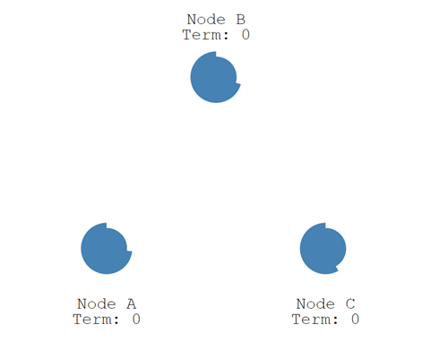

一开始，所有节点**都处于跟随者状态**。图中每个节点都在等待领导者的心跳信息，而每个节点的超时时间是随机生成的。

```go
// randomTimeout returns a value that is between the minVal and 2x minVal.
func randomTimeout(minVal time.Duration) <-chan time.Time {
   if minVal == 0 {
      return nil
   }
   extra := (time.Duration(rand.Int63()) % minVal)
   return time.After(minVal + extra)
}

hbTimeout := r.config().HeartbeatTimeout
heartbeatTimer = randomTimeout(hbTimeout)
```

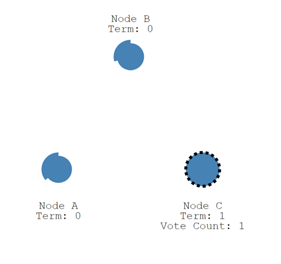

节点C首先超时，此时节点C**增加自己的任期编号（term），并推举自己为候选人，同时为自己投一票（Vote Count）**。其他节点收到候选人C的投票请求后，在当前任期编号为1且尚未进行过投票的情况下，会将选票投给C，并将自己的任期编号加1。如果候选人在选举时间内赢得了大多数选票，则成为该任期的领导者。

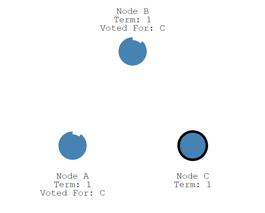

节点C当选领导者之后，会周期性地发送心跳消息，通知其他节点其领导者的身份。其他节点在收到心跳信息时，会重置自己的计时器。

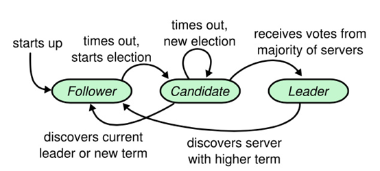

在某些情况下，选举过程可能会导致选票分散。在这种情况下，该任期将以无领导人状态结束；新的任期（以及新的选举）将很快开始。Raft 确保在一个给定的任期内，最多只有一个领导者。

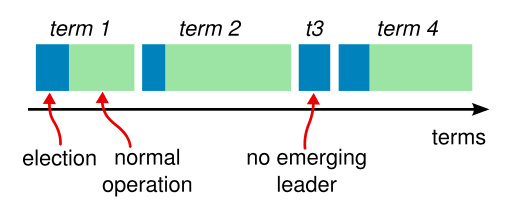

每个节点都存储一个当前任期号，该编号在整个时期内单调递增。在服务器之间通信时，会交换当前任期号；如果某个服务器的任期号小于其他服务器，它会将自己的任期号更新为较大的值。**如果候选人或领导者发现自己的任期号已过期，他们将立即恢复为跟随者状态**。如果节点收到包含过期任期号的请求，它将直接拒绝该请求。

其他说明：

1. 每个服务器在一个任期内最多投出一张选票，遵循先来先服务的原则。
2. 在等待投票期间，候选人可能会从其他服务器接收到声明其为领导者的附加日志项 RPC。如果该领导者的任期号（包含在此次 RPC 中）不低于候选人的当前任期号，候选人将承认该领导者合法并返回跟随者状态。如果此次 RPC 中的任期号低于候选人当前的任期号，候选人将拒绝此次 RPC 并继续保持候选人状态。
3. 如果多个跟随者同时成为候选人，选票可能会被分散，导致没有候选人能够获得大多数支持。在这种情况下，每个候选人都会超时，并通过增加当前任期号来启动新一轮选举。Raft 算法通过使用随机选举超时时间的方法，确保很少会发生选票分散的情况，即使发生也能迅速解决。

## 复制状态机

复制状态机通常基于复制日志实现。每个服务器存储一个包含一系列指令的日志，并按日志顺序执行这些指令。所有日志都按照相同的顺序包含相同的指令，因此每个服务器执行相同的指令序列。由于每个状态机都是确定性的，每次执行操作都会产生相同的状态和序列。

在一台服务器上，一致性模块接收客户端发送的指令并将其添加到自己的日志中。它与其他服务器上的一致性模块进行通信，以确保每个服务器上的日志最终以相同的顺序包含相同的请求，即使有些服务器会宕机。一旦指令被正确复制，每个服务器的状态机将按日志顺序处理它们，并将输出结果返回给客户端。因此，服务器集群看起来形成了一个高可靠的状态机。

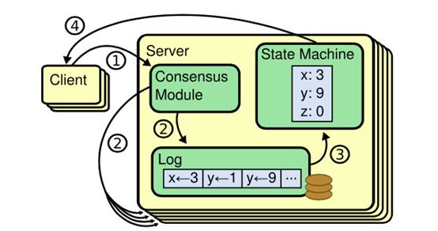

## 日志复制

客户端的每个请求都包含一条由复制状态机执行的指令。领导者将这条指令作为新的日志条目附加到日志中，然后并行地发起附加条目 RPCs 给其他服务器，以使它们复制这条日志条目。

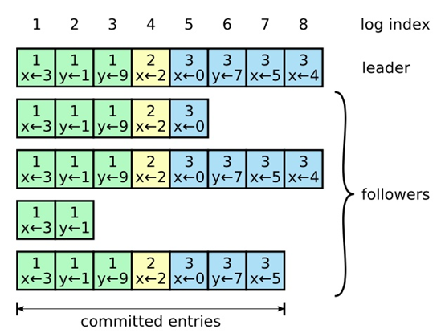

- 指令（command）：由客户端指定，状态机需要执行的指令。对应图中的 `x <- 3`。
- 索引（log index）：日志项对应的整数索引值。
- 任期编号（term）：创建这条日志项的领导者的任期编号。对应图中的 `x <- 3` 上面的 `1`。

首先，领导者通过日志复制（AppendEntries）的RPC消息将日志项复制到集群的其他节点中。如果领导者接收到大多数节点的复制成功响应，它会将日志应用（Apply）到其状态机（FSM）。应用到状态机的日志称为已提交（committed）日志。随后，领导者返回执行成功给客户端。**当跟随者接收到心跳消息或新的日志复制RPC消息时，如果发现领导者已经提交了某条日志项而自己尚未应用，那么跟随者会将该日志项应用到本地状态机**。

```go
// Log entries are replicated to all members of the Raft cluster
// and form the heart of the replicated state machine.
type Log struct {
	// Index holds the index of the log entry.
	Index uint64

	// Term holds the election term of the log entry.
	Term uint64

	// Type holds the type of the log entry.
	Type LogType

	// Data holds the log entry's type-specific data.
	Data []byte

	// Extensions holds an opaque byte slice of information for middleware. It
	// is up to the client of the library to properly modify this as it adds
	// layers and remove those layers when appropriate. This value is a part of
	// the log, so very large values could cause timing issues.
	//
	// N.B. It is _up to the client_ to handle upgrade paths. For instance if
	// using this with go-raftchunking, the client should ensure that all Raft
	// peers are using a version that can handle that extension before ever
	// actually triggering chunking behavior. It is sometimes sufficient to
	// ensure that non-leaders are upgraded first, then the current leader is
	// upgraded, but a leader changeover during this process could lead to
	// trouble, so gating extension behavior via some flag in the client
	// program is also a good idea.
	Extensions []byte

	// AppendedAt stores the time the leader first appended this log to it's
	// LogStore. Followers will observe the leader's time. It is not used for
	// coordination or as part of the replication protocol at all. It exists only
	// to provide operational information for example how many seconds worth of
	// logs are present on the leader which might impact follower's ability to
	// catch up after restoring a large snapshot. We should never rely on this
	// being in the past when appending on a follower or reading a log back since
	// the clock skew can mean a follower could see a log with a future timestamp.
	// In general too the leader is not required to persist the log before
	// delivering to followers although the current implementation happens to do
	// this.
	AppendedAt time.Time
}
```

### 日志的一致性实现

领导者通过强制跟随者直接复制其日志项来处理不一致的日志。也就是说，Raft 通过以领导者的日志为基准，确保各节点日志的一致性。领导者通过日志复制 RPC 的一致性检查，找到跟随者节点上与自己相同日志项的最大索引值。然后，领导者强制跟随者更新并覆盖不一致的日志项，从而实现日志的一致性。 跟随者中的不一致日志项会被领导者的日志覆盖，**但领导者从不会覆盖或删除自己的日志**。

## 安全性

到目前为止描述的机制尚不足以确保每个状态机都能按照相同的顺序执行相同的指令。例如，一个跟随者可能在领导人提交了若干日志条目后进入不可用状态，随后该跟随者可能会被选举为新的领导人并覆盖这些日志条目；因此，不同的状态机可能会执行不同的指令序列。

为了确保一致性，需要添加一些限制。这一限制保证了任何新当选的领导人在给定的任期内，都必须拥有之前所有任期中已被提交的日志条目。

### 选举限制

请求投票 RPC 实现了这样的限制：**RPC 中包含了候选人的日志信息，然后投票人会拒绝那些日志不如自己新的投票请求**。

“新”的定义：Raft 通过比较两份日志中最后一条日志条目的索引值和任期号来定义谁的日志更新。如果两份日志最后的条目的任期号不同，那么任期号大的日志更新。如果两份日志最后的条目任期号相同，那么日志较长的那个更新。

换句话说，**只有当候选人的日志至少与大多数节点一样新或更新时，才可能被选为领导者**。

如果候选人的日志至少与大多数服务器节点一样新，那么他一定持有了所有已提交的日志条目。

### 提交规则

Raft 永远不会通过计算副本数目的方式去提交一个之前任期内的日志条目。只有领导人当前任期里的日志条目可以通过计算副本数目被提交；一旦当前任期的日志条目以这种方式被提交，那么由于日志匹配特性，之前的日志条目也会被间接提交。

简要来说，**Raft 只会提交当前任期的日志条目**，而之前任期的日志条目也会因此被间接提交。

### 状态机安全

一个日志条目一旦被应用到状态机，就永远不能再被改变或回滚。每个服务器按日志索引顺序，顺序且仅一次地将已提交日志应用到状态机。

### 安全性证明

证明比较复杂，可以查看 Raft 论文。

## 成员变更

成员变更是 Raft 中一个复杂但关键的部分，它允许集群在不中断服务的情况下安全地添加或移除节点。Raft 提供了两种主要方法：**联合共识**和**单节点变更**。

配置（Configuration）：集群由哪些节点组成，是集群各节点地址信息的集合。例如，由节点 A、B 和 C 组成的集群，其配置为 [A, B, C]。

成员变更的最大风险在于可能出现两个领导者。例如，在进行成员变更时，如果节点 A、B 和 C 之间发生网络分区错误，节点 A 和 B 仍构成旧配置中的“大多数”，即变更前的三节点集群中的“大多数”。此时，旧配置中的领导者（如节点 A）仍然是领导者。

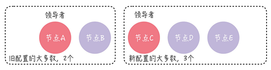

### 单节点变更

解决的方法是**单节点变更**。每次变更只涉及一个节点，如果需要变更多个节点，则需要多次执行单节点变更。

当前集群配置为 [A, B, C]，现在向集群中加入新节点 D，这意味着新配置将变为 [A, B, C, D]。成员变更通过以下两个步骤实现：

1. 领导者（节点 A）向新节点（节点 D）同步数据；
2. 领导者（节点 A）将新配置 [A, B, C, D] 作为一个日志项，复制到新配置中的所有节点（节点 A、B、C、D），然后将新配置的日志项应用到本地状态机，完成单节点变更。

无论旧的集群配置如何组成，旧配置的“大多数”和新配置的“大多数”都会有一个节点是重叠的。因此，不会出现两个领导者的情况。

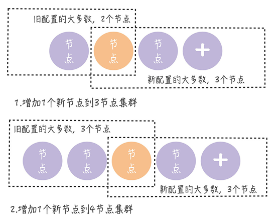

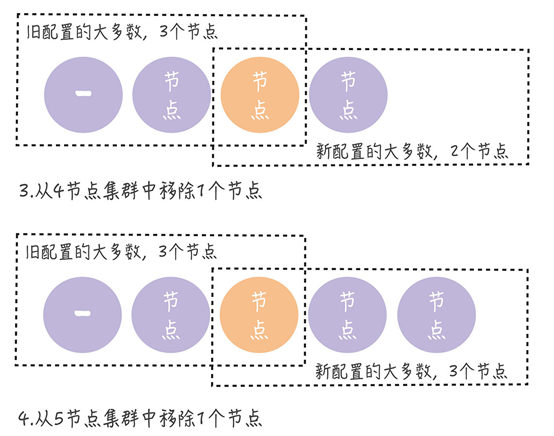

### 联合共识

联合共识是另一个解决成员变更的方法，但实现复杂，一般用得比较少。

### 对比

| 特性     | 联合共识               | 单节点变更            |
|--------|--------------------|------------------|
| 变更粒度   | 支持批量变更             | 只能单节点变更          |
| 安全性证明  | 通过双重多数保证           | 通过集合相交保证         |
| 实现复杂度  | 高                  | 低                |
| RPC 轮次 | 至少 2 轮（联合配置 + 新配置） | 1 轮              |
| 性能影响   | 变更期间决策需要双重多数，性能下降  | 影响较小             |
| 实际采用   | 较少，主要在学术实现中        | 广泛（etcd、Consul等） |
| 容错性    | 在变更过程中领导者故障时恢复复杂   | 恢复相对简单           |
## 日志压缩

1. 问题背景

- 日志无限增长：Raft 日志会随着时间不断追加，占用大量存储空间。
- 重启恢复缓慢：节点重启需要重放所有日志，如果日志太长，恢复时间不可接受。
- 新节点加入困难：新节点需要同步完整的日志历史，传输量过大。
- 内存压力：长期运行的日志可能超过内存容量。

2. 压缩目标

- 保留状态机的完整状态。
- 丢弃已应用且不再需要的历史日志。
- 保持协议安全性不变。
- 支持快速重启和节点恢复。

3. 基本思想

快照（Snapshot）是日志压缩的核心机制：

- 将当前状态机的完整状态保存到持久化存储
- 丢弃快照点之前的所有日志条目
- 保留快照点之后的日志用于后续更新

## Multi Raft

Raft 可以实现强一致性模型，但读写操作都必须在领导者节点上进行，因此性能接近于单机。为了提升性能，可以将数据分片（例如使用一致性哈希算法）并存储在独立的 Raft 共识组（Raft group）中。这意味着一个节点（服务器）可以参与多个 Raft 共识群组。

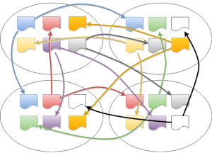

## 小结

Raft 可以实现强一致性，但并不总是如此，需要客户端的配合。写操作只能在领导者节点上进行。

Consul 实现了三种一致性模型：

- **Default**：客户端访问领导者节点执行读操作。如果领导者确认自己处于稳定状态（在 leader leasing 时间内），则返回本地数据给客户端；否则返回错误。在这种情况下，客户端可能会读到旧数据。例如，在网络分区错误时，新领导者已经更新了数据，但由于网络故障，旧领导者未更新数据且仍处于稳定状态。

- **Consistent**：客户端访问领导者节点执行读操作。领导者在与大多数节点确认自己仍是领导者后返回本地数据给客户端；否则返回错误。在这种情况下，客户端读到的都是最新数据。

- **Stale**：从任意节点读取数据，不局限于领导者节点。客户端可能会读到旧数据。

Raft 算法是目前分布式系统开发中首选的共识算法。

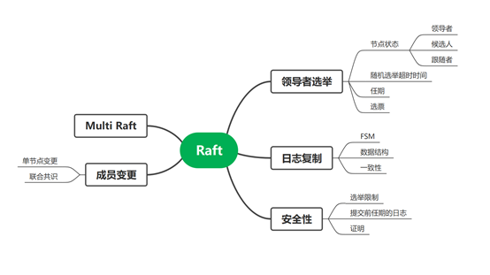

## Raft 论文

Raft 论文译文：https://github.com/maemual/raft-zh_cn
Raft 论文原文：https://raft.github.io