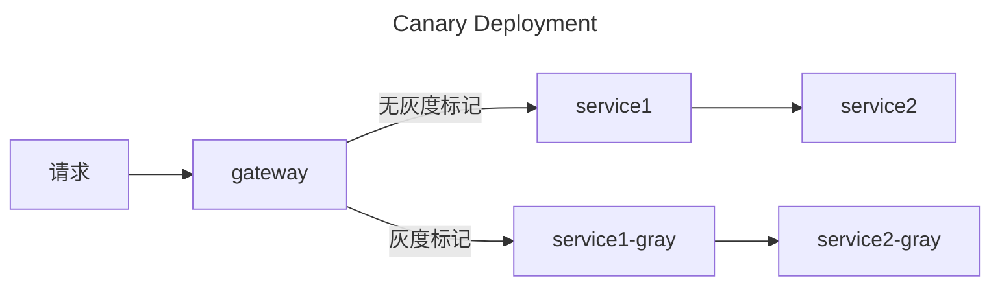

---
category:
  - 微服务
  - spring
tag:
  - 灰度发布
date: 2023-10-25
---

# Spring Cloud 全链路灰度发布

灰度发布又称为金丝雀（canary）发布，是一种版本更新的平滑过度方式。在微服务里，一般是更新服务时，先更新部分实例，通过配置一些用户访问新版本，新版本稳定后，再更新所有实例，把所有流量切到新版本。灰度发布也可以用来做AB测试，例如想测试一个新的算法的效果，可以把部分流量切到新算法，和旧版本效果对比。

此外，还有蓝绿发布，一般来说，蓝绿发布是有两个集群，更新时更新其中的一个集群。原集群和新集群同时保持运行一段时间，在此期间，新集群出现问题，可以立马把流量切回原集群。新集群稳定后，再下线原集群，新集群变为稳定集群。

## Spring Cloud 灰度发布原理

Spring Cloud灰度发布本质上是利用客户端负载均衡的能力，根据不同的请求，选择不同版本的实例。

先从`@LoadBalanced`注解开始，标上`@LoadBalanced`注解的`RestTemplate`或者`WebClient`的Bean会被配置`LoadBalancerClient`。也就是说，标记该注解的客户端实现了服务发现。值得注意，该注解上标有`@Qualifier`，意味着它可以作为一个qualifier使用。

```java
@Target({ ElementType.FIELD, ElementType.PARAMETER, ElementType.METHOD })
@Retention(RetentionPolicy.RUNTIME)
@Documented
@Inherited
@Qualifier
public @interface LoadBalanced {

}
```

查看`LoadBalancerAutoConfiguration`的代码，发现是通过给标有`@LoadBalanced`的`RestTemplate`添加了一个`LoadBalancerInterceptor`拦截器。

```java
@Configuration(proxyBeanMethods = false)
@ConditionalOnClass(RestTemplate.class)
@ConditionalOnBean(LoadBalancerClient.class)
@EnableConfigurationProperties(LoadBalancerClientsProperties.class)
public class LoadBalancerAutoConfiguration {

    @LoadBalanced
    @Autowired(required = false)
    private List<RestTemplate> restTemplates = Collections.emptyList();

    @Autowired(required = false)
    private List<LoadBalancerRequestTransformer> transformers = Collections.emptyList();

    @Bean
    public SmartInitializingSingleton loadBalancedRestTemplateInitializerDeprecated(
            final ObjectProvider<List<RestTemplateCustomizer>> restTemplateCustomizers) {
        return () -> restTemplateCustomizers.ifAvailable(customizers -> {
            for (RestTemplate restTemplate : LoadBalancerAutoConfiguration.this.restTemplates) {
                for (RestTemplateCustomizer customizer : customizers) {
                    customizer.customize(restTemplate);
                }
            }
        });
    }

    @Bean
    @ConditionalOnMissingBean
    public LoadBalancerRequestFactory loadBalancerRequestFactory(LoadBalancerClient loadBalancerClient) {
        return new LoadBalancerRequestFactory(loadBalancerClient, this.transformers);
    }

    @Configuration(proxyBeanMethods = false)
    @Conditional(RetryMissingOrDisabledCondition.class)
    static class LoadBalancerInterceptorConfig {

        @Bean
        public LoadBalancerInterceptor loadBalancerInterceptor(LoadBalancerClient loadBalancerClient,
                                                               LoadBalancerRequestFactory requestFactory) {
            return new LoadBalancerInterceptor(loadBalancerClient, requestFactory);
        }

        @Bean
        @ConditionalOnMissingBean
        public RestTemplateCustomizer restTemplateCustomizer(final LoadBalancerInterceptor loadBalancerInterceptor) {
            return restTemplate -> {
                List<ClientHttpRequestInterceptor> list = new ArrayList<>(restTemplate.getInterceptors());
                list.add(loadBalancerInterceptor);
                restTemplate.setInterceptors(list);
            };
        }

    }
}
```

查看`LoadBalancerInterceptor`，发现其主要是通过`LoadBalancerClient`实现。

```java
public class LoadBalancerInterceptor implements ClientHttpRequestInterceptor {

	private LoadBalancerClient loadBalancer;

	private LoadBalancerRequestFactory requestFactory;

	public LoadBalancerInterceptor(LoadBalancerClient loadBalancer, LoadBalancerRequestFactory requestFactory) {
		this.loadBalancer = loadBalancer;
		this.requestFactory = requestFactory;
	}

	public LoadBalancerInterceptor(LoadBalancerClient loadBalancer) {
		// for backwards compatibility
		this(loadBalancer, new LoadBalancerRequestFactory(loadBalancer));
	}

	@Override
	public ClientHttpResponse intercept(final HttpRequest request, final byte[] body,
			final ClientHttpRequestExecution execution) throws IOException {
		final URI originalUri = request.getURI();
		String serviceName = originalUri.getHost();
		Assert.state(serviceName != null, "Request URI does not contain a valid hostname: " + originalUri);
		return this.loadBalancer.execute(serviceName, this.requestFactory.createRequest(request, body, execution));
	}

}
```
而`LoadBalancerClient`的实现为`BlockingLoadBalancerClient`。

```java
public class BlockingLoadBalancerClient implements LoadBalancerClient {

	private final ReactiveLoadBalancer.Factory<ServiceInstance> loadBalancerClientFactory;

	public BlockingLoadBalancerClient(ReactiveLoadBalancer.Factory<ServiceInstance> loadBalancerClientFactory) {
		this.loadBalancerClientFactory = loadBalancerClientFactory;
	}

	@Override
	public <T> T execute(String serviceId, LoadBalancerRequest<T> request) throws IOException {
		String hint = getHint(serviceId);
		LoadBalancerRequestAdapter<T, TimedRequestContext> lbRequest = new LoadBalancerRequestAdapter<>(request,
				buildRequestContext(request, hint));
		Set<LoadBalancerLifecycle> supportedLifecycleProcessors = getSupportedLifecycleProcessors(serviceId);
		supportedLifecycleProcessors.forEach(lifecycle -> lifecycle.onStart(lbRequest));
		ServiceInstance serviceInstance = choose(serviceId, lbRequest);
		if (serviceInstance == null) {
			supportedLifecycleProcessors.forEach(lifecycle -> lifecycle.onComplete(
					new CompletionContext<>(CompletionContext.Status.DISCARD, lbRequest, new EmptyResponse())));
			throw new IllegalStateException("No instances available for " + serviceId);
		}
		return execute(serviceId, serviceInstance, lbRequest);
	}

	private <T> TimedRequestContext buildRequestContext(LoadBalancerRequest<T> delegate, String hint) {
		if (delegate instanceof HttpRequestLoadBalancerRequest) {
			HttpRequest request = ((HttpRequestLoadBalancerRequest) delegate).getHttpRequest();
			if (request != null) {
				RequestData requestData = new RequestData(request);
				return new RequestDataContext(requestData, hint);
			}
		}
		return new DefaultRequestContext(delegate, hint);
	}

	@Override
	public <T> T execute(String serviceId, ServiceInstance serviceInstance, LoadBalancerRequest<T> request)
			throws IOException {
		if (serviceInstance == null) {
			throw new IllegalArgumentException("Service Instance cannot be null");
		}
		DefaultResponse defaultResponse = new DefaultResponse(serviceInstance);
		Set<LoadBalancerLifecycle> supportedLifecycleProcessors = getSupportedLifecycleProcessors(serviceId);
		Request lbRequest = request instanceof Request ? (Request) request : new DefaultRequest<>();
		supportedLifecycleProcessors
				.forEach(lifecycle -> lifecycle.onStartRequest(lbRequest, new DefaultResponse(serviceInstance)));
		try {
			T response = request.apply(serviceInstance);
			Object clientResponse = getClientResponse(response);
			supportedLifecycleProcessors
					.forEach(lifecycle -> lifecycle.onComplete(new CompletionContext<>(CompletionContext.Status.SUCCESS,
							lbRequest, defaultResponse, clientResponse)));
			return response;
		}
		catch (IOException iOException) {
			supportedLifecycleProcessors.forEach(lifecycle -> lifecycle.onComplete(
					new CompletionContext<>(CompletionContext.Status.FAILED, iOException, lbRequest, defaultResponse)));
			throw iOException;
		}
		catch (Exception exception) {
			supportedLifecycleProcessors.forEach(lifecycle -> lifecycle.onComplete(
					new CompletionContext<>(CompletionContext.Status.FAILED, exception, lbRequest, defaultResponse)));
			ReflectionUtils.rethrowRuntimeException(exception);
		}
		return null;
	}

	private <T> Object getClientResponse(T response) {
		ClientHttpResponse clientHttpResponse = null;
		if (response instanceof ClientHttpResponse) {
			clientHttpResponse = (ClientHttpResponse) response;
		}
		if (clientHttpResponse != null) {
			try {
				return new ResponseData(clientHttpResponse, null);
			}
			catch (IOException ignored) {
			}
		}
		return response;
	}

	private Set<LoadBalancerLifecycle> getSupportedLifecycleProcessors(String serviceId) {
		return LoadBalancerLifecycleValidator.getSupportedLifecycleProcessors(
				loadBalancerClientFactory.getInstances(serviceId, LoadBalancerLifecycle.class),
				DefaultRequestContext.class, Object.class, ServiceInstance.class);
	}

	@Override
	public URI reconstructURI(ServiceInstance serviceInstance, URI original) {
		return LoadBalancerUriTools.reconstructURI(serviceInstance, original);
	}

	@Override
	public ServiceInstance choose(String serviceId) {
		return choose(serviceId, REQUEST);
	}

	@Override
	public <T> ServiceInstance choose(String serviceId, Request<T> request) {
		ReactiveLoadBalancer<ServiceInstance> loadBalancer = loadBalancerClientFactory.getInstance(serviceId);
		if (loadBalancer == null) {
			return null;
		}
		Response<ServiceInstance> loadBalancerResponse = Mono.from(loadBalancer.choose(request)).block();
		if (loadBalancerResponse == null) {
			return null;
		}
		return loadBalancerResponse.getServer();
	}

	private String getHint(String serviceId) {
		LoadBalancerProperties properties = loadBalancerClientFactory.getProperties(serviceId);
		String defaultHint = properties.getHint().getOrDefault("default", "default");
		String hintPropertyValue = properties.getHint().get(serviceId);
		return hintPropertyValue != null ? hintPropertyValue : defaultHint;
	}

}
```

发现其是通过`ReactiveLoadBalancer<ServiceInstance>`实现获取服务列表，而`WebClient`的实现也通过`ReactiveLoadBalancer<ServiceInstance>`获取服务列表的。先看看`WebClient`的实现。

```java
public class LoadBalancerWebClientBuilderBeanPostProcessor implements BeanPostProcessor {

	private final DeferringLoadBalancerExchangeFilterFunction exchangeFilterFunction;

	private final ApplicationContext context;

	public LoadBalancerWebClientBuilderBeanPostProcessor(
			DeferringLoadBalancerExchangeFilterFunction exchangeFilterFunction, ApplicationContext context) {
		this.exchangeFilterFunction = exchangeFilterFunction;
		this.context = context;
	}

	@Override
	public Object postProcessBeforeInitialization(Object bean, String beanName) throws BeansException {
		if (bean instanceof WebClient.Builder) {
			if (context.findAnnotationOnBean(beanName, LoadBalanced.class) == null) {
				return bean;
			}
			((WebClient.Builder) bean).filter(exchangeFilterFunction);
		}
		return bean;
	}

}
```

该类通过实现`BeanPostProcessor`给所有标有`@LoadBlanced`注解的`WebClient`加上一个`DeferringLoadBalancerExchangeFilterFunction` Filter。

查看`ReactorLoadBalancerClientAutoConfiguration`和`LoadBalancerBeanPostProcessorAutoConfiguration`，发现在`DeferringLoadBalancerExchangeFilterFunction`里代理的对象是`ReactorLoadBalancerExchangeFilterFunction`。

```java
public class ReactorLoadBalancerExchangeFilterFunction implements LoadBalancedExchangeFilterFunction {

	private static final Log LOG = LogFactory.getLog(ReactorLoadBalancerExchangeFilterFunction.class);

	private final ReactiveLoadBalancer.Factory<ServiceInstance> loadBalancerFactory;

	private final List<LoadBalancerClientRequestTransformer> transformers;

	public ReactorLoadBalancerExchangeFilterFunction(ReactiveLoadBalancer.Factory<ServiceInstance> loadBalancerFactory,
			List<LoadBalancerClientRequestTransformer> transformers) {
		this.loadBalancerFactory = loadBalancerFactory;
		this.transformers = transformers;
	}

	@Override
	public Mono<ClientResponse> filter(ClientRequest clientRequest, ExchangeFunction next) {
		URI originalUrl = clientRequest.url();
		String serviceId = originalUrl.getHost();
		if (serviceId == null) {
			String message = String.format("Request URI does not contain a valid hostname: %s", originalUrl);
			if (LOG.isWarnEnabled()) {
				LOG.warn(message);
			}
			return Mono.just(ClientResponse.create(HttpStatus.BAD_REQUEST).body(message).build());
		}
		Set<LoadBalancerLifecycle> supportedLifecycleProcessors = LoadBalancerLifecycleValidator
				.getSupportedLifecycleProcessors(
						loadBalancerFactory.getInstances(serviceId, LoadBalancerLifecycle.class),
						RequestDataContext.class, ResponseData.class, ServiceInstance.class);
		String hint = getHint(serviceId, loadBalancerFactory.getProperties(serviceId).getHint());
		RequestData requestData = new RequestData(clientRequest);
		DefaultRequest<RequestDataContext> lbRequest = new DefaultRequest<>(new RequestDataContext(requestData, hint));
		supportedLifecycleProcessors.forEach(lifecycle -> lifecycle.onStart(lbRequest));
		return choose(serviceId, lbRequest).flatMap(lbResponse -> {
			ServiceInstance instance = lbResponse.getServer();
			if (instance == null) {
				String message = serviceInstanceUnavailableMessage(serviceId);
				if (LOG.isWarnEnabled()) {
					LOG.warn(message);
				}
				supportedLifecycleProcessors.forEach(lifecycle -> lifecycle
						.onComplete(new CompletionContext<>(CompletionContext.Status.DISCARD, lbRequest, lbResponse)));
				return Mono.just(ClientResponse.create(HttpStatus.SERVICE_UNAVAILABLE)
						.body(serviceInstanceUnavailableMessage(serviceId)).build());
			}

			if (LOG.isDebugEnabled()) {
				LOG.debug(String.format("LoadBalancer has retrieved the instance for service %s: %s", serviceId,
						instance.getUri()));
			}
			LoadBalancerProperties.StickySession stickySessionProperties = loadBalancerFactory.getProperties(serviceId)
					.getStickySession();
			ClientRequest newRequest = buildClientRequest(clientRequest, instance,
					stickySessionProperties.getInstanceIdCookieName(),
					stickySessionProperties.isAddServiceInstanceCookie(), transformers);
			supportedLifecycleProcessors.forEach(lifecycle -> lifecycle.onStartRequest(lbRequest, lbResponse));
			return next.exchange(newRequest)
					.doOnError(throwable -> supportedLifecycleProcessors.forEach(lifecycle -> lifecycle
							.onComplete(new CompletionContext<ResponseData, ServiceInstance, RequestDataContext>(
									CompletionContext.Status.FAILED, throwable, lbRequest, lbResponse))))
					.doOnSuccess(clientResponse -> supportedLifecycleProcessors.forEach(
							lifecycle -> lifecycle.onComplete(new CompletionContext<>(CompletionContext.Status.SUCCESS,
									lbRequest, lbResponse, new ResponseData(clientResponse, requestData)))));
		});
	}

	protected Mono<Response<ServiceInstance>> choose(String serviceId, Request<RequestDataContext> request) {
		ReactiveLoadBalancer<ServiceInstance> loadBalancer = loadBalancerFactory.getInstance(serviceId);
		if (loadBalancer == null) {
			return Mono.just(new EmptyResponse());
		}
		return Mono.from(loadBalancer.choose(request));
	}

}
```

我们发现其是通过`ReactiveLoadBalancer<ServiceInstance>`去获取服务实例的。查看`getInstance`方法的实现，发现其返回的是一个`ReactorServiceInstanceLoadBalancer`，

```java
public interface ReactorServiceInstanceLoadBalancer extends ReactorLoadBalancer<ServiceInstance> {

}
```

```java
@Configuration(proxyBeanMethods = false)
@ConditionalOnDiscoveryEnabled
public class LoadBalancerClientConfiguration {

    @Bean
    @ConditionalOnMissingBean
    public ReactorLoadBalancer<ServiceInstance> reactorServiceInstanceLoadBalancer(Environment environment,
                                                                                   LoadBalancerClientFactory loadBalancerClientFactory) {
        String name = environment.getProperty(LoadBalancerClientFactory.PROPERTY_NAME);
        return new RoundRobinLoadBalancer(
                loadBalancerClientFactory.getLazyProvider(name, ServiceInstanceListSupplier.class), name);
    }

    @Configuration(proxyBeanMethods = false)
    @ConditionalOnReactiveDiscoveryEnabled
    @Order(REACTIVE_SERVICE_INSTANCE_SUPPLIER_ORDER)
    public static class ReactiveSupportConfiguration {

        @Bean
        @ConditionalOnBean(ReactiveDiscoveryClient.class)
        @ConditionalOnMissingBean
        @Conditional(DefaultConfigurationCondition.class)
        public ServiceInstanceListSupplier discoveryClientServiceInstanceListSupplier(
                ConfigurableApplicationContext context) {
            return ServiceInstanceListSupplier.builder().withDiscoveryClient().withCaching().build(context);
        }
    }
}
```

其默认实现为`RoundRobinLoadBalancer`

```java
public class RoundRobinLoadBalancer implements ReactorServiceInstanceLoadBalancer {

	private static final Log log = LogFactory.getLog(RoundRobinLoadBalancer.class);

	final AtomicInteger position;

	final String serviceId;

	ObjectProvider<ServiceInstanceListSupplier> serviceInstanceListSupplierProvider;

	/**
	 * @param serviceInstanceListSupplierProvider a provider of
	 * {@link ServiceInstanceListSupplier} that will be used to get available instances
	 * @param serviceId id of the service for which to choose an instance
	 */
	public RoundRobinLoadBalancer(ObjectProvider<ServiceInstanceListSupplier> serviceInstanceListSupplierProvider,
			String serviceId) {
		this(serviceInstanceListSupplierProvider, serviceId, new Random().nextInt(1000));
	}

	/**
	 * @param serviceInstanceListSupplierProvider a provider of
	 * {@link ServiceInstanceListSupplier} that will be used to get available instances
	 * @param serviceId id of the service for which to choose an instance
	 * @param seedPosition Round Robin element position marker
	 */
	public RoundRobinLoadBalancer(ObjectProvider<ServiceInstanceListSupplier> serviceInstanceListSupplierProvider,
			String serviceId, int seedPosition) {
		this.serviceId = serviceId;
		this.serviceInstanceListSupplierProvider = serviceInstanceListSupplierProvider;
		this.position = new AtomicInteger(seedPosition);
	}

	@SuppressWarnings("rawtypes")
	@Override
	// see original
	// https://github.com/Netflix/ocelli/blob/master/ocelli-core/
	// src/main/java/netflix/ocelli/loadbalancer/RoundRobinLoadBalancer.java
	public Mono<Response<ServiceInstance>> choose(Request request) {
		ServiceInstanceListSupplier supplier = serviceInstanceListSupplierProvider
				.getIfAvailable(NoopServiceInstanceListSupplier::new);
		return supplier.get(request).next()
				.map(serviceInstances -> processInstanceResponse(supplier, serviceInstances));
	}

	private Response<ServiceInstance> processInstanceResponse(ServiceInstanceListSupplier supplier,
			List<ServiceInstance> serviceInstances) {
		Response<ServiceInstance> serviceInstanceResponse = getInstanceResponse(serviceInstances);
		if (supplier instanceof SelectedInstanceCallback && serviceInstanceResponse.hasServer()) {
			((SelectedInstanceCallback) supplier).selectedServiceInstance(serviceInstanceResponse.getServer());
		}
		return serviceInstanceResponse;
	}

	private Response<ServiceInstance> getInstanceResponse(List<ServiceInstance> instances) {
		if (instances.isEmpty()) {
			if (log.isWarnEnabled()) {
				log.warn("No servers available for service: " + serviceId);
			}
			return new EmptyResponse();
		}

		// Do not move position when there is only 1 instance, especially some suppliers
		// have already filtered instances
		if (instances.size() == 1) {
			return new DefaultResponse(instances.get(0));
		}

		// Ignore the sign bit, this allows pos to loop sequentially from 0 to
		// Integer.MAX_VALUE
		int pos = this.position.incrementAndGet() & Integer.MAX_VALUE;

		ServiceInstance instance = instances.get(pos % instances.size());

		return new DefaultResponse(instance);
	}

}
```

我们发现它是从一个`ServiceInstanceListSupplier` Bean里获取服务列表的。它的默认实现可以在`LoadBalancerClientConfiguration`里看到。

## Spring Cloud 灰度发布实现

在了解其原理之后，实现灰度发布就很简单了，有两种方式可以实现，一是实现`ReactorServiceInstanceLoadBalancer`对服务实例列表过滤，而是实现`ServiceInstanceListSupplier`对服务实例过滤。

我们采用实现`ServiceInstanceListSupplier`实现灰度发布。根据请求头里`gray`的值是否为`true`去选择灰度的实例版本。实例的元数据自定义方式，需要参考具体的注册中心的文档。

```java
@Component
public class CanaryInstanceListSupplier implements ServiceInstanceListSupplier {

    private ServiceInstanceListSupplier delegate;

    public CanaryInstanceListSupplier(ConfigurableApplicationContext context) {
        delegate = ServiceInstanceListSupplier.builder().withDiscoveryClient().withCaching().build(context);
    }

    @Override
    public String getServiceId() {
        return delegate.getServiceId();
    }

    @Override
    public Flux<List<ServiceInstance>> get(Request request) {
        Object context = request.getContext();
        if (!(context instanceof RequestDataContext ctx)) {
            return get();
        }

        boolean isGray = Optional.ofNullable(ctx.getClientRequest())
                .map(RequestData::getHeaders)
                .map(h -> h.get("gray"))
                .map(l -> l.get(0))
                .orElse("false")
                .equals("true");
        
        if (!isGray) {
            return get();
        }
        
        return get().map(serviceInstances -> serviceInstances.stream()
                .filter(instance -> Optional.ofNullable(instance.getMetadata())
                        .map(m -> m.get("version"))
                        .orElse("noGray")
                        .equals("gray"))
                .toList()
        );
    }

    @Override
    public Flux<List<ServiceInstance>> get() {
        return delegate.get();
    }
}
```

只要在每个服务都添加上该`ServiceInstanceListSupplier`，并且在微服务链路传递灰度标记，即可实现全链路灰度发布。该策略对Spring Cloud Gateway也会生效，因为其也是通过`ReactiveLoadBalancer<ServiceInstance>`获取实例的。

一般来说，可以在网关处，根据用户ID和配置的策略，统一给请求设置灰度标记。

